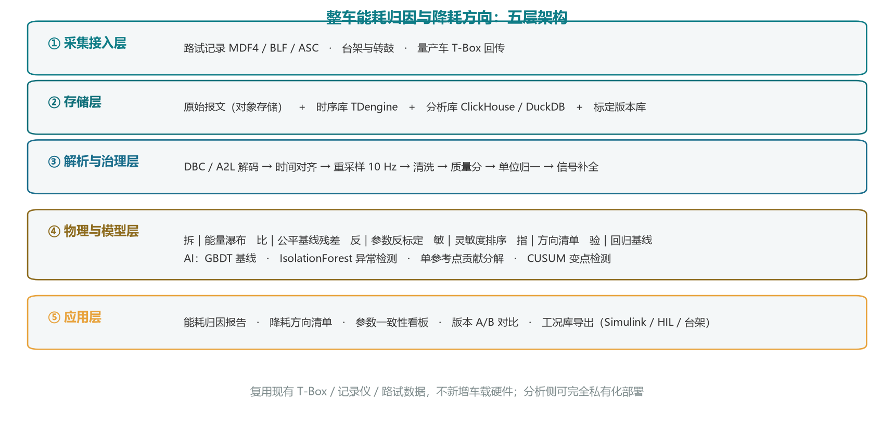
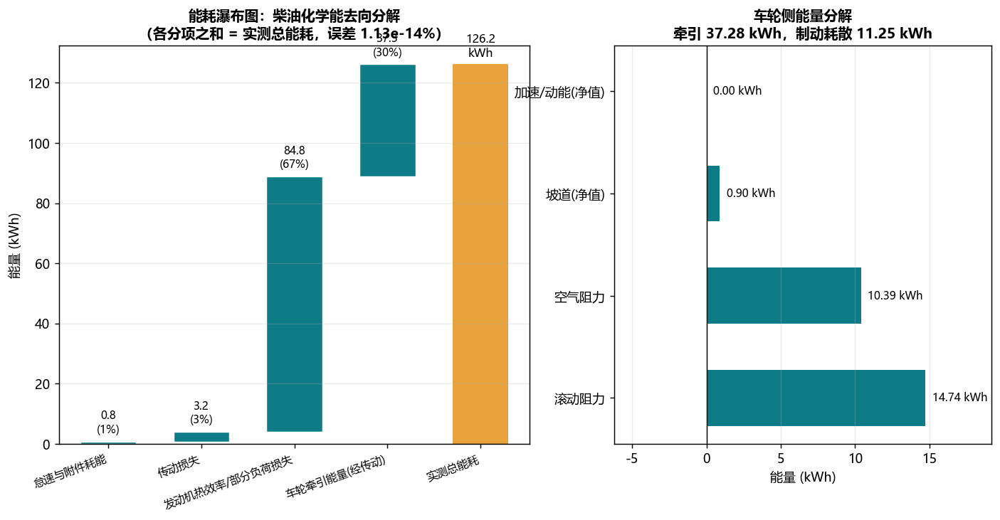
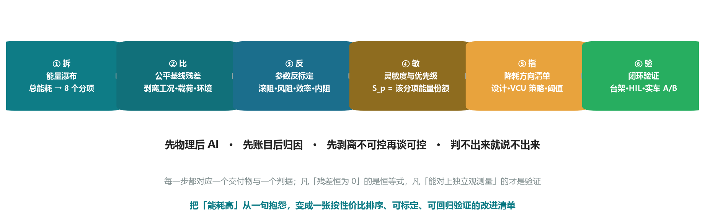
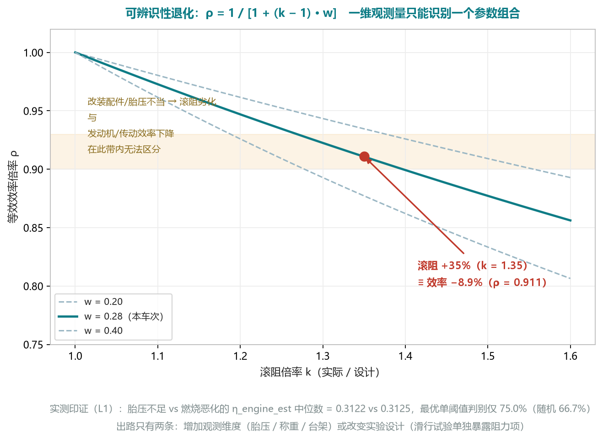
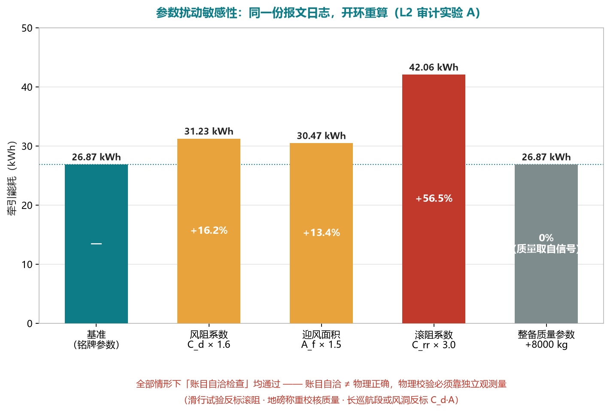
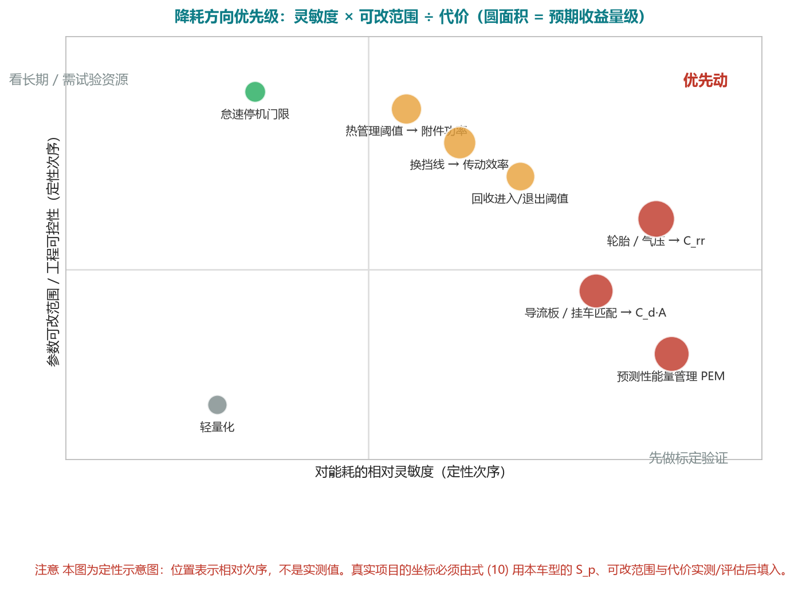
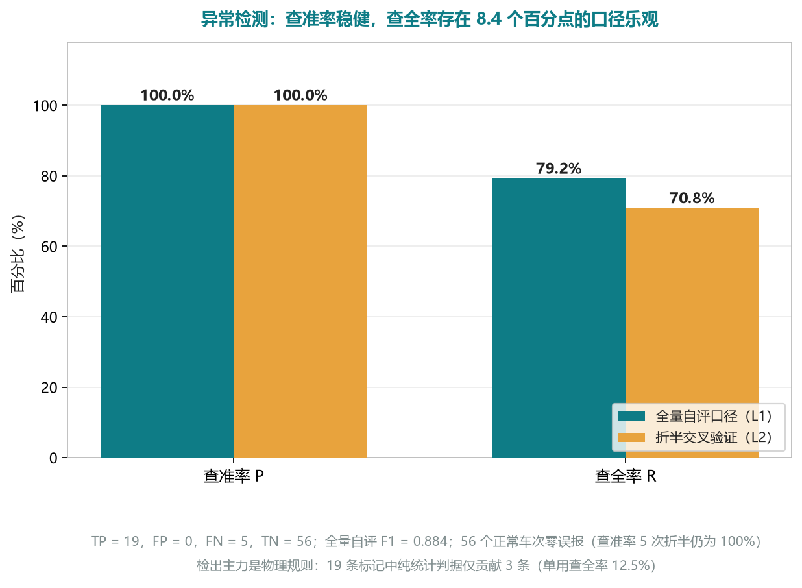

# 面向整车开发与 VCU 标定的整车能耗归因与降耗方向 AI 方案

> **参赛方案**：创科升「AI 应用方案大赛」
> **赛道要求对应**：AI 辅助「数据分析 / 数据整理」场景，提升工作效率与工作质量
> **参赛形式**：**已落地使用的方案**（PPT 讲解 + 现场演示）
> **受众**：**整车开发商**（整车能耗开发 / 性能集成、动力总成与能量管理、热管理、法规与合规、竞品对标）· **VCU 开发厂家**（VCU 控制策略开发、能量管理标定、HIL 与实车测试验证）
> **一句话方案**：把整车每天都在产生、却只被用来"回放和报警"的 CAN / SAE J1939 报文（含台架、转鼓、路试与量产回传数据），通过一套**可复现、可审计**的自动化流水线，翻译成【可对账的能耗账本 + 可分项归因的能量瀑布 + 按性价比排序的降耗方向清单】，把"这车为什么费能"从一句抱怨，变成整车厂与 VCU 团队**可以直接排期、可以标定、可以回归验证**的工程任务。

---

## 0. 摘要（给评审的 60 秒版）

| 项 | 内容 |
|---|---|
| **客户需求** | 用 AI 分析整车能耗，指出**降低能耗的方向**——设计参数改哪个、VCU 策略与标定改哪个、能省多少、怎么验证 |
| **现状痛点** | ① 能耗账目算得出来，但**不可归因**（1.25 kWh/km 里哪一项该改？）；② 分析与决策之间隔着"翻译"，靠资深工程师人肉；③ 不同线路/载荷/温度混着比，**改进效果无法归因**；④ 设计值 vs 在用车实际（滚阻、风阻、附件功率、电池内阻）**无持续反标**；⑤ 策略改动的收益靠"路试 + 感觉"，缺同工况回归基线；⑥ 一次完整能耗分析 4 h/车次，标定项目动辄几百车次，**人力不可扩展** |
| **方案做法（六步法）** | **拆**（能量瀑布）→ **比**（公平基线残差）→ **反**（参数反标定）→ **敏**（灵敏度与优先级）→ **指**（降耗方向清单：设计参数 / VCU 可干预量 / 标定阈值）→ **验**（工况回放 → 台架/转鼓/HIL/实车 A/B 闭环） |
| **核心产出** | ① 能耗瀑布（怠速/附件/滚阻/风阻/坡道/动能/制动耗散/传动损失）② 公平基线残差（剥离工况、载荷、地形、环境）③ 关键参数反标定值（等效滚阻、C_d·A、传动效率、附件功率、电池内阻）④ **降耗方向清单**（可干预量 + 预期收益 + 置信度 + 验证方式，按性价比排序）⑤ 面向工程师的《能耗归因与降耗方向说明书》（LLM 只做翻译，不算数字） |
| **归因精度（原型实测）** | 能耗账目与外部真值**对账误差 1.08% ~ 3.57%**（目标 < 5%）；三方里程互差 **0.01% ~ 0.03%** |
| **开发效率（原型实测）** | 单车次能耗分析 4 h（人工基线）→ **0.00 ~ 0.04 s**；标定项目按 300 车次计：人工约 150 人天 → **分钟级** |
| **落地性** | **不依赖新硬件**，复用现有 T-Box / CAN 记录仪 / 路试记录（MDF4）；原型代码已可运行（见 `prototype/`），第三方独立审计已复现（见 `方案文档/04`） |
| **诚实边界** | 全部指标在**带真值的仿真数据**上实测通过，证明算法自洽、算得准；**不能替代真车与台架验证**。文档中"待实现 / 近似实现 / 待标定假设"三类状态均已逐项标注（见 §4.9、附录 E） |

> **给评审的一句话**：本方案的 AI 不承担"把物理算出来"的活，而是承担**物理模型解释不掉的那部分残差**，并把残差翻译成"哪个设计参数 / 哪条控制策略 / 哪个标定阈值"——这是整车厂与 VCU 厂家真正要的东西。

---

## 1. 背景：能耗开发为什么难

### 1.1 数据现状

整车厂与 VCU 厂家手上其实**不缺能耗数据**，缺的是把数据变成决策的能力：

| 数据源 | 内容 | 采样率 | 典型用途（现状） |
|---|---|---|---|
| 台架 / 测功机 | 发动机燃油率、电驱与电池效率 MAP | 10~100 Hz | 效率标定，孤立于整车 |
| 转鼓 / 环境舱 | 法规或自定义循环、温度、附件状态 | 1~100 Hz | 认证与达标，工况不完全代表真实使用 |
| 路试 / 标定车记录 | 整车 CAN +（可含）VCU 内部量 | 10~100 Hz | 现场调参，交付后**很少被系统化复盘** |
| 量产车 T-Box 回传 | 整车 CAN 信号子集 | 1~10 Hz | 监控大屏 + 故障回放 |
| 标定数据集 / 版本记录 | 参数版本（`dcm`/`cdfx`/`hex`） | 事件级 | 版本管理，**与能耗结果不挂钩** |

一台车一天可产生 **GB 级原始报文**。这些数据目前的应用基本停留在三个层面：**实时监控大屏、故障回放、单点试验报告**——**没有一层是"把能耗拆开、指出该改什么"**。

### 1.2 六个真实痛点（面向整车开发与 VCU）

| # | 痛点 | 具体表现 |
|---|---|---|
| **P1** | **能耗账目在，归因不在** | 能算出 32 L/100km 或 1.25 kWh/km，但拆不出"怠速多少、附件多少、风阻多少、传动损失多少"，于是**不知道该动设计还是动策略** |
| **P2** | **分析与决策之间隔着"翻译"** | 报文里是 `0x0CF00400`、`SPN 183`、`PGN 65257`；决策要的是"换挡线 / 回收阈值 / 热管理目标温度 / C_d·A"。今天这一步靠资深工程师人肉 |
| **P3** | **对比不公平，A/B 结论不可信** | 山区重载、城配空载、冬季开暖风混在一起比，改了一版策略看到"能耗变了"，却说不清是策略的功劳还是天气的功劳 |
| **P4** | **参数漂移不可见** | 设计值 𝐶_rr = 0.0075、`C_d·A`、传动效率、附件功率、电池内阻——**在用车实际是多少、随里程怎么变，没有持续反标机制** |
| **P5** | **迭代闭环缺失** | 策略/标定改动的收益靠"跑一圈看看"，缺**同工况回归基线**；改好了没沉淀，改坏了难定位到版本 |
| **P6** | **人力不可扩展** | 一次完整能耗分析（解码→对齐→算里程→算能耗→切工况→出汇报）**4 h/车次**；一个标定项目几百车次，数据只能躺在库里 |

### 1.3 为什么现在能用 AI 解决

1. **数据已经在了** —— 增量成本几乎为零，这是"快速落地"的前提。
2. **物理模型 + 机器学习互补** —— 能耗有明确的物理规律（能量守恒与纵向动力学），AI 不需要从零学物理，只需学**物理模型解释不掉的残差**：样本需求大幅降低，结果可解释、可归因。
3. **LLM 补齐最后一公里** —— 结构化数字结论由大模型翻译成工程师语言，直接产出可评审、可排期的《降耗方向说明书》；**所有数值由物理与统计模型计算，LLM 只做表达**。

---

## 2. 目标与衡量指标

### 2.1 业务目标

1. 让**任何一个车次、任何一台车**的能耗都能被自动拆解到"分项归因"级别，并给出**该分项对应的可干预量**；
2. 让**关键参数的实际值**（等效滚阻、风阻面积、传动效率、附件功率、电池内阻）可以被持续反标定，并与设计值、竞品值对比；
3. 让**降耗方向**具体到"改哪个设计参数 / 哪条 VCU 策略 / 哪个标定阈值 / 预期省多少 / 用什么方式验证"，并能在同工况下**回归验证是否真的省下来了**。

### 2.2 可量化指标（KPI）

| 类别 | 指标 | 目标值 | 验证方式 | 当前状态 |
|---|---|---|---|---|
| **归因精度** | 能耗账目与外部真值**对账误差** | **< 5%** | 加油小票 / 充电订单 / 台架称重 | 原型实测 **1.08% ~ 3.57%** |
| **归因精度** | 里程三路径互差 | < 2% | 车速积分 / 里程表差分 / GNSS | 原型实测 **0.01% ~ 0.03%** |
| **归因覆盖** | 能耗账目可分解率 | 100% | 瀑布分项之和回到总量 | 100%（**按定义闭合**，配平项见 §4.9） |
| **归因覆盖** | 分项分解与真值偏差（参数正确车次） | < 5% | 与仿真真值逐项对照 | 合格车次 **0.00% ~ 0.03%**；参数已错标车次 **9.08%**——这**不是误差，是待检测的信号** |
| **方向有效性** | 降耗方向清单中"经台架/实车验证有效"的比例 | **≥ 60%**（试点标定） | 试点项目逐条闭环 | 待试点（**测算目标**） |
| **开发效率** | 单车次能耗分析耗时 | 4 h → **< 3 min** | 人工基线 vs 自动化计时 | 实测 **0.00 ~ 0.04 s** |
| **开发效率** | 标定迭代周期 | 周 → 天（试点） | 项目里程碑对比 | 待试点（**测算目标**） |
| **参数一致性** | 关键参数反标定重复性（同车多次） | 相对离散 < 5% | 重复反标 | 待实现后评测（滚阻口径实测离散 0.003%，因其恒由铭牌值决定，见 §4.6.3） |
| **法规口径** | 法规工况口径能耗影响预估偏差 | < 3%（试点标定） | 与转鼓实测对比 | 待试点（**测算目标**） |

> **给评审的关键点**：本方案把"效率指标"（4 h → 分钟级）与"精度指标"（对账误差 < 5%）都做成了**可现场复现**的形式（`python run_demo.py`），并且**主动标注了每一个尚未实现的能力**（§4.9）——因为这套东西要交给整车厂与 VCU 厂家的工程师用，**口径不实比功能不足更致命**。

---

## 3. 数据基础

### 3.1 数据来源

| 来源 | 内容 | 采样率 | 作用 |
|---|---|---|---|
| 整车 CAN / J1939 报文 | 动力、行驶、能量流信号 | 10~100 Hz | **主数据源** |
| 路试 / 标定测量记录 | 整车 CAN + **VCU 内部量**（XCP/CCP + A2L） | 10~100 Hz | 策略达成率、限扭与降功率原因（见 §4.6.5） |
| GNSS 轨迹 | 经纬度、海拔、速度、方向 | 1 Hz | 坡度估计、里程校验、线路画像 |
| 载重 / 悬架压力 | 轴荷、总重 | 1~10 Hz | 质量获取（能耗第一敏感因子） |
| 环境 | 温度、胎压、空调状态 | 0.1~1 Hz | 风阻/滚阻修正、附件能耗归因 |
| 台架 / 转鼓 / 环境舱 | 燃油率、效率 MAP、循环工况 | 10~100 Hz | **独立真值**与参数标定 |
| 标定数据集与版本 | 参数版本、软件版本 | 事件级 | **A/B 版本能耗对比** |
| 称重 / 滑行试验 / 风洞或长巡航段 | 质量、滚阻、C_d·A | 事件级 | **独立观测量**（参数反标定的校核基准） |

### 3.2 关键信号清单（示例，需按实际 DBC / A2L 映射）

**燃油车**

| 信号 | 典型来源 | 单位 | 用途 |
|---|---|---|---|
| `WheelBasedVehicleSpeed` | J1939 PGN 65265 / SPN 84 | km/h | 里程、动力学 |
| `EngineSpeed` | PGN 61444 / SPN 190 | rpm | 功率计算 |
| `ActualEnginePercentTorque` | PGN 61444 / SPN 513 | % | 扭矩法反算功率 |
| `EngineFuelRate` | PGN 65257 / SPN 183 | L/h | **油耗主信号** |
| `TotalFuelUsed` | PGN 65257 / SPN 250 | L | **对账基准** |
| `AcceleratorPedalPosition` | PGN 61443 / SPN 91 | % | 需求识别 |
| `BrakeSwitch` | PGN 65265 / SPN 597 | 0/1 | 制动与回收识别 |
| `SelectedGear` / `CurrentGear` | PGN 61445 | — | **换挡线评价** |
| `HighResolutionTotalVehicleDistance` | PGN 65217 / SPN 917 | km | 里程校验 |
| `TotalVehicleMass`（或悬架压力） | 悬架/轴荷模块 | kg | 质量 |

**新能源车**

| 信号 | 单位 | 用途 |
|---|---|---|
| `BatteryVoltage` / `BatteryCurrent` | V / A | **电能主信号** 𝑃 = 𝑈 · 𝐼 |
| `StateOfCharge` | % | SOC 对账（ΔSOC 校验）、SOC 窗口评价 |
| `MotorSpeed` / `MotorTorque` | rpm / N·m | 电驱功率、**工作点 vs 高效区** |
| `RegenBrakeTorque` | N·m | 能量回收量化 |
| `MotorTemperature` / `BatteryTemperature` | °C | 热管理损耗、**回收受限事件** |
| `AuxiliaryPower`（空调 / 加热 / 冷却） | kW | 附件与热管理能耗（**纯电冬季大头**） |

**VCU 内部量（建议纳入，需 XCP/CCP + A2L）—— 这是"从分析到策略"的关键接口**

| 内部量 | 用途 |
|---|---|
| 目标驱动扭矩 / 实际驱动扭矩 | 需求仲裁与执行偏差 |
| 目标回收扭矩 / 实际回收扭矩 | **回收策略达成率** |
| 回收允许标志 / 回收受限原因 | 为什么没回收（温度、SOC、ABS、车速） |
| 怠速停机允许标志 / 状态机 | 启停策略达成率 |
| 热管理请求等级 / 目标温度 | 附件与热管理策略评价 |
| **限扭原因 / 降功率原因** | 能耗偏差中"被限制"的那一部分 |
| 电池可用充放电功率（BMS 限值） | 回收与驱动受限的量化 |
| 挡位请求 / 实际挡位 | 换挡线一致性 |
| 辅机状态（空压机、电子风扇、水泵、转向泵） | 附件能耗按需控制效果 |

### 3.3 数据质量现实（必须正视）

| 问题 | 影响 | 应对 |
|---|---|---|
| 丢帧 / 总线负载抖动 | 信号时间轴有洞 | 质量评分 + 插值/物理模型补全 |
| 时间戳漂移（设备本地时钟） | 多源无法对齐 | 与 GNSS UTC 对齐，估计并补偿时钟偏置 |
| 信号分辨率低（如 `TotalFuelUsed` 步进 0.5 L） | 短行程对账误差大 | 长窗口对账 + 多信号交叉验证 |
| DBC 不完整 / 保密 | 部分信号解不出 | J1939 标准 PGN 反查 + 逆向解析 + 物理量反推 |
| **无 CRC / 校验字段** | 被破坏的帧会被**静默接受**为有效数据 | 量程断言 + 卡死检测（原型已在质量分中实现）；接入真车 DBC 时**必须确认是否有校验字段** |
| 单位与符号约定不统一 | 计算出负数/量级错误 | 单位注册表 + 量纲断言 + 自动告警 |
| 信号缺失（低配车型） | 关键量算不出 | 冗余估计（见 §4.6.3），并**显式标记降级**（原型当前存在一处静默回退缺陷，见 §4.9） |

### 3.4 数据安全与合规

- **标定数据与量产回传数据分级存储**：原始报文（热 30 天 + 冷归档 1 年）、分析结果（长期）；
- **车辆与人员信息解耦**：分析侧只用匿名车辆 ID，如需人员维度须单独授权；
- **对外汇报只出聚合结论**，不出现可定位到个人的轨迹细节；
- **VCU 内部量（XCP/A2L）属于厂家核心资产**：本方案支持"内部量只在本地/厂内网分析、只输出归因结论与方向清单"的部署形态。

---

## 4. 技术方案

### 4.1 总体架构



**技术选型**（全部为成熟开源组件，降低落地风险）

| 环节 | 选型 | 理由 |
|---|---|---|
| 报文解码 | `cantools` + `python-can`（原型已验证） | 工业标准 DBC 解析 |
| 计算引擎 | Python (pandas/numpy) → 规模化后 PySpark | 单车用 pandas 足够快，全量车队上 Spark |
| 时序存储 | TDengine / InfluxDB | 高写入吞吐，降采样查询 |
| 分析库 | ClickHouse / DuckDB | 列存聚合快，支持 SQL 自助分析 |
| 机器学习 | scikit-learn → LightGBM/XGBoost | 树模型对表格特征最强、可解释 |
| 可解释性 | 单参考点贡献分解（**SHAP 的高效近似**）→ 生产环境 `shap.TreeExplainer` | 逐条结论可归因 |
| 报告生成 | LLM（结构化 Prompt + 数值回校验） | 数字 → 工程师语言 |
| 可视化 | ECharts / matplotlib | 看板与静态报告 |

### 4.2 处理流水线（核心 8 步）

1. **解码**：DBC/A2L 定义 → 物理值；未知 ID 走 J1939 标准 PGN 反查表；记录 **CAN ID 在 DBC 中的命中率**（注意：该指标**不度量信号完整性**，见 §4.9）。
2. **对齐**：全部信号统一到 **UTC + 10 Hz 网格**（连续量线性插值、累计量零阶保持、开关量就近取值），GNSS 作为时间基准。
3. **清洗**：物理量纲断言（车速 0~160 km/h、转速 0~2600 rpm、燃油率 0~200 L/h 等）、常量段识别（传感器卡死）。
4. **质量评分**：每车每日 0~100 分（ID 命中率、缺失率、最长空档、信号卡死、越量程点，按**信号重要度加权**），低分数据自动标注"结论置信度低"。
5. **里程与能耗计算**：见 §4.4，要求**三条独立路径互相校验**。
6. **工况切分**：见 §4.5，把行程切成怠速/起步/巡航/爬坡/制动等片段。
7. **特征工程**：片段级 + 行程级特征，并**按"作业条件 / 驾驶与操作 / 车辆状态"分组**（分组决定残差代表什么，见 §4.7）。
8. **建模与产出**：六步法 → 归因 → 方向清单 → 报告。

### 4.3 里程计算（三条路径交叉校验）

| 路径 | 方法 | 特点 |
|---|---|---|
| A. 车速积分 | 𝑠 = ∫ 𝑣 𝑑𝑡（梯形法，CAN 轮速信号） | 连续，但有累积误差 |
| B. 里程表差分 | Δ(TotalVehicleDistance)（取 max − min，抗单点毛刺） | 最准，但受 0.005 km/bit 量化限制 |
| C. GNSS 速度积分 | 𝑠 = ∫ 𝑣_GNSS 𝑑𝑡（梯形法） | 独立**传感器**，但隧道/城市峡谷丢星 |

> **实现口径说明（v2 更正）**：三条路径的**数值算子相同**（都是梯形积分或首尾差分），**独立性来自传感器不同**（轮速 / 里程表计数器 / GNSS 测速），而不是算法不同。v1 曾把路径 C 描述为"相邻点大圆距离之和（haversine）"，**与代码不符**——代码是对 `GNSSSpeed` 做梯形积分。若要增加真正的**几何**第三方校验，应改为对经纬度做相邻点大圆距离求和（列为待补项）。

**融合策略**：以 B 为主，A 做高频细分，C 做异常检测。三者两两偏差 > 2% 时告警并降级标注。

### 4.4 物理内核：能量瀑布

#### 4.4.1 燃油车：化学能 → 车轮

燃油低热值取 LHV = 42.8 MJ/kg，密度 0.84 kg/L → 35.95 MJ/L ≈ 9.99 kWh/L（可按实测油品标定）。

**（1）主算法 —— 燃油率积分**

𝐸_fuel [L] = ∫ EngineFuelRate [L/h] dt / 3600<br>
𝐸_chem [kWh] = 𝐸_fuel × 9.99

**（2）对账算法 —— 累计油耗差分**

𝐸_fuel_ref[L] = TotalFuelUsed(𝑡_end) − TotalFuelUsed(𝑡_start)

> 两条路径偏差 > 5% 时，说明 ECU 燃油率信号或数据质量有问题，自动标记。

**（3）补全算法 —— 扭矩法**（燃油率信号缺失时）

𝑃_e [kW] = 𝑇_e [N·m] × ω [rad/s] / 1000<br>
𝑇_e = ActualEnginePercentTorque [%] × 额定扭矩<br>
BSFC = 𝑓(𝑛, 𝑇_e)（万有特性 MAP 查表，g/kWh）<br>
FuelRate [L/h] = 𝑃_e × BSFC / 1000 / 0.84

**（4）燃油侧瀑布口径（与原型实现一致）**

| 分项 | 含义 |
|---|---|
| E_idle_aux | 怠速与附件耗能（v < 1 km/h 期间的燃油能量） |
| E_dt_loss | 传动损失 (1 − η_dt) |
| E_engine | 发动机热效率 / 部分负荷损失 ← 配平项，见下 |
| E_trac | 车轮牵引能量（经传动） |

合计：𝐸_chem = 𝐸_idle_aux + 𝐸_dt_loss + 𝐸_engine + 𝐸_trac

𝐸_trac = 𝐸_roll + 𝐸_aero + 𝐸_grade(净值) + 𝐸_kinetic + 𝐸_brake

> ⚠️ **必须说清的口径**：`E_engine`（发动机热效率/部分负荷损失）在原型中是**配平项**（总能量 − 怠速附件 − 传动前牵引能量），因此瀑布**按定义闭合**、残差恒为 0。**这不是验证，是代数恒等式**。要让这一项变成独立可计算的量，必须引入**实测 BSFC 万有特性 MAP**（台架数据）——已列入 §4.9 待办。

#### 4.4.2 新能源车：电池 → 车轮

𝑃_batt [kW] = 𝑈 [V] × 𝐼 [A] / 1000（放电为正，回收为负）<br>
𝐸_batt [kWh] = ∫ 𝑃_batt dt<br>
E_aux：附件 / 热管理电耗<br>
E_regen：能量回收（收益）<br>
E_drive_loss：电驱与传动损失

**对账**：**ΔSOC × 额定电量** 应与 `E_batt` 一致，偏差 > 5% 告警。
**附件必须单拆**：冬季纯电附件（空调/加热/热管理）可占 20%~35%，是**热管理策略与硬件选型的第一优化对象**。
> ⚠️ 原型中**回收效率 0.55 为待标定假设**，**附件电耗为参数常数**（未从信号计算）；真实项目必须替换为实测回收效率 MAP 与空调/加热/冷却 CAN 信号——已列入 §4.9。

#### 4.4.3 纵向动力学能耗分解

整车纵向受力：

| 分项 | 表达式 |
|---|---|
| 惯性 | 𝑚_eff · 𝑎 |
| 坡道 | 𝑚 · 𝑔 · sinθ |
| 滚动阻力 | 𝑚 · 𝑔 · 𝐶_rr · cosθ |
| 空气阻力 | ½ · ρ · 𝐶_d · 𝐴 · (𝑣 + 𝑣_wind)² |

合计：𝐹_total = 𝑚_eff · 𝑎 + 𝑚 · 𝑔 · sinθ + 𝑚 · 𝑔 · 𝐶_rr · cosθ + ½ · ρ · 𝐶_d · 𝐴 · (𝑣 + 𝑣_wind)²

其中 𝑚_eff = 𝑚 · (1 + δ)，δ ≈ 0.04~0.10（旋转惯量等效系数）。

车轮处需求功率 𝑃_wheel = 𝐹_total · 𝑣；驱动 𝑃_engine = 𝑃_wheel / η_drivetrain + 𝑃_aux；制动 𝑃_brake_loss = abs(𝑃_wheel) × (1 − η_regen)。

**这张瀑布就是"能耗花在哪"的答案**，也是后续三步（反、敏、指）的输入。



#### 4.4.4 三个难点的工程解法（含实现状态）

| 难点 | 方案 | **当前实现状态** |
|---|---|---|
| **整车质量 m 未知** | ① 轴荷/悬架压力传感器直接读数；② 无传感器时递推最小二乘辨识 𝑚̂ = (𝐹_drive − 𝐹_resist) / 𝑎（工况筛选：abs(𝑎) > 0.3 m/s²、无换挡、无制动） | ① 已实现；② **待实现**——当前无信号时**静默回退铭牌质量且不标记降级**，这是已定位缺陷（影响重载变化场景的瀑布分解） |
| **道路坡度 θ 未知** | ① IMU 纵向加速度与车速微分求坡度；② GNSS 海拔回归；③ 卡尔曼滤波融合 | ① 已实现（5 s 滑动平均，优先）；② 已实现（30 s 窗口线性回归，**回退路径**）；③ **卡尔曼融合待实现**（当前是 `if/elif` 回退，不是融合） |
| **风速 / 风阻** | 无风速传感器时按 𝑣_wind = 0 处理并**标定**：用长期巡航段数据反标 `C_d·A`，把系统偏差吸收进气动系数 | 反标定方法已设计，**长窗口自动反标待实现**（见 §4.6.3） |

### 4.5 工况切分（Operating Mode Segmentation）

**方法**：规则状态机（可解释、可审计）+ 无监督聚类（发现未知模式）双轨。

| 工况 | 判定条件（示例） | 关注点（面向开发） |
|---|---|---|
| 怠速 | v < 1 km/h 且动力系统运行 | 怠速时长占比、怠速燃油率 → **启停策略** |
| 起步/加速 | a > 0.3 m/s² | 大功率需求次数 → **扭矩仲裁与功率限制** |
| 匀速巡航 | abs(a) < 0.2 m/s² 且 v > 40 km/h | 经济车速达成率 → **巡航与限速策略** |
| 减速/制动 | 𝑎 < −0.3 m/s² 或制动开关 = 1 | **可回收但未回收的减速事件** → 回收策略 |
| 爬坡 | θ > 1.5% | 挡位/工作点是否合理 → 换挡线、PEM |
| 下坡 | θ < −1.5% | 回收与辅助制动配比 → 回收阈值 |
| 停车熄火 | 𝑣 = 0 且转速/电流 = 0 | 长时间怠速不熄火 → 启停门限 |

**聚类补充**：对片段的速度-加速度-坡度三维轨迹做 KMeans / DTW 聚类，自动发现"高频启停的城配工况""长时间高速满载工况"等，用于**工况库建设**（§4.6.6）。

### 4.6 六步法：从能耗数据到降耗方向

> 这是 v2 的核心方法学。**拆→比→反→敏→指→验**，每一步都对应一个交付物与一个决策。



#### 4.6.1 第一步 · 拆（Decompose）

输出**能量瀑布**：一个总能耗数字 → 8 个可归因分项。分项的定义见 §4.4.1 / §4.4.2。
**判据**：分项之和回到总量（**按定义闭合**）；分项占比与历史基线、同类车型对比给出"异常分项"提示。

#### 4.6.2 第二步 · 比（Benchmark）

把**不可控因素**（线路地形、载荷、车型车龄、环境温度、时段）从能耗里剥离出去，得到"这台车在这趟活里**本应**消耗多少"：

**𝑟 = 实际能耗 − 基线模型预测能耗**（残差）

- **r ≈ 0** → 正常
- **r > 0**（显著）→ **在同等条件下比应有水平更耗能** → 进入归因（是车、是策略，还是操作）
- **r < 0** → 优秀，可作为**同一车型的达标基线**沉淀下来（面向 OEM 的"内标杆"）

> **这一步是"A/B 结论可信"的前提**：没有公平基线，改了一版策略看到能耗变了，也无法判断是策略的功劳还是天气的功劳。

#### 4.6.3 第三步 · 反（Re-calibrate）—— 参数反标定

从长期实车数据反推**等效物理参数**，与设计值、竞品值对比：

| 反标定量 | 方法（设计） | 可辨识条件 | 对应降耗方向 |
|---|---|---|---|
| 等效滚阻 `C_rr,eff` | 滑行段（无驱动无制动）功率平衡反解 | 需要有足够长的滑行段与准确质量 | 轮胎选型/气压、轴承、制动拖滞 |
| 风阻面积 `C_d·A` | 长巡航段功率-速度回归（Δ𝑃 ∝ 𝑣³） | 需无风或长期统计，速度分布要宽 | 造型、导流板、挂车匹配、限速策略 |
| 传动效率 `η_dt` | 驱动段 **P_wheel / P_engine** 统计 | 需准确扭矩/功率信号 | 变速器速比、润滑、挡位策略 |
| 附件功率 `P_aux` | 怠速与停车段功率基线 | 需区分怠速与熄火状态 | 空调/热管理阈值、辅机按需控制 |
| 电池内阻 `R_batt` | 充电/放电段 **ΔU / ΔI**（多温度点） | 需多温度、多 SOC 点覆盖 | 加热/冷却阈值、SOC 窗口 |

> ⚠️ **当前状态（必须写清）**：`C_rr` 在原型中**恒取铭牌值**，因此"滚动阻力能耗"在所有车次上是常数——实测**每吨公里滚阻能耗恒为 0.02042~0.02043 kWh/(t·km)，相对离散仅 0.003%**（审计复算 `audit/audit3.py` 实验 M）。这意味着：
> ① **滚阻能耗不能作为滚阻故障的检测器**；
> ② **参数反标定是 v2 明确列出的待实现能力**（`C_rr,eff`/`C_d·A` 的自动反标）；在补齐之前，本方案只能给出"参数可能偏离"的**假设**，必须由**独立观测量**（称重、滑行试验、风洞或长巡航回归）闭环确认。



#### 4.6.4 第四步 · 敏（Sensitivity）—— 灵敏度与优先级

**"哪个参数更值得改"不能靠感觉，要用灵敏度排序：**

**优先级 = (Δ分项能耗 / Δ参数) × 参数可改范围 ÷ 改动代价与风险**

审计已复算的**参数扰动敏感性**（同一份报文日志，改动整车参数后重算牵引能耗）：

| 参数设定 | 牵引能耗 | 相对基准 | 账目自洽性检查 |
|---|---:|---:|---|
| 基准（铭牌参数） | 26.87 kWh | — | 通过 |
| 风阻系数 `C_d` × 1.6 | 31.23 kWh | **+16.2%** | 通过 |
| 迎风面积 `A` × 1.5 | 30.47 kWh | **+13.4%** | 通过 |
| 滚阻系数 `C_rr` × 3.0 | 42.06 kWh | **+56.5%** | 通过 |
| 整备质量参数 +8000 kg | 26.87 kWh | 0%（**质量取自信号，参数不生效**） | 通过 |

> 这张表同时说明两件事，本方案两件都讲：
> **(a) 分项能耗对参数高度敏感** → 灵敏度分析就是降耗方向排序的依据；
> **(b) 只做"账目自洽性检查"发现不了参数错标**（牵引能耗偏 57% 仍然全绿）→ 真正的物理校验必须依赖**独立观测量**（滑行试验反标滚阻、称重校核质量、长巡航段反标 C_d·A）。这条结论是审计用对抗性实验得到的，本方案把它写进方法学，而不是藏起来。



#### 4.6.5 第五步 · 指（Prescribe）—— 降耗方向清单

把前四步的结果翻译成**可排期的工程任务**，每条包含：

```
{能耗分项, 当前值/占比, 基准值, 偏差,
 候选可干预量（设计参数 / VCU 策略 / 标定阈值）,
 预期收益（单位与口径）, 置信度,
 需要的独立观测验证, 建议验证方式（台架 / 转鼓 / HIL / 实车A/B）}
```

**VCU 可干预量 × 能耗分项映射（摘要，全表见 `方案文档/05`）**

| 能耗分项 | 设计侧可改 | **VCU / 标定侧可改** | 分析侧证据 |
|---|---|---|---|
| 怠速 / 停车耗能 | 起停硬件、电动化附件 | 怠速停机允许条件、驻车取力策略、怠速转速 | 怠速时长与占比、每百公里怠速秒数 |
| 附件 / 热管理 | 热泵 vs PTC、保温、风道 | 压缩机转速与占空比、PTC 分级、风扇/水泵按需、目标温度与阈值 | 附件功率占比 vs 环境温度偏离曲线 |
| 制动耗散 / 回收 | 制动器规格、回收上限 | 回收强度分级、进入/退出阈值、制动扭矩分配、滑行回收策略 | 回收占比、**"可回收未回收"事件清单** |
| 传动损失 | 挡位数、速比、轴承润滑 | 换挡线、锁止离合器、挡位保持 | 巡航挡位/转速分布 |
| 空气阻力 | `C_d`、迎风面积、导流板 | 巡航目标车速、限速、预测性滑行/跟驰 | 巡航车速分布、`C_d·A` 反标值 |
| 坡道 / 动能 | 轻量化、旋转惯量 | **预测性能量管理（地形前瞻）**、坡道-回收耦合 | 坡度序列、下坡回收达成率 |
| 电池 / 热管理（EV） | 内阻、热管理架构 | SOC 窗口、加热/冷却阈值、低温回收限值 | 温度-内阻-回收受限事件 |
| 电驱工作点（EV） | 电机效率 MAP、拓扑 | 双电机扭矩分配、单/双电机切换门限 | 工作点热力图 vs 高效区占比 |

> **如果 VCU 内部量能通过 XCP/A2L 取到**，本方案还能再往下一层：直接算出**目标值 vs 实际值的执行偏差**（目标回收扭矩 vs 实际回收扭矩、热管理请求等级 vs 实际功率），以及**限扭/降功率原因**的时长占比——**这是"能耗偏差里有多少是策略没执行到位"的直接证据**，也是 VCU 厂家最想要的输出。



#### 4.6.6 第六步 · 验（Verify）—— 闭环验证

```
真实工况 → 切分与聚类 → 代表性循环（工况库）
      → 导出给 Simulink / HIL / 台架 / 实车
      → 施加改动（设计参数 / 策略 / 标定阈值）
      → 同工况复测 → 与回归基线对比 → 确认收益 → 沉淀为新基线
```

**判据**：同工况（线路、载荷、温度带、工况分布一致）下，改动前后能耗差异 > 基线波动带（由同版本重复试验给出）才认定有效；否则视为无效，回到第四步重排优先级。

### 4.7 AI 建模层（本方案的"智能"部分）

#### 模型 1：能耗基线预测（核心）

- **任务**：给定"这台车、这条线路、这个载重、这个温度、这种工况"，预测**应该**消耗多少能耗。
- **输入特征**按语义分组（**分组决定残差代表什么**）：

| 特征组 | 具体特征 | 是否进入作业基线 |
|---|---|---|
| 载荷 | 整车总质量、载重利用率 | ✅ |
| 线路地形 | 累计爬升/下降、平均/最大坡度、坡度分布 | ✅ |
| 环境 | 平均温度、空调使用时长 | ✅ |
| 车辆 | 车型、车龄、总里程、动力型式 | ✅ |
| **驾驶/操作** | PKE（正动能需求）、急加速/急减速次数、油门开度标准差、车速带占比、巡航占比 | ❌ **必须排除**，否则残差会把"操作方式"吸收掉，无法分离成可改的工程项 |

- **模型**：`HistGradientBoostingRegressor`（原型已用）/ 生产用 LightGBM；目标变量 `L/100km` 或 `kWh/100km`。
- **输出**：预测值 + **残差 𝑟 = 实际 − 预测**（见 §4.6.2）。
- **实测（原型）**：样本外 𝑅² = 0.894，MAE 1.71 L/100km，MAPE 4.61%。
- ⚠️ **口径声明**：该 R² 来自**工况高度同质的仿真车队**（`avg_speed_moving_kph` 相对离散仅 2.9%、`distance_km` 2.4%、`payload_t` 23.9%）。审计实验表明：**单特征（整车总质量）R² = 0.797**，**载荷+地形 4 特征 R² = 0.909**（高于 14 特征口径）。因此该指标相对真实项目**偏乐观**；真实项目的模型价值必须重新标定。

#### 模型 2：能耗异常检测

**三级判据（如实分工）**：

1. **物理规则**（可解释、小样本稳健）：长时间怠速、急加速/急减速/PKE、经济车速占比、车速偏高（风阻）、整体能效偏低、胎压偏低 —— **原型已实现 6 类**；
2. **残差统计**：**𝑧 ≥ 1.8** 且超出量 **> 1.5%**（**单点判定；"持续 𝑁 段"为待实现的稳健化设计**）；
3. **无监督离群**：IsolationForest（`iso_quantile = 0.88`），在"片段特征 + 物理残差"空间上找离群点。

**实测（原型，全量自评口径）**：查准率 **100%**、查全率 **79.2%**、F1 **0.884**（TP=19 / FP=0 / FN=5 / TN=56，**56 个正常车次零误报**）。
**审计复核**：折半交叉验证（阈值只在半数样本上标定、在另一半评估）下查准率仍为 **100%**（5 次折半均如此），查全率降至 **70.8%** → **"零误报"是稳健结论，查全率存在约 8.4 个百分点的乐观偏差**。
**审计的另一条结论（必须如实说）**：全系统 19 条标记中，**纯统计路径只贡献 3 条**（单独使用该判据查全率仅 12.5%）——**检出主力是物理规则**；AI 的主要贡献在**公平基线（比）与归因（指）**，而不是"检出"。这符合本方案"AI 学物理模型解释不掉的残差"的设计原则。



#### 模型 3：贡献分解与归因（面向"改哪个量"）

用**单参考点贡献分解**（把某特征替换为车队中位数，观察预测变化量；即 **SHAP 的高效近似**，生产环境替换 `shap.TreeExplainer`）给出每个车次的偏差来源分解，例如：
> 本车次能耗高于同类基线 6.2%，其中 **3.1% 来自减速段回收不足、1.8% 来自巡航车速偏高、1.3% 来自长时间怠速**。

#### 模型 4：参数与车况趋势监控

对同一台车的残差序列做 **CUSUM 变点检测**：残差均值持续上移 → 提示"该车技术状况/参数标定正在偏离"，用于**把问题发现提前到故障码之前**，并作为"是否需要重新反标定"的触发条件。

#### 模型 5：LLM 说明书生成

把结构化结果（能量瀑布、残差、反标定参数、灵敏度排序、方向清单、验证建议）按固定 JSON Schema 交给大模型，生成：
- 面向**整车能耗开发/性能集成**的《能耗归因与降耗方向说明书》
- 面向**VCU 策略与标定工程师**的《可干预量清单与标定建议》
- 面向**台架/HIL 验证**的《工况回放与试验需求单》

**约束**：LLM 只做"翻译与表达"，**所有数字由物理模型和统计模型计算**，禁止 LLM 生成或推算数值 —— 通过 Prompt 硬约束 + 输出数值回校验（正则提取后与源数据比对）保证。

### 4.8 可解释性与验证机制（v2 的诚实版）

**必须区分两类检查，v1 曾把它们混为一谈：**

| 检查 | 性质 | 能证明什么 | 不能证明什么 |
|---|---|---|---|
| **账目自洽性**：瀑布分项之和 = 总能耗 | **按定义闭合的代数恒等式**（残差 ~1e-14% 是浮点零） | 计算链路没有丢项/重复计项 | **不能**证明物理模型算得对（实验 A：参数错标 3 倍滚阻，牵引能耗偏 57%，仍全绿） |
| **里程互差**：积分/里程表/GNSS | 只依赖报文信号 | 报文链路与里程口径可信 | 与整车参数无关，发现不了参数错标 |
| **外部独立验证**：加油/充电对账 | **真正的验证** | 能耗账目与真值一致 | 需要外部真值数据 |
| **外部独立验证**：称重 / 滑行试验 / 风洞或长巡航反标 | **真正的物理验证** | 质量、滚阻、`C_d·A` 等参数是否正确 | 需要试验资源，属 v2 待补能力 |

**发布门禁**：一份《降耗方向说明书》必须通过 ① 账目自洽性 ② 三方里程互差 ③ 外部对账（如有真值）三项，且凡涉及"参数偏离"的结论必须附**独立观测验证建议**，否则不得对外发布。

### 4.9 已知缺陷与待实现清单（本方案主动公开）

| # | 项 | 现状 | 影响 | 计划 |
|---|---|---|---|---|
| 1 | 无轴荷信号时的质量估计 | **静默回退铭牌质量，不标记降级**（RLS 辨识**待实现**） | 重载变化场景的瀑布分解与残差会系统性失真 | 补递推最小二乘辨识（约 40 行）+ 工况筛选 + 质量分降级标记 |
| 2 | 坡度估计 | IMU 滑动平均优先 + GNSS 回归回退（**卡尔曼融合待实现**） | 坡度噪声进入滚阻/坡道分项 | 实现卡尔曼融合，或以 GNSS+IMU 融合滤波器替代 |
| 3 | 贡献归因 | **单参考点置换近似**（非严格 SHAP） | 归因贡献不满足可加性/一致性公理 | 生产环境替换 `shap.TreeExplainer` |
| 4 | 异常判据持续性 | 逐车次**单点判定，无"持续 N 段"要求** | 单次异常可能被过度解读 | 引入片段级持续性与时间窗聚合 |
| 5 | 仿真器物理约束 | `solve_feasible_profile` 求解功率可达轨迹时**未施加滚阻倍率**（约 3 行可修） | 80 车次中 12 个峰值需求越界（> 347 kW）、6 个超额定 353 kW；**对能耗账目无影响**，但削弱"真值物理自洽"的宣称 | 修复并重跑全量基准 |
| 6 | EV 能量回收效率 | 固定假设 **0.55** | 回收收益与电驱损失分项失真 | 用实测回收效率 MAP（转速/温度/功率）替换 |
| 7 | EV 附件/热管理电耗 | **参数常数**，未从信号计算 | 无法评价热管理策略与硬件选型 | 接入空调/加热/冷却 CAN 信号或实测 MAP |
| 8 | 发动机热效率/部分负荷损失 | **配平项** | 该分项不可独立解释 | 引入台架 BSFC 万有特性 MAP |
| 9 | 参数反标定 | `C_rr,eff` / `C_d·A` 自动反标**待实现** | 无法自动定位"设计值 vs 在用车实际"的偏离 | 实现长窗口反标 + 外部观测校核 |
| 10 | 异常判据阈值 | 阈值取自**被评测的同一批数据** | 查全率乐观约 8.4 个百分点 | 阈值改由独立标定集确定；对外标注口径 |
| 11 | 近邻基线 | "同类"里**混有同类型故障车**（占比均值 22.2%、最大 56%） | 基线被抬高，灵敏度下降 | 计算近邻中位数时剔除已标记异常车次 |
| 12 | 特征重要度 | 用**训练集预测自证** | 重要度被高估 | 改用折外预测计算 |
| 13 | 解析鲁棒性指标 | "ID 命中率"**不度量信号完整性**（实验 J：破坏 5% 帧载荷仍 100%） | 可能掩盖数据损坏 | 更名并补充位翻转/截断鲁棒性实验；接入真车 DBC 时确认 CRC |

> **为什么要把这张表放进方案**：本方案的受众是整车厂与 VCU 厂家的工程师，他们**一定会**问"哪些是真的实现了"。事前写清楚，比现场被问出来好；而且这张表本身就是"我们真的读过自己的代码"的证据。

---

## 5. 面向整车开发的六类应用场景

| # | 场景 | 使用者 | 输出 | 频次 |
|---|---|---|---|---|
| 1 | **能耗归因与降耗方向评审** | 整车能耗开发 / 性能集成 | 能量瀑布 + 灵敏度排序 + 降耗方向清单 | 每轮标定 / 每版本 |
| 2 | **VCU 策略与标定优化** | VCU 策略开发、能量管理标定 | 目标-实际执行偏差、可干预量清单、阈值建议与预期收益 | 每标定迭代 |
| 3 | **热管理与附件能耗优化** | 热管理、电气架构 | 附件/热管理分项、温度-能耗曲线偏离、按需控制效果 | 季节切换 / 每版本 |
| 4 | **参数一致性看板** | 整车集成、质量 | 等效滚阻 / `C_d·A` / 传动效率 / 内阻的分布与漂移趋势 | 周 / 月 |
| 5 | **A/B 版本能耗回归** | 标定版本管理、测试验证 | 同工况下软件/标定版本的能耗差异与置信区间 | 每次发版 |
| 6 | **工况库与试验输入** | 台架/HIL/仿真 | 代表性循环数据集（含坡度、载荷、温度维度）与回放配置 | 项目立项 / 阶段门 |

> **下游衍生价值（不作为本方案的价值主张）**：同一套输出可直接供物流车队做运营节能（v1 曾按 100 台车队测算年化 54 万~144 万元）。本方案的验收与价值主张**不依赖**该场景。

---

## 6. 落地路径（对齐 9/30 报名、10/13 路演）

**现实约束**：从报名截止（9/30）到路演（10/13）只有 **13 天**，路线图按"路演前必须完成什么"倒排。

### 阶段 0：数据与接口摸底（D1–D2，2 天）

- [ ] 拿到 **≥ 3 台车、≥ 5 天**的原始报文样本（`.blf` / `.asc` / `candump` / **`.mf4`**）
- [ ] 拿到对应 **DBC**；如能拿到 **A2L**，确认可读取的 VCU 内部量清单（目标扭矩、回收允许标志、限扭原因…）
- [ ] 确认**标定版本信息**（软件版本 / 数据集 / 生效时间），为 A/B 对比做准备
- [ ] 确认是否有**独立真值**：加油小票 / 充电订单 / 台架数据 / 称重 / 滑行试验
- [ ] 确认车型动力型式与主要设计参数（`C_d`、`A`、`C_rr`、`η_dt`、额定参数）
- **交付**：数据可用性结论 + 信号清单 + VCU 可观测性结论 + 质量评分报告

### 阶段 1：MVP —— 跑通"报文 → 能耗账本 → 分项瀑布"（D3–D7，5 天）

- [ ] 解码 + 清洗 + 重采样
- [ ] 里程三路径计算与校验
- [ ] 能耗主算法 + 对账，**误差打进 5% 以内**
- [ ] 输出单车能量瀑布与分项占比
- **交付（路演核心素材）**：一台真车的能耗归因报告，含分项瀑布与对账结果

### 阶段 2：智能化 —— 加上 AI 与方向（D6–D10，部分并行）

- [ ] 工况切分与工况库初版
- [ ] 特征分组 + 公平基线模型（跨车跨天；样本不足时先用同型车聚合）
- [ ] 异常检测 + 贡献分解归因
- [ ] **参数敏感性分析 + VCU 可干预量映射表 + 降耗方向清单**
- **交付**：方向清单、参数敏感性表、异常事件清单与归因解释

### 阶段 3：报告与演示准备（D9–D13）

- [ ] LLM《降耗方向说明书》生成 + 数值回校验
- [ ] 可视化看板 / 静态报告
- [ ] PPT + **现场演示脚本彩排**（确保演示可复现、**完全离线**）
- **交付**：路演 PPT + 可现场运行的 Demo

### 阶段 4（若获奖/立项后）：规模化与真车验证

- [ ] 补齐 §4.9 的 1~4、6~9 项（质量辨识、卡尔曼融合、`TreeExplainer`、参数反标定、EV 回收 MAP）
- [ ] 全量车队/全项目接入，Spark 化与调度化
- [ ] 与标定版本管理、台架/HIL 工具链打通，形成**能耗回归门禁**
- [ ] 用称重 / 滑行试验 / 转鼓对反标定参数做外部校核，做真实项目的 A/B 验证

### 团队分工（≤ 3 人）

| 角色 | 职责 |
|---|---|
| **A. 数据与平台** | 数据接入、DBC/A2L 解码、存储、流水线工程化、工具链集成 |
| **B. 算法与物理建模** | 能耗模型、质量/坡度估计、参数反标定、ML 模型、异常检测 |
| **C. 整车业务与呈现** | 需求对齐（OEM/VCU 角色）、指标定义、方向清单规格、可视化、报告、PPT 与路演 |

> 若为**个人参赛**：阶段 0–2 是必做项，阶段 3 的 LLM 报告可用模板替代，把精力集中在**"对账误差 < 5%"与"VCU 可干预量映射表"**这两个最能打动整车厂与 VCU 评委的交付物上。

---

## 7. 现场演示设计（路演 5 分钟）

| 时间 | 环节 | 动作 |
|---|---|---|
| 0:00–0:30 | 抛出问题 | 展示一段真实原始报文（满屏十六进制）→ 问评委："**这段数据里，这台车多耗的这 8 升油（或 3 kWh 电），该改设计还是改策略？**" |
| 0:30–1:30 | **一键跑通** | 现场执行 `python run_demo.py`，屏幕上流水线滚动：解码 → 清洗 → 质量分 → 里程 → 能耗 → 分项瀑布 |
| 1:30–2:30 | **账目自洽与对账** | 展示"计算油耗 vs 累计油耗差分"，实测误差 **1.08%~3.57%**；里程三路径互差 **0.01%~0.03%**；并**主动交出**"账目自洽性检查发现不了参数错标"这一鉴别力边界 |
| 2:30–3:30 | **拆 + 敏** | 能量瀑布分项（怠速与附件 / 传动损失 / 热效率损失 / 滚阻 / 风阻 / 坡道 / 动能 / 制动需求）+ 参数扰动敏感性：`C_d`×1.6 → **+16.2%**、`A`×1.5 → **+13.4%**、`C_rr`×3 → **+56.5%** → **方向可以被排序，而不是被罗列** |
| 3:30–4:30 | **指** | 异常清单（19 条，**零误报**）→ 归因证据 → 设计参数 / VCU 策略 / 标定阈值候选 + 验证方式；交付物即《降耗方向说明书》 |
| 4:30–5:00 | 价值收口 | 三个数字：分析段 < 1 s、灵敏度 16.2% / 13.4% / 56.5%、每 1% 能耗 = 1,800 元（纯电 768 元，**测算假设**） |

> 演示脚本（逐段命令、口播词、兜底方案）详见 `方案文档/02_PPT大纲与现场演示脚本.md`。

---

## 8. 价值测算（三层，全部标注口径）

> **口径声明**：以下第 1 层基于原型**实测**效率；第 2 层为**试点目标**；第 3 层为**测算假设**，需以本车型实际油耗/电耗、里程、单价标定。**对外的保守值只引用第 1 层与第 3 层的换算公式，不承诺具体节能率。**

### 8.1 第一层：开发与分析效率（实测 + 经验口径）

| 工作 | 人工基线 | 自动化 | 说明 |
|---|---|---|---|
| 单车次能耗分析（解码→对齐→里程→能耗→切工况→出结论） | 约 **4 h**（经验口径） | **0.00 ~ 0.04 s**（原型实测） | 含分项瀑布与自检 |
| 一个标定项目（按 300 车次计） | 约 **1,200 h ≈ 150 人天** | 分钟级（批量） | 人力释放到"改什么、怎么改" |
| 报告与方向清单产出 | 人工撰写 | LLM 起草 + 数值回校验 | 数值全部来自模型计算 |

### 8.2 第二层：方向质量（试点目标，待验证）

| 指标 | 目标 | 验证方式 |
|---|---|---|
| 降耗方向清单中"经台架/实车验证有效"的比例 | **≥ 60%** | 试点项目逐条闭环 |
| 达到能耗目标的迭代轮次 | **减少 ≥ 30%** | 与上一车型/上一项目对比 |
| 参数偏离的发现及时性 | 从"故障码/客户抱怨"提前到**趋势预警** | CUSUM 触发记录 |

### 8.3 第三层：产品价值（换算公式，非本方案承诺）

**燃油（单车年使用成本）**

8 万 km/年 × 30 L/100km × 7.5 元/L = 18.0 万元/年<br>
每 1% 能耗改善 ≈ 1,800 元/车/年<br>
整车全生命周期（5 年）≈ 9,000 元/车

**纯电（单车年使用成本）**

8 万 km/年 × 1.2 kWh/km × 0.8 元/kWh = 7.68 万元/年<br>
每 1% 能耗改善 ≈ 768 元/车/年

对整车厂而言，上述金额的直接价值体现为**产品竞争力与法规余量**（法规条款以现行有效版本为准，见 `方案文档/05` 第 11 章）；对 VCU 厂家而言，体现为**标定交付速度、现场调试人天与差异化服务能力**。

---

## 9. 原型验证（已落地部分）

本方案附带**可运行的端到端原型**（`prototype/`），用于证明技术路线可行，并作为现场演示载体。

**原型能力**

| 模块 | 文件 | 说明 |
|---|---|---|
| DBC 定义 | `config/trucks_demo.dbc` | J1939 风格 DBC（11 条报文 / 25 个信号） |
| 报文仿真 | `src/simulator.py` | 纵向动力学 + 闭环驾驶员 + 功率可达性求解，生成**带真值**的行程并编码成 CAN 报文（叠加量化、噪声、随机丢帧、突发丢包） |
| 编解码 | `src/can_io.py` | 矢量化比特打包编码；用 `cantools` 按 DBC 解码 candump 日志 |
| 清洗与质量 | `src/preprocess.py` | 重采样 10 Hz、量纲断言、质量评分、插值补全、坡度/质量估计 |
| 能耗模型 | `src/energy.py` | 里程三路径、能耗主算法、**能量瀑布分解**、对账与自洽性检查 |
| 工况与评分 | `src/modes.py` | 工况切分、驾驶/操作特征量化 |
| AI 模型 | `src/ai_models.py` | 基线预测（GBDT）+ 样本外残差 + IsolationForest + 物理规则判据 + 责任判定 + CUSUM |
| 报告 | `src/report.py` | 4 张图表 + Markdown 报告（LLM 输入就绪） |
| 编排 | `run_demo.py` | 一键端到端 |

**原型验证结果（`python run_demo.py` 实测；括号内为第三方审计复现值）**

| # | 验证项 | 目标 | 实测结果 |
|---|---|---|---|
| 1 | **CAN ID 在 DBC 中的命中率** | ≥ 99.5% | **100.0000%**（235,711 帧 / 3 车次 / 11.8 MB）※不度量信号完整性 |
| 2 | 能耗账目 vs 仿真真值误差 | — | **0.00% / 0.03% / 0.01%** |
| 3 | 三方里程最大互差 | < 2% | **0.01% ~ 0.03%** |
| 4 | **外部对账误差（加油记录口径）** | **< 5%** | **3.57% / 1.08% / 1.10%**（均值 1.92%） |
| 5 | 瀑布账目自洽性残差 | — | 0 ~ 2.6e-14%（**按定义闭合的恒等式**） |
| 6 | 单车能耗分析耗时 | < 3 min | **0.00 s**（文档旧值 0.04 s） |
| 7 | 能耗基线模型（样本外） | — | 𝑅² = 0.894，MAE 1.71 L/100km，MAPE 4.61%（工况同质，偏乐观） |
| 8 | 异常检测 | — | **查准 100% / 查全 79.2% / F1 0.884**（全量自评；折半交叉验证查全 70.8%、查准仍 100%） |
| 9 | 平均数据质量分 | — | **93.2** |
| 10 | 自研矢量化编码器正确性 | — | 与 cantools 官方 `encode_message` **3300/3300 完全一致**（审计实验 H） |
| 11 | 跨版本可复现性 | — | 4 个大版本依赖差异下，CAN 日志 **SHA256 逐字节一致**、`车队汇总.csv` **22 个数值列逐位相同** |
| 12 | 参数扰动敏感性 | — | `C_rr`×3 → 牵引能耗 **+56.5%**；`C_d`×1.6 → **+16.2%**；`A`×1.5 → **+13.4%**（审计实验 A） |

> **一个必须说清的口径**：第 2 行 **0.00%~0.03%** 指的是**能耗账目本身**（燃油升数 / 化学能总量）与真值的偏差 —— 这是"账算得准不准"。
> 而**车轮侧物理分解**（滚阻/风阻/坡道各占多少）是按**铭牌参数**算的：遇到滚阻实际恶化 35% 的车次，分解结果与真值会差 **9.08%**（审计独立重算：计算 37.278 kWh vs 真值 40.999 kWh）。
> **这不是缺陷，这恰恰是 AI 要检测的信号** —— 分解对不上，说明车辆参数变了。也正因如此，（v1 的）"数值自洽性检查"在故障车次上依然全绿，而**真正能定位问题的，是参数反标定与独立观测量**。

**偏差归因 × 责任方向判定**（最能说明"AI 有没有用"的一张表）：

| 注入偏差 | 平均残差 | 未标记 | 待人工判定 | **车辆侧主导** | **操作/工况侧主导**※ | 共同作用 |
|---|---:|---:|---:|---:|---:|---:|
| 燃烧恶化 | +9.9% | 0 | 0 | **3** | 0 | 1 |
| 胎压不足 | +6.5% | 0 | 0 | **6** | 0 | 2 |
| 激烈驾驶（超速） | +2.6% | 5 | 1 | 0 | **2** | 0 |
| 长时间怠速 | −1.4% | 0 | 0 | 0 | **4** | 0 |
| 正常 | −2.3% | **56** | 0 | 0 | 0 | 0 |

> 车辆侧偏差被判为"车辆侧主导"，操作/工况侧偏差被判为"操作/工况侧主导" —— 直接回答整车厂与 VCU 最关心的问题：**"这块能耗偏高，是设计/参数的问题，还是标定策略的问题？"** 判不出单一原因的车次标记为**「待人工判定」**，**不**武断归咎于车辆。
> ※ 产物 `异常清单.json` 中的原始判定标签为 `驾驶行为主导`（另含 `驾驶行为与车辆状况共同作用`）。本方案在面向整车开发的叙述中统一译为"操作/工况侧主导"，**读取产物时以原始标签为准**。

**一个值得写进方案的工程结论（可辨识性边界）**：`eta_engine_est`（整体能效反标定值）在"胎压不足"与"燃烧恶化"两类车次上几乎完全相同（中位数 **0.3122 vs 0.3125**，最优单阈值判别准确率仅 **75.0%**，随机基线 66.7%）——**仅凭油耗数据二者本质不可辨识**。方案的处理是：**先给出两个候选假设，再用独立观测量（胎压信号、滑行试验、台架）判别**；没有独立观测时，系统只能说"能耗偏高，原因待查"，不得武断归因。

**为什么先做仿真再上真车**：真实数据受保密与获取周期限制；仿真数据带**真值**，可以先证明"算法算得准"。拿到真车数据后**只需替换数据源，模型与流水线不变**。
**仿真不能替代真车与台架验证** —— 上述精度指标需在真实数据上重新实测，不可直接沿用。

---

## 10. 风险与应对

| 风险 | 可能性 | 影响 | 应对措施 |
|---|---|---|---|
| **拿不到真实报文/标定数据**（保密、流程慢） | 中 | 高 | ① 提前走数据申请与保密协议；② 用带真值的仿真数据先跑通全链路（原型已完成）；③ 用脱敏单台车或台架数据做 PoC |
| 拿不到 VCU 内部量（无 XCP/A2L） | 中 | 中 | 退回"只用报文可观测信号"的降级模式：仍能出分项瀑布、公平基线、部分可干预量，但**不能**给"目标-实际执行偏差"，需在报告中标注 |
| DBC/A2L 不完整、信号解不出 | 高 | 中 | J1939 标准 PGN 反查 + 逆向解析 + 扭矩法/观测器冗余估计 |
| **参数反标定不准**（缺滑行试验/称重/风洞） | 中 | 高 | 只用"长期统计 + 多条件覆盖"给出**带置信区间的估计**，并强制附"独立验证建议"；不得把估计值当作实测参数 |
| 数据质量差（丢帧严重、无 CRC） | 中 | 高 | 质量评分前置；低质量数据自动降级并标注置信度；接入时确认校验字段 |
| **对账误差打不进 5%** | 中 | 高 | 多算法交叉（燃油率积分 / 累计油耗差分 / 扭矩法），偏差大时自动定位问题信号；必要时长窗口对账 |
| 工况同质性导致模型指标虚高 | 高 | 中 | 明确标注仿真口径；真实项目上先做**分层标定**（车型+线路+载荷带）并报告样本分布 |
| 不同工况/车型迁移性不足 | 中 | 中 | 特征按语义分组，先物理兜底再上模型；跨车型时用"同型车+同线路"分层 |
| 法规口径与实际使用不一致 | 高 | 中 | 明确"只做口径映射与影响预估，不作认证替代"；法规条款以现行有效版本为准 |
| 结论被误用为"考核依据" | 中 | 中 | 定位为**工程辅助工具**；输出同时给出置信度与验证建议；待人工判定项不得直接下结论 |
| LLM 幻觉编造数字 | 中 | 高 | 数值全部由物理/统计模型计算，LLM 仅做文字表达；输出做数值回校验，不匹配则拒绝发布 |
| 路演现场演示失败 | 低 | 高 | Demo **完全离线**可运行；预先录制备份视频；准备静态报告兜底 |

---

## 11. 参赛亮点（对应评审维度）

| 评审关注点 | 本方案的回答 |
|---|---|
| **是否真的用了 AI** | 用了机器学习（公平基线 GBDT、IsolationForest 异常检测、单参考点贡献分解、CUSUM 变点检测）+ LLM（说明书生成）；且 AI 用在**物理模型解决不了的残差部分**，不是硬套。**同时如实说明**：检出主力是物理规则，纯统计判据只贡献 19 条中的 3 条；AI 的主要贡献在**公平基线与归因** |
| **是否提升工作效率** | 单车次能耗分析 4 h → **0.00~0.04 s**；标定项目按 300 车次计，人力从约 150 人天降到分钟级 |
| **是否提升工作质量** | ① 可分项归因（8 个分项）② 可对账（对账误差 1.08%~3.57%）③ 可反标定（参数偏离可视化）④ 可回归（同工况 A/B）⑤ 每条结论可溯源到报文片段；并主动公开 13 项已知缺陷与待实现清单（§4.9） |
| **是否已落地 / 可落地** | 原型已可运行且**跨版本逐位可复现**；不依赖新硬件，复用现有 T-Box/路试记录；MVP 可在 **5 天内**跑通真车数据；已通过**第三方独立对抗性审计**（`方案文档/04`） |
| **是否符合"数据分析 / 数据整理"场景** | 本质是**数据分析 + 数据整理**：把不可读的原始报文整理成可读、可对账、可决策的能耗账本与**降耗方向清单** |
| **是否可复制推广** | 架构与车型解耦，仅需替换 DBC/A2L 与参数集；可从商用车推广到乘用车、工程机械、非道路移动机械及任何有 CAN 数据的动力系统 |
| **经济价值是否清晰** | 三层口径：开发效率（实测）、方向有效性（试点目标）、产品价值（换算公式，明确标注不是承诺） |
| **技术诚实度** | 主动公开：账目自洽性是恒等式而非验证、查全率存在 8.4 pp 乐观偏差、仿真工况同质、胎压与燃烧不可辨识、参数反标定尚未实现 |

---

## 12. 附录

### 附录 A：核心公式汇总

| 量 | 公式 |
|---|---|
| 里程 | 𝑠 = ∫ 𝑣 𝑑𝑡 |
| 燃油化学能 | 𝐸_chem = 𝐸_fuel[L] × 9.99 kWh/L |
| 电池能量 | 𝐸_batt = ∫ 𝑈·𝐼 𝑑𝑡 |
| 整车质量（含旋转惯量） | 𝑚_eff = 𝑚 · (1 + δ) |
| 惯性力 / 坡度阻力 / 滚动阻力 / 空气阻力 | **𝑚_eff · 𝑎** ／ **𝑚 · 𝑔 · sinθ** ／ **𝑚 · 𝑔 · 𝐶_rr · cosθ** ／ **½ · ρ · 𝐶_d · 𝐴 · v²** |
| 车轮需求功率 | 𝑃_wheel = (𝐹_acc + 𝐹_grade + 𝐹_roll + 𝐹_aero) · 𝑣 |
| 发动机/电驱输入功率 | 𝑃_engine = 𝑃_wheel / η_dt + 𝑃_aux |
| 标准能耗指标 | `L/100km`、`kWh/100km`、`L/(100 t·km)`、`kWh/(t·km)` |
| 公平基线残差 | **𝑟 = 实际能耗 − 模型预测能耗** |
| 灵敏度 | 𝑆 = ∂𝐸_分项 / ∂参数 |
| 方向优先级 | 𝑃 = 𝑆 × 参数可改范围 ÷ 改动代价与风险 |

**典型参数取值（需按车型标定）**

| 参数 | 典型值 |
|---|---|
| 柴油低热值 LHV | 42.8 MJ/kg |
| 柴油密度 | 0.83 ~ 0.845 kg/L |
| 传动效率 `η_dt` | 0.88 ~ 0.93（直接挡） |
| 滚动阻力系数 `C_rr` | 0.006 ~ 0.010（良好路面） |
| 空气阻力系数 `C_d` | 0.5 ~ 0.7（重型卡车） |
| 迎风面积 `A` | 8 ~ 10 m² |
| 旋转惯量系数 `δ` | 0.04 ~ 0.10 |
| 空气密度 `ρ` | 1.225 kg/m³（15 °C 海平面） |

### 附录 B：术语表

| 术语 | 含义 |
|---|---|
| VCU | 整车控制器（Vehicle Control Unit） |
| 报文 | CAN 总线上传输的数据帧，含 CAN ID + 数据字节 |
| DBC | 描述 CAN 报文中各信号位置、精度、单位的定义文件 |
| A2L / XCP / CCP | 标定测量描述文件与测量标定协议，用于读取 VCU 内部量 |
| MDF4（`.mf4`） | 测量数据格式，INCA/CANape 等标定工具的通用记录格式 |
| J1939 / PGN / SPN | 商用车 CAN 应用层标准及其参数组/参数编号 |
| 转鼓 / 环境舱 | 底盘测功机与可控环境试验设施 |
| HIL | 硬件在环仿真测试 |
| PEM | 预测性能量管理（Predictive Energy Management） |
| PKE | 正动能需求（Positive Kinetic Energy） |
| BSFC | 有效燃油消耗率，g/kWh |
| CUSUM | 累积和变点检测方法 |
| CHTC / C-WTVC | 中国汽车行驶工况 / 中国商用车行驶工况 |
| VECTO | 欧盟重型车 CO₂ 认证仿真工具 |

### 附录 C：原型运行方式

```bash
cd prototype
pip install -r requirements.txt
python build_dbc.py           # 生成并校验 DBC 数据字典（可选，run_demo 会自动生成）
python run_demo.py            # 一键端到端：仿真 → 报文字节编码 → 解码 → 能耗 → AI → 报告
python run_demo.py --quick    # 快速模式（约 25 秒），用于彩排
python run_demo.py --powertrain ev   # 切换纯电车型
```

> ⚠️ **Windows 中文环境必读（已实测复现）**：原型在打印 `R²` 时会因控制台默认 **GBK** 编码抛出 `UnicodeEncodeError`（发生在 AI 层输出那一步）。运行前必须先执行 `chcp 65001`，或设置 `$env:PYTHONIOENCODING="utf-8"`；本方案已在 Python 3.12.10 + 中文 Windows 上完整复跑通过（端到端 **6.8 s**，全部指标与下表一致）。

* 全程**离线**、单进程、无 GPU；完整模式在审计机器上约 **6.5 s**（作者环境约 70 s）。
* 结果**可复现**（随机种子由 `stable_seed` 固定，不使用 Python 内置 `hash()`）。
* 产物输出到 `prototype/outputs/`：4 张图表、单车报告、车队汇总 CSV、
  异常清单 JSON、归因示例 JSON、完整运行日志 `run_log.txt`。
* 审计复现方法见 `audit/audit.py`、`audit2.py`、`audit3.py`。

### 附录 D：待确认信息（向整车厂 / VCU 厂家确认）

1. **本次目标**：是"定位某个能耗问题"（PoC）还是"建立常态化能耗归因与回归门禁"（平台）？
2. **数据可得性**：能否提供 ≥3 台车 ≥5 天的原始报文（`.blf`/`.asc`/`.mf4`）+ **DBC**？
3. **VCU 内部量**：能否提供 **A2L** 与 XCP 测量能力？可测哪些量（目标扭矩/回收允许/限扭原因/热管理请求）？
4. **标定版本信息**：软件版本与标定数据集能否与数据时间段关联（用于 A/B）？
5. **独立真值**：是否有加油/充电记录、台架数据、称重、滑行试验、风洞或长巡航段数据？
6. **法规口径**：本项目关注的法规/工况口径（CHTC / C-WTVC / 企业内循环）与目标值？
7. **设计参数**：车型的 `C_d`、`A`、`C_rr`、`η_dt`、额定参数、附件功率基线？
8. **载荷信息**：是否装配轴荷/悬架压力传感器？
9. **定位精度**：GNSS 是否含海拔与速度？采样率？
10. **动力型式与占比**：燃油 / 纯电 / 混动？是否有增程或双电机拓扑？
11. **试验资源**：可用于校核的台架/转鼓/HIL 时段与工装条件？
12. **数据合规**：标定数据与量产回传数据的使用边界、脱敏责任方由谁审批？
13. **集成方式**：结果是"离线报告 + 数据集导出"，还是要嵌入现有标定/数据平台（API/看板）？
14. **验收标准**：本项目以什么指标判定成功（对账误差？方向清单有效率？迭代周期？）
15. **对接角色**：整车能耗开发、VCU 策略、标定、测试验证四方谁牵头？

### 附录 E：证据等级与口径声明

| 等级 | 含义 | 本文中的例子 |
|---|---|---|
| **L1 已实测（可复现）** | `python run_demo.py` 可复现 | ID 命中率 100.0000%、对账误差 1.08%~3.57%、R²=0.894、质量分 93.2、分析耗时 0.00 s |
| **L2 第三方独立复现** | `audit/*.py` 可复算 | 参数敏感性表、编码器一致性 3300/3300、折半交叉验证 70.8%、工况同质性、吨公里滚阻能耗离散 0.003% |
| **L3 待实现 / 近似实现** | 有设计、无实现或为近似 | 质量 RLS 辨识、卡尔曼坡度融合、参数自动反标定、`TreeExplainer`、"持续 N 段"判据、EV 回收效率 MAP |
| **L4 测算假设** | 经验口径，需试点标定 | 人工基线 4 h/车次、方向有效率 ≥60%、迭代轮次 -30%、法规口径偏差 <3%、单价与里程参数 |

> **本文所有 L1/L2 数字均可在本机复现；所有 L3/L4 均已显式标注，不得作为已实现能力或已达成收益对外陈述。**

---

*文档版本 v2.0（受众：整车开发商 + VCU 开发厂家）｜ 配套材料：`02_PPT大纲与现场演示脚本.md`、`03_一页纸速览.md`、`05_面向整车厂与VCU的降耗方向专项设计.md`、`06_算法模型_数学建模论文格式.md`（算法模型的论文体例整理）、`04_独立复现与技术审计报告.md`、`prototype/`*
