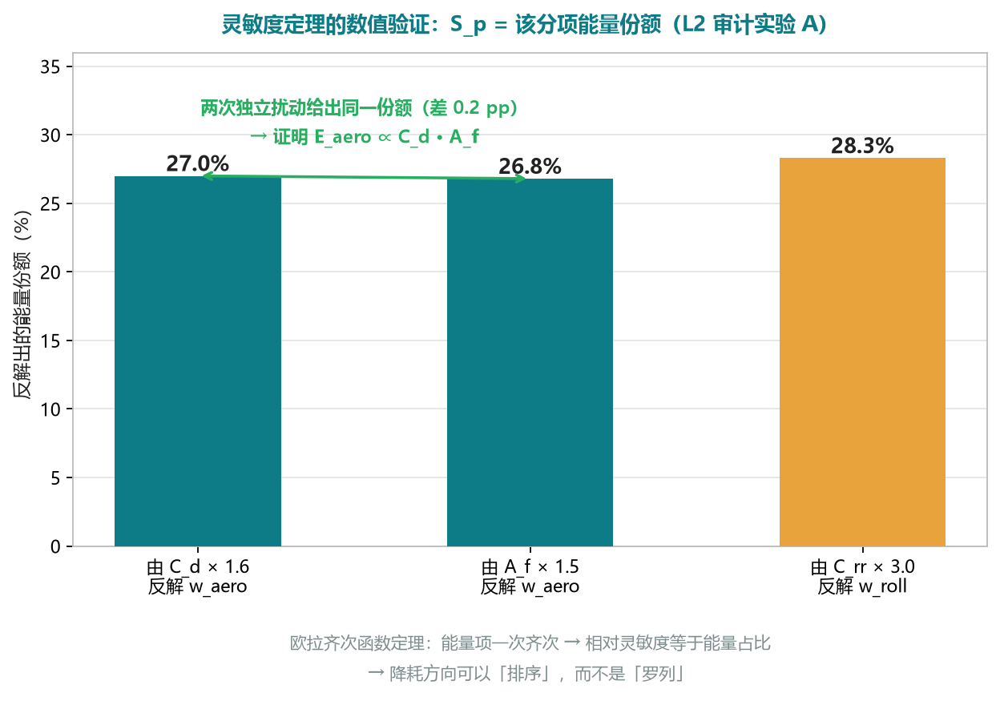

# 02 · PPT 大纲与现场演示脚本（v2 · 面向整车开发与 VCU 标定）

> **配套方案**：`方案文档/01_AI应用方案_整车能耗归因与降耗方向.md`（v2，**口径源头**）
> **专项设计**：`方案文档/05_面向整车厂与VCU的降耗方向专项设计.md`（VCU 可干预量全表、输出 JSON Schema、可观测性矩阵、工具链集成、法规口径映射）
> **独立审计**：`方案文档/04_独立复现与技术审计报告.md`（审计对象为 **v1**；**v2 已逐条回改**，本文件所有能力声明均以该报告为界）
> **参赛**：创科升「AI 应用方案大赛」｜**赛道**：AI 辅助「**数据分析 / 数据整理**」场景，提升工作效率与工作质量｜**参赛形式**：**已落地方案**（PPT 讲解 + 现场演示）
> **里程碑**：报名截止 **9 月 30 日** → 路演 **10 月 13 日**（倒排 **13 天**）
> **本文件用途**：① 路演基础信息 ② PPT 逐页大纲（**16 页**）③ 评审高频问答（**18 组**）④ 现场演示脚本（**5 分钟**）⑤ 账目自洽性与外部独立验证（**诚实版**）⑥ 演示失败三级降级 ⑦ 答辩 3 分钟逐字稿 ⑧ 物料清单

---

**使用说明（重要）**

1. 本文件是 **v2 的逐字稿级脚本**：表格中「口播要点」与第四、七章文字**可直接照读**；方括号【】内为**舞台动作**，不读出声。加粗处为**必须咬清的重音**（尤其是数字与口径）。
2. 本文件**不引入任何新数字**。全部数字来自三处：`prototype/`（真实可运行原型与其 `outputs/` 产物）、`audit/`（第三方独立复算）、`01`/`05`（方案口径）。演示段落的命令与屏幕输出**取自真实运行结果**（`prototype/outputs/run_log.txt` 为 UTF-16 原始日志）。
3. **口径分级**——本文件每个数字后面都带标注，四级含义如下：

| 标注 | 含义 | 上台规则 |
|---|---|---|
| **L1 原型实测** | `cd prototype && python run_demo.py` 可现场复现 | 可以讲，鼓励现场复现 |
| **L2 审计复算** | `audit/audit.py`、`audit2.py`、`audit3.py` 独立重算 | 可以讲，须说明"第三方审计复算" |
| **L3 待实现** | 设计清晰、但**代码中不存在** | 可以讲，**必须口头加"待实现"** |
| **L4 测算假设** | 经验口径，待试点标定 | 可以讲，**必须报口径** |

4. **与 v1 的差异红线**（这条表同时是评审的"这次到底改了什么"）：

| 维度 | v1 | **v2（本文件）** |
|---|---|---|
| 受众 | 物流车队运营侧（调度与驾驶人员） | **受众 A｜整车开发商**：整车能耗开发/性能集成、动力总成与能量管理、热管理、法规与合规、竞品对标<br>**受众 B｜VCU 开发厂家**：VCU 控制策略开发、能量管理标定、HIL 与实车测试验证 |
| 目的 | 给运营侧省油建议、行为评分与排行 | **把能耗数据变成降耗方向**：设计参数 + VCU 控制策略 + 标定阈值的改进方向，按性价比排序 |
| 核心交付 | 《车辆能耗体检报告》 | **《降耗方向说明书》/《能耗归因与改进方向报告》** + 结构化方向清单（JSON） |
| 叙事骨架 | 五层架构 + 残差 AI | **六步法：拆 → 比 → 反 → 敏 → 指 → 验** |
| 删除 | 行为评分榜、运营侧降耗排行榜、面向个人的改进建议、把运营侧节油 ROI 当价值主张 | **一律不作为价值主张**；"行为差异"只在"**不可控外部因素被公平基线剥离**"处出现一次 |
| 保留并升级 | 能量瀑布、公平基线残差、账目对账、可复现原型、LLM 只翻译不计算、诚实边界 | 全部保留，并升级为 **参数反标定 + 灵敏度排序 + 闭环验证** |

5. **凡"待实现"必须当场说明**。v1 有三处对外表述超出代码实现（质量辨识、坡度多源滤波、可解释性方法），v2 全部改成"原型实现是什么 + 生产环境要做什么"。**这不是扣分项，是技术评委最认的加分项**——本文件多处刻意把边界放在最显眼的位置。

---

## 一、路演基础信息（先说清楚，评委才知道我们在比什么）

| 项 | 内容 |
|---|---|
| 赛事 | 创科升「AI 应用方案大赛」 |
| 赛道对应 | AI 辅助「**数据分析 / 数据整理**」场景，提升工作效率与工作质量 |
| 参赛形式 | **已落地方案**：PPT 讲解 + 现场演示（现场跑真实原型，不播示意图） |
| 报名截止 | **9 月 30 日** |
| 路演时间 | **10 月 13 日** |
| 团队规模 | **≤ 3 人** |
| 奖金 | **500 ~ 20,000 元**，按"方案带来的工作效率提升价值"发放 |

### 1.1 受众（本方案为谁写）

| 受众 | 具体角色 | 他关心的问题 |
|---|---|---|
| **A｜整车开发商（OEM）** | 整车能耗开发 / 性能集成、动力总成与能量管理、热管理、法规与合规、竞品对标 | 能耗目标的**系统级分解**能不能做？设计参数（C_d、A、C_rr、速比、热管理架构）到底贡献多少？达标余量在哪？竞品差异来自哪一项？ |
| **B｜VCU 开发厂家** | VCU 控制策略开发、能量管理标定、HIL 与实车测试验证 | 哪条策略/哪个标定阈值值得动？动了能省多少？**怎么证明改完真省了**？标定版本之间的差异怎么量化？ |

> 本方案的**数据基座**：随车 CAN / SAE J1939 报文（主数据源）+ 台架、转鼓、路试记录 + 量产车回传。
> **不新增硬件**：复用既有 T-Box / CAN 记录仪 / 标定工具链的旁路记录。

### 1.2 目的：把能耗数据变成降耗方向（定量回答三问）

1. **这些能耗花在哪？** —— 能量瀑布（分项）+ 灵敏度；
2. **哪个设计参数、哪条 VCU 策略、哪个标定阈值能动，能省多少？** —— **降耗方向清单**，按性价比排序；
3. **改完到底省没省？** —— 同工况 A/B **闭环验证**，形成回归基线。

### 1.3 一句话方案（全场反复回扣这一句）

> **把"能耗高"从一句抱怨，变成一张按性价比排序、可标定、可回归验证的改进清单。**

**主叙事 = 六步法：拆 → 比 → 反 → 敏 → 指 → 验**

| 步 | 名称 | 一句话 | 面向谁的决策 |
|---|---|---|---|
| 1 | **拆** | 能量瀑布：把总能耗拆成怠速/附件、滚阻、风阻、坡道、动能、制动、传动损失等分项 | 所有人都先要"花在哪" |
| 2 | **比** | 公平基线残差：剥离工况、载荷、环境、地形，得到"这台车本应消耗多少" | 把不可控因素摘出去，剩下的才可改 |
| 3 | **反** | 参数反标定：从长期实车数据反推等效滚阻、风阻面积、传动效率、附件功率、电池内阻 | 找"设计与实际不一致"的量 |
| 4 | **敏** | 灵敏度与优先级：Δ分项能耗 / Δ参数 × 参数可改范围 ÷ 代价 | **排序，而不是列清单** |
| 5 | **指** | 降耗方向清单：每条给"可干预量 + 预期收益 + 置信度 + 验证方法" | OEM 改设计 / VCU 改策略与标定 |
| 6 | **验** | 闭环验证：工况回放 → 台架/转鼓/HIL/实车 A/B → 复测确认 | 证明方向有效，形成回归基线 |

---

## 二、PPT 逐页大纲（16 页）

> 页序与评审逻辑：**问题（2）→ 方法（3）→ 数据（4–5）→ 拆（6）→ 反与敏（7）→ 比（8）→ 指（9、13）→ AI 与可信（10、11）→ 演示（12）→ 工程落地（14、15）→ 收口（16）**。
> 单页口播按 **60 秒版**写；现场若超时，优先压缩第 4、5、14 页（各留 20 秒），**第 6、7、9、11、16 页一个字都不能省**。

---

### 第 1 页 · 封面与一句话方案

| 项 | 内容 |
|---|---|
| **标题** | 从"能耗账本"到"**降耗方向清单**"——面向整车开发与 VCU 标定的整车能耗归因 AI 方案 |
| **核心信息（一句话）** | 用 AI 把随车报文、台架/转鼓/路试与量产回传数据，变成**按性价比排序、可标定、可回归验证的降耗方向**。 |
| **页面要素** | 主标题；副标题"数据基座：整车 CAN / SAE J1939 报文 + 台架 / 转鼓 / 路试 / 量产车回传"；左上角两个受众标签「**整车开发商**」「**VCU 开发厂家**」；中部一行三问："**花在哪？哪能动？改完省没省？**"；中部一行六步法："**拆 → 比 → 反 → 敏 → 指 → 验**"；参赛标签「已落地方案 · PPT + 现场演示」；团队 ≤3 人姓名与角色；右下角日期「2025.10.13」；背景图：半透明**能量瀑布图**叠加**VCU 可干预量映射表**轮廓（两页的核心图，先给视觉锚点）。 |
| **口播要点（60 秒）** | 各位评委好，我们是 XX 队。一句话说我们在做什么：**把整车能耗数据，变成一张按性价比排序、可标定、可回归验证的降耗方向清单**。<br>我们的受众是两类人。第一类是整车开发商——整车能耗开发、性能集成、动力总成与能量管理、热管理、法规合规、竞品对标；第二类是 VCU 开发厂家——控制策略开发、能量管理标定、HIL 与实车验证。<br>我们要回答三个问题：**这些能耗花在哪？哪个设计参数、哪条 VCU 策略、哪个标定阈值能动、能动多少？改完到底省没省？**<br>我们的工作方法叫六步法：**拆、比、反、敏、指、验**——拆开能耗，比出公平基线，反标定物理参数，做灵敏度排序，给出降耗方向，最后闭环验证。<br>而且这不是一个 PPT 方案：**原型的全链路是可以现场跑通的**，等会儿有 5 分钟现场演示，从原始十六进制报文跑到结构化方向清单。 |

---

### 第 2 页 · 受众痛点：OEM 与 VCU 各自卡在哪（P1~P6）

| 项 | 内容 |
|---|---|
| **标题** | 六个痛点，一边是"改不动"，一边是"不敢改" |
| **核心信息（一句话）** | 能耗结论只有一个总数、对比没有可比口径、设计与实际不一致无人发现、改进方向无法排序、标定人力不可扩展、法规达标缺证据链。 |
| **页面要素** | 六行三列表格（痛点 / OEM 侧表现 / VCU 侧表现），每行配一个编号图标：<br>**P1 只有一个总数**——报表只给百公里油耗/电耗 → OEM 无法把整车目标分解到系统与部件；VCU 不知道该动哪条策略。<br>**P2 没有可比口径**——线路、载荷、环境不同就直接比 → 设计验证、竞品对标、A/B 版本对比都缺公平基线。<br>**P3 设计与实际不一致无人发现**——铭牌 C_rr、C_d·A、传动效率、附件功率与实际值偏离，标定基线随时间漂移，**没有反标定手段**。<br>**P4 方向无法排序**——改哪个参数、哪条策略收益最大，靠经验拍；改动代价与收益不能同口径权衡。<br>**P5 标定人力不可扩展**——一次完整能耗分析约 **4 h/车次**（**L4 测算假设**）；标定数据集版本一多，A/B 结论只能人肉堆。<br>**P6 法规达标缺证据链**——CHTC / C-WTVC / GB 30510 / 双积分 / VECTO 的口径与实车回传数据脱节，达标余量只能事后算。<br>底部数字条：随车报文采样 **10~100 Hz**，一台车一天 **GB 级**原始数据（**L4 量级口径**）。 |
| **口播要点（60 秒）** | 我们把两类受众的痛点收敛成六个。<br>**P1，只有一个总数**：你拿到的是百公里 32 升，但整车目标要分解到动力总成、热管理、传动、风阻，分解不了；VCU 侧同样，不知道该动哪条策略。<br>**P2，没有可比口径**：不同线路、不同载荷、不同环境直接比，结论必错，所以设计验证和竞品对标一直缺一把公平的尺子。<br>**P3，这是最贵的一条**：设计参数和实车实际值会偏离——滚阻、风阻面积、传动效率、附件功率都会变，**偏离多少、什么时候偏离，今天没人量化**，标定基线就这样悄悄漂掉了。<br>**P4，方向排不了序**：都知道降能耗要动很多地方，但哪一项收益最大、代价多少，靠经验；**我们要给的是排序，不是清单**。<br>**P5，人力**：一次完整能耗分析大约 4 小时每车次，这是测算假设，我们标了口径；标定数据集一多，A/B 只能人肉堆。<br>**P6，法规**：CHTC、C-WTVC、GB 30510、双积分、VECTO，口径和实车回传是两套语言，达标余量只能事后算。<br>这六条，就是我们要解决的全部问题。 |

---

### 第 3 页 · 六步法总览：一张图看完方法


| 项 | 内容 |
|---|---|
| **标题** | 拆 → 比 → 反 → 敏 → 指 → 验：从"花在哪"到"改完省没省" |
| **核心信息（一句话）** | 前三步是**诊断**（拆、比、反），中间两步是**决策**（敏、指），最后一步是**收口**（验）——每一步都有明确输入、输出与判据。 |
| **页面要素** | 横向六格流程图（照 `05` §3），每格四行：<br>**① 拆**｜输入：解码后的信号 → 方法：纵向动力学 + 能量守恒 → 输出：**8 分项能量瀑布** → 判据：分项之和 = 账目总量（**按定义闭合的恒等式**）。<br>**② 比**｜输入：车队级特征 → 方法：GBDT 基线（按车型+工况族分层）+ 近邻同类对比 → 输出：**残差 = 实际 − 应达** → 判据：样本外交叉验证（原型 R² **0.894**、MAPE **4.61%**，`--` 口径见第 8 页）。<br>**③ 反**｜输入：长期实车数据 + 独立观测量 → 方法：参数反标定（滑行试验反标滚阻、称重校核质量、长巡航段/风洞反标 C_d·A、长怠速段反标附件功率）→ 输出：**参数偏差表** → 判据：有独立观测量才给单点值，否则给区间 + 置信度。<br>**④ 敏**｜输入：参数偏差 × 可改范围 → 方法：参数扰动敏感性（审计实验 A 已复算）→ 输出：**优先级排序** → 判据：Δ分项/Δ参数 稳定且单调。<br>**⑤ 指**｜输入：分项 + 残差 + 参数偏差 + 排序 → 方法：映射到可干预量（设计侧 / VCU 侧）→ 输出：**降耗方向清单**（含预期收益、置信度、验证方式）→ 判据：每条方向必须有验证方式。<br>**⑥ 验**｜输入：方向清单 → 方法：工况回放 + 台架 / 转鼓 / HIL / 实车 A/B → 输出：**复测结论 + 回归基线** → 判据：同车、同工况、同载荷下的差异 > 基线噪声底线。<br>底部一行：**每一步的详细输入/输出/判据见 `05` §3；本页只给骨架。** |
| **口播要点（60 秒）** | 这一页是整套方法的总览，六步，每步都有输入、方法和判据。<br>**拆**：用纵向动力学和能量守恒，把总能耗拆成八个分项，画成能量瀑布。<br>**比**：用机器学习建一个公平基线，回答"这台车、这条线路、这个载重**本应**耗多少"。<br>**反**：这是 v2 的新增重点——从长期数据反标定物理参数：滚阻、风阻面积、传动效率、附件功率、电池内阻，找的是"**设计与实际不一致**"的量。<br>**敏**：做参数扰动敏感性，算出"改这个参数 1% 会动多少分项能耗"，这样出来的才是**排序**。<br>**指**：把排序翻译成可干预量——设计侧改什么、VCU 侧改哪条策略、哪个阈值，每条都带预期收益口径、置信度和验证方式。<br>**验**：最后用工况回放，在台架、转鼓、HIL、实车上做同工况 A/B，证明改完真省了，并把结论固化成回归基线。<br>请注意这张图的读法：**前三步是诊断，中间两步是决策，最后一步是收口**。 |

---

### 第 4 页 · 数据基础与信号清单：台架 / 转鼓 / 路试 / 量产回传

| 项 | 内容 |
|---|---|
| **标题** | 数据不是只有报文：四类数据源，两类车，一张可观测性清单 |
| **核心信息（一句话）** | 报文是主数据源和唯一的时间对齐基准；台架/转鼓/路试提供**受控工况**，量产回传提供**统计广度**；对账真值决定结论能不能被信任。 |
| **页面要素** | 上表：数据源 4 行 × 4 列（来源 / 典型内容 / 采样与形态 / 在本方案中的角色）：<br>① **整车 CAN / J1939 报文**（10~100 Hz，主数据源，时间对齐基准）② **台架 / 转鼓**（稳态 MAP、瞬态循环、效率 MAP，事件级/100 Hz+，**受控工况与真值**）③ **路试记录**（滑行试验 coast-down、称重、环境舱，事件级，**参数反标定的独立观测量**）④ **量产车回传**（T-Box 上传、长周期，统计广度、趋势与漂移检测）。<br>中左：**原型 DBC 实际落地的信号清单**（`prototype/config/trucks_demo.dbc`，**11 条报文 / 25 个信号**，**L1 原型实测**）：<br>燃油/动力侧 `EEC1`(EngineSpeed, ActualEnginePercentTorque)、`LFE`(EngineFuelRate, TotalFuelUsed)、`CCVS`(WheelBasedVehicleSpeed, BrakeSwitch)、`VDHR`(HighResolutionTotalVehicleDistance)、`AMB`(AmbientAirTemperature)；<br>载荷/道路侧 `TRK_LOAD1`(TotalVehicleMass, AxleLoadFront)、`TRK_ENV1`(RoadGrade, WindSpeed)、`TRK_TPMS1`(TirePressureFront, TirePressureRear)；<br>定位侧 `TRK_GNSS1`(Latitude, Longitude)、`TRK_GNSS2`(GNSSAltitude, GNSSSpeed, GNSSHeading, GNSSSatellites)；<br>新能源侧 `TRK_BMS1`(PackVoltage, PackCurrent, StateOfCharge, MotorTorque, MotorSpeedRpm100)。<br>中右：**VCU 内部量（需 XCP/CCP + A2L + MDF4 记录，报文里看不到）**：目标扭矩与扭矩分配、策略状态机与使能条件、热管理请求等级、回收强度分级与进出阈值、怠速停机允许条件、SOC 窗口与加热/冷却阈值、换挡线与锁止策略、单/双电机切换门限。<br>底部一行红框：**可观测性三级**——① 报文可观测（含置信度）② 需 VCU 内部量 ③ 需标定数据集（A2L 中的 MAP/阈值）；**拿不到第 ②③ 级时必须降级估计并标注置信度**（全表见 `05` §6）。 |
| **口播要点（60 秒）** | 数据基础有四类来源。**报文是主数据源，也是唯一的时间对齐基准**；台架和转鼓提供**受控工况**；路试记录提供**参数反标定需要的独立观测量**——滑行试验、称重、环境舱；量产回传提供**统计广度**，用来发现长期漂移。<br>左边这一块是原型真实落地的信号清单：**11 条报文、25 个信号**，燃油侧有发动机转速、扭矩百分比、瞬时燃油率和累计油耗；道路侧有整车质量、坡度、胎压；定位侧有 GNSS；新能源侧有电池电压、电流、SOC 和电机扭矩转速。<br>右边这一块请特别注意，**这些量在报文里看不到**：目标扭矩、策略状态机、热管理请求等级、回收分级阈值、SOC 窗口、换挡线、单双电机切换门限。它们要靠 **XCP/CCP 加 A2L 和 MDF4 记录**才能拿到。<br>所以我们把可观测性分成三级：**报文可观测、需 VCU 内部量、需标定数据集**。拿不到后两级，就必须**降级估计并标注置信度**，不能假装知道。这一条是我们和"跑个脚本出个图"最本质的区别。 |

---

### 第 5 页 · 数据质量现实：先承认，再解决

| 项 | 内容 |
|---|---|
| **标题** | 真实数据是脏的——我们不打滤镜，而且知道哪一层兜住了它 |
| **核心信息（一句话）** | 丢帧、时钟漂移、分辨率不足、DBC 不全/无校验、单位不统一、信号缺失，六类问题各有工程解法；**且我们明确说明哪一层真正兜住了损坏数据**。 |
| **页面要素** | 六行三列表格（问题 / 影响 / 应对）：<br>① **丢帧与突发丢包**（隧道/总线抖动 2.5~8 s）→ 信号时间轴有洞 → 质量评分 + 插值补全（原型：最长空档 4.8~8.0 s 全部补全，**L1**）。<br>② **时间戳漂移** → 多源无法对齐 → 与 GNSS UTC 对齐，估计并补偿时钟偏置。<br>③ **分辨率不足**（`TotalFuelUsed` 步进 **0.5 L**）→ 短行程对账误差大 → **长窗口对账** + 多信号交叉验证（T005-1 的量化下限 **4.00%**，**L1**）。<br>④ **DBC 不完整 / 保密 / 无校验字段** → 部分信号解不出，且**坏帧会被静默接受** → J1939 标准 PGN/SPN 反查 + 逆向解析 + 物理量反推；**接真车 DBC 时必须确认是否有 CRC/校验字段**。<br>⑤ **单位与符号约定不统一** → 负数/量级错误 → 单位注册表 + **量程断言（RANGE_CHECK）**。<br>⑥ **信号缺失（低配车型）** → 关键量算不出 → 冗余估计：轴荷优先，缺失时的**递推最小二乘质量辨识为待实现（L3）**；坡度走 IMU 滑动平均优先、GNSS 高程回归回退（**多源滤波融合待实现，L3**）。<br>底部红框（**本页最值钱的一段**）：原型实测——**破坏 5% 帧的载荷字节后，"CAN ID 在 DBC 中的命中率"仍为 100.0000%**（因为 DBC 未定义 CRC，任意 8 字节都能"解出"数值）；**只有注入未知 CAN ID 才会掉到 99.3682%**（**L2 审计复算，实验 J**）。真正兜住损坏数据的是 `preprocess.score_quality` 里的**量程断言 + 卡死检测（>300 s 判卡死）**，它藏在**质量分**里。 |
| **口播要点（60 秒）** | 我想先承认一件事：**真实数据是脏的**。六类问题：丢帧和突发丢包，隧道里一断就是几秒；时间戳漂移；累计油耗步进是 0.5 升，短行程根本对不准；DBC 不全甚至保密；单位不统一；低配车型信号缺失。<br>每一类我们都有对应解法，但我更想说**最下面这一条，这是我们审计出来的**：我们把 5% 的帧的载荷字节故意破坏，终端汇总区那一行标签（**沿用旧名的那一行**）**纹丝不动，还是 100%**。为什么？因为 DBC 里没有 CRC 校验，**任意 8 个字节它都能给你"解出"一组数值**。所以这一行的正确名字是 **"CAN ID 在 DBC 中的命中率"，它不度量信号完整性**。只有注入未知 CAN ID，它才会掉到 99.37%。<br>那**真正兜住坏数据的是什么**？是质量评分里的**量程断言和卡死检测**——超出物理量程、信号卡死超过 300 秒，都会被扣分。分低的数据我们自动标注"结论置信度低"，**宁可不说，也不输出误导结论**。<br>另外一条工程提醒：接真车 DBC 的时候，**必须先确认有没有 CRC 或校验字段**。这句话我们写进了待确认清单。 |

---

### 第 6 页 · 能量瀑布：能耗花在哪（拆）

| 项 | 内容 |
|---|---|
| **标题** | 一个总数变成八个分项：能量瀑布 |
| **核心信息（一句话）** | 𝐸_total = 𝐸_idle/aux + 𝐸_roll + 𝐸_aero + 𝐸_grade + 𝐸_kinetic + 𝐸_brake + 𝐸_dt_loss + 𝐸_engine_loss，燃油侧按 LHV 42.8 MJ/kg、密度 0.84 kg/L → **9.99 kWh/L** 折算，油电同图可比。 |
| **页面要素** | 中央大幅**瀑布图**（真实产物 `prototype/outputs/02_能耗瀑布图.png`，车次 T005-1，**L1**）：<br>化学能侧逐级扣减——**怠速与附件 0.84 kWh**、**传动损失 3.24 kWh**、**发动机热效率/部分负荷损失 84.83 kWh**、**车轮牵引能量（经传动）37.28 kWh**，合计 **126.19 kWh**，与实测账目一致；<br>车轮侧再独立分解——**滚动阻力 14.74**、**空气阻力 10.39**、**坡道（净值）0.90**、**加速/动能（净值）0.00**、**制动需求（耗散）11.25 kWh**。<br>左侧公式区：𝐸_fuel[L] = ∫ EngineFuelRate 𝑑𝑡 / 3600；𝐸_chem[kWh] = 𝐸_fuel × 9.99；EV：𝑃_batt = 𝑈 · 𝐼 / 1000，𝐸_batt = ∫ 𝑃_batt 𝑑𝑡。<br>右侧纵向动力学区：𝐹_total = 𝑚_eff · 𝑎 + 𝑚 · 𝑔 · sinθ + 𝑚 · 𝑔 · 𝐶_rr · cosθ + ½ · ρ · 𝐶_d · 𝐴 · (𝑣 + 𝑣_wind)²，𝑃_wheel = 𝐹_total · 𝑣，𝑃_engine = 𝑃_wheel / η_drivetrain + 𝑃_aux。<br>底部一行**诚实标注**：① "**发动机热效率/部分负荷损失**"在原型中是**配平项**（总能量 − 怠速 − 传动前能量），**按定义闭合，不能作为独立验证**；② EV 侧"能量回收"按 **0.55 固定系数**折入（`energy.py`），真值模型用 0.65（`physics.EvParams.regen_efficiency`）——**回收效率为待标定假设（L3），接项目后必须用实测回收效率 MAP 统一替换**；③ EV 附件电耗在原型中是**参数常数 2.0 kW**，真实项目必须用空调/加热/冷却 CAN 信号或实测 MAP。 |
| **口播要点（60 秒）** | 这一页是"**拆**"，也是整套方法的物理内核。能量的去向其实很明确：怠速和附件拿一部分，滚动阻力、空气阻力、坡道、加速动能、制动耗散各拿一部分，再加上传动损失和发动机的热效率损失。<br>看这张真实跑出来的瀑布图。左边总量 **126.19 度电**，逐级往下扣：**怠速与附件 0.84、传动损失 3.24、发动机热效率与部分负荷损失 84.83，真正到车轮的牵引能量 37.28**。到了车轮侧再拆一次：**滚阻 14.74、风阻 10.39、坡道 0.90、加速动能 0.00、制动需求 11.25**。燃油按低热值换算，**一升柴油约 9.99 度电**，所以油和电能在同一张图上比。<br>但我要主动指出下面三行标注，**这三行是我们和 v1 最大的区别**：第一，"发动机热效率与部分负荷损失"这一项在原型里是**配平项**——就是总量减去怠速再减去传动前能量，**它按定义恒等于零，所以它不能拿来当独立验证**；第二，电动车的能量回收，原型用的是 **0.55 的固定系数**，这是**待标定假设**，接项目必须换成实测的回收效率 MAP；第三，电动车的附件电耗在原型里是个**常数**，真实项目必须用空调、加热、冷却的 CAN 信号。<br>把边界先讲清楚，后面每一步的结论才站得住。 |

---

### 第 7 页 · 参数反标定与灵敏度（反 + 敏，v2 核心新增）




| 项 | 内容 |
|---|---|
| **标题** | 改这个参数到底能省多少：参数扰动敏感性实测 |
| **核心信息（一句话）** | 分项能耗对物理参数**高度敏感**——灵敏度就是降耗方向排序的依据；而"账目自洽"**发现不了参数错标**，所以真正的物理校验必须靠**独立观测量**。 |
| **页面要素** | 中央大表（**L2 审计复算，`audit/audit.py` 实验 A**：用**严重错标**的整车参数重算同一份报文日志，牵引能耗一项）：<br>｜ 参数设定 ｜ 牵引能耗 kWh ｜ 相对基准 ｜ 账目自洽检查 ｜<br>｜---｜---:｜---:｜---｜<br>｜ 基准（铭牌参数） ｜ 26.87 ｜ — ｜ 全过 ｜<br>｜ 风阻系数 C_d × 1.6 ｜ 31.23 ｜ **+16.2%** ｜ 全过 ｜<br>｜ 迎风面积 A × 1.5 ｜ 30.47 ｜ **+13.4%** ｜ 全过 ｜<br>｜ 滚阻系数 C_rr × 3.0 ｜ 42.06 ｜ **+56.5%** ｜ 全过 ｜<br>｜ 整备质量参数 +8000 kg ｜ 26.87 ｜ 0%（**因质量取自信号，参数不生效**） ｜ 全过 ｜<br>左下图：**反标定手段表**（参数 / 独立观测手段 / 由谁做 / 未做时的处理）：等效滚阻 C_rr → **滑行试验（coast-down）**；整车质量 → **地磅称重**；C_d·A → **长巡航段反标 / 风洞**；附件功率 → **长怠速段反标 / 环境舱**；传动效率 → **台架稳态 MAP**；电池内阻 → **ΔSOC-电压关系 + 台架**。每一条都注明"未做时给区间 + 置信度，不给单点值"。<br>右下图：**原型已实现的反标定量**——整体能效反标定 eta_engine_est = 牵引侧机械功 / 可用于牵引的燃油化学能（分子分母都剔除怠速），实测中位数 **0.3122（胎压不足）vs 0.3125（燃烧恶化）**（**L1**）。<br>底部红框两句话：**(a)** 分项能耗对参数高度敏感 → 灵敏度分析就是降耗方向排序的依据；**(b)** 把牵引能耗算偏 **57%**，那三项账目自洽检查**依然全绿**（**L2，实验 A**）——**账目自洽 ≠ 物理正确**，所以物理校验必须靠独立观测量。 ｜
| **口播要点（60 秒）** | 这一页是 v2 的新增重点：**反标定**和**灵敏度**。<br>先看中间这张表，这是我们审计复算出来的，做法很简单也很残酷：**同一份报文，故意用严重错标的整车参数重算一遍**。风阻系数乘 1.6，牵引能耗从 26.87 度涨到 31.23 度，**+16.2%**；迎风面积乘 1.5，**+13.4%**；滚阻系数乘 3.0，涨到 42.06 度，**+56.5%**。注意最后一列——**所有这些情况下，"账目自洽"检查全部是绿灯**。所以结论有两条。<br>**第一条好消息**：分项能耗对物理参数高度敏感，这意味着**灵敏度分析可以直接用来给降耗方向排序**——这就是六步法里的"敏"。<br>**第二条必须承认的边界**：账目自洽检查**发现不了参数错标**。所以我们绝不把账目自洽当成"物理算得对"的证据。真正的物理校验必须靠**独立观测量**：滚阻靠**滑行试验**反标，质量靠**地磅称重**，风阻面积靠**长巡航段或风洞**，附件功率靠长怠速段，传动效率靠台架稳态 MAP。<br>这些观测量的获取，我们写进了两周 PoC 的动作清单——**没有它，我们只给区间和置信度，不给单点值。** |

---

### 第 8 页 · 公平基线残差：把不可控因素剥离出去（比）

| 项 | 内容 |
|---|---|
| **标题** | 先回答"本应耗多少"，再谈"多了多少" |
| **核心信息（一句话）** | 基线把工况、载荷、地形、环境这些**不可控因素**吸收掉，剩下的残差才指向可改的东西；**而仿真车队的工况同质性使这个 R² 偏乐观，必须自己先说出来**。 |
| **页面要素** | 左：**基线模型**（`HistGradientBoostingRegressor`，生产替换 LightGBM；**80 车次 × 14 特征**，5 折交叉验证，**L1**）——样本外 **R² = 0.894**、**MAE 1.71 L/100km**、**MAPE 4.61%**；残差 `r = 实际 − 预测`：`r ≈ 0` 正常，`r` 显著为正进入归因。前 5 重要特征：`payload_t`(6.88)、`grade_up_m`(1.17)、`grade_down_m`(0.70)、`speed_band_0_10_pct`(0.34)、`distance_km`(0.32)（**训练集置换重要度口径**）。<br>中：**审计对这套 R² 的拆解**（**L2，实验 𝑁**）：单特征整车总质量 **R² = 0.797**；载荷+地形 4 特征 **R² = 0.909**（**高于**文档 14 特征的 0.894 → 说明部分特征贡献的是噪声）；工况离散度：`avg_speed_moving_kph` **2.9%**、`distance_km` **2.4%**、`payload_t` **23.9%** —— **仿真车队 80 个车次共用同一套 30 分钟工况骨架**（起步怠速 → 4×城市启停 → 城郊 50 → 高速 80 → 市区 35），真实车队的工况差异远大于此，**因此 R²/MAPE 相对真实车队偏乐观**。<br>右：**近邻同类对比的保守性**（**L2，实验 F**）：每个车次的 9 个近邻里，故障样本占比**均值 22.2%、最大 56%**（车队整体故障比例 30%）→ 近邻基线偏保守；实测 `tire_pressure_low` 的**同类偏差仅 +2.55%**，而其模型残差 **+6.48%**。<br>底部一行：**被剥离的不可控因素清单**——线路与地形、载荷、环境温度、作业结构、驾驶行为差异（**这一条也是本方案唯一一次提到人的因素：它作为不可控外部因素被公平基线剥离出去，不作为评价输出**）。 |
| **口播要点（60 秒）** | 第四个问题："这台车到底多耗了多少？"常规报表回答不了，因为**没有"应该耗多少"这个基准**。<br>我们用基线模型给出来：输入工况结构、载荷、地形、环境这些**不可控因素**，预测"本应耗多少"。原型实测：**80 个车次、14 个特征、5 折交叉验证，样本外 R² 0.894、MAPE 4.61%**。残差接近零是正常，显著为正才进入归因。<br>但我要主动交代三件事，**这三件事都是我们自己审计出来的**。<br>第一，**这个 R² 偏乐观**：仿真车队 80 个车次共用同一套工况骨架，平均车速的离散只有 2.9%，真正有方差的只有载荷和地形；审计发现**单靠整车质量一个特征就能拿到 R² 0.797**，而"载荷+地形"四个特征反而比 14 个特征更高。真实车队工况差异远大于此，**所以真车上这个 R² 必须重测**。<br>第二，**同类近邻基线偏保守**：每个车次的 9 个近邻里，故障车平均占 22.2%、最高 56%，把有问题的车当成了正常参照，所以近邻偏差会低估异常。<br>第三，被这个基线**剥离掉的不可控因素**里包含作业结构和驾驶行为差异——**我们把它当作噪声源处理掉，它的用途是让剩下的残差可比，本方案不输出对人的评价**。 |

---

### 第 9 页 · VCU 可干预量 × 能耗分项映射表（**本方案最有杀伤力的一页**）


| 项 | 内容 |
|---|---|
| **标题** | 每个能耗分项，到底谁动得了 |
| **核心信息（一句话）** | 左列是能量去向，中间两列是"**设计侧能改什么 / VCU 与标定侧能改什么**"，右列是"分析侧必须给出什么证据"——这一页把"能耗报告"直接翻译成**研发与标定工单**。 |
| **页面要素** | 八行大表（`01` 出摘要版，**全表见 `05` §4、每条方向的输出规格见 `05` §5**）：<br>｜ 能耗分项 ｜ 设计侧可改 ｜ VCU / 标定侧可改 ｜ 分析侧需要的证据 ｜<br><br>｜ **怠速 / 停车耗能** ｜ 起停系统硬件、电动化附件 ｜ 怠速停机允许条件、驻车取力策略、怠速转速 ｜ 怠速时长与占比、每百公里怠速秒数、怠速燃油率 ｜<br>｜ **附件 / 热管理** ｜ 热泵 vs PTC、保温、风道 ｜ 压缩机转速与占空比、PTC 分级、电子风扇/水泵按需、目标温度与阈值、余热回收 ｜ 附件功率占比 vs 环境温度偏离曲线、热管理请求等级时长 ｜<br>｜ **制动耗散 / 能量回收** ｜ 制动器规格、回收能力上限 ｜ 回收强度分级、进入/退出阈值、制动扭矩分配、滑行回收策略（vs 空挡滑行） ｜ 回收能量占比、**"可回收但未回收"的减速事件清单** ｜<br>｜ **传动损失** ｜ 变速器挡位数、速比、轴承/润滑 ｜ 换挡线（升/降挡）、锁止离合器、挡位保持策略 ｜ 巡航挡位/转速分布、同一 v-a 下转速偏高 ｜<br>｜ **空气阻力** ｜ C_d、迎风面积 A、导流板、挂车匹配 ｜ 巡航目标车速、限速策略、预测性滑行/队列跟驰 ｜ 巡航车速分布、v³ 敏感度、C_d·A 反标定值 ｜<br>｜ **坡道 / 动能** ｜ 轻量化、旋转惯量 ｜ **预测性能量管理（PEM，地形前瞻）**、坡道与回收耦合、加速功率限制 ｜ 坡度序列、加速功率分布、下坡回收达成率 ｜<br>｜ **电池 / 热管理（EV）** ｜ 电池内阻、热管理架构 ｜ SOC 窗口、加热/冷却阈值、目标温度、低温回收功率限制 ｜ 温度-内阻-回收受限事件、ΔSOC 对账 ｜<br>｜ **电驱 / 工作点（EV）** ｜ 电机效率 MAP、双电机拓扑 ｜ 双电机扭矩分配、单/双电机切换门限 ｜ 工作点热力图 vs 高效区占比 ｜<br>底部红框：**"分析侧的每一列证据，都是原型已经能算出来的量"**——例如"可回收但未回收的减速事件"来自 `p_brake` 积分与回收判定；"工作点热力图"来自电机转速-扭矩信号（`TRK_BMS1`）。 ｜
| **口播要点（60 秒）** | 这一页是我今天最想让各位带走的一页。<br>前面我们有了八个能耗分项、有了公平基线、有了参数反标定。问题是——**谁动得了？** 所以左边是能量去向，中间两列是**设计侧能改什么、VCU 和标定侧能改什么**，右边是**分析侧必须给出的证据**。<br>举三个例子。**怠速与停车耗能**：设计侧想起来停系统硬件和电动化附件，VCU 侧能改的是怠速停机允许条件、驻车取力策略和怠速转速；那我们分析侧必须给出什么？必须给出怠速时长与占比、每百公里怠速秒数、以及怠速工况的燃油率——**否则这条策略就没有标定依据**。<br>**空气阻力**：设计侧是 C_d、迎风面积、导流板；VCU 侧是巡航目标车速、限速策略、预测性滑行；分析侧要给出巡航车速分布、**v³ 灵敏度**、以及 C_d·A 的反标定值。<br>**制动与回收**：VCU 侧是回收强度分级、进出阈值、制动扭矩分配、滑行回收策略；分析侧要给出**"可回收但未回收"的减速事件清单**——这份清单在 HIL 上是可以逐条复现的。<br>一句话：**这一页把能耗报告，直接变成了研发和标定工单。** |

---

### 第 10 页 · AI 模型层与可解释性：AI 用在哪、用不上在哪

| 项 | 内容 |
|---|---|
| **标题** | 先物理，后 AI；而且我们说清 AI 在检出上贡献了多少 |
| **核心信息（一句话）** | AI 承担三件事：**公平基线预测、样本外残差、贡献分解**；检出主力其实是**物理规则**——这条我们也写在页面上。 |
| **页面要素** | 五张卡片排两行：<br>① **基线预测**：`HistGradientBoostingRegressor`（生产 LightGBM），14 特征，5 折交叉验证，样本外 **R² 0.894 / MAE 1.71 / MAPE 4.61%**（**L1**；同质性口径见第 8 页）。<br>② **残差与三路证据判据**（`ai_models.detect_faults`，**L1 代码口径**）：物理规则 + 统计判据 + 无监督离群。实际阈值：残差 𝑧 分数阈值 `𝑧_thresh = 1.8`、相对基线超出下限 `min_residual_pct = 1.5%`、IsolationForest 分位 `iso_quantile = 0.88`；判据是逐车次单点触发，没有持续性要求——"持续 𝑁 段/多个采样段"的稳健化设计为待实现（𝐿3）。<br>③ **原型已实现的 6 类判据**：长时间怠速（距离归一化）、急加速/急减速与 PKE、经济车速占比、车速偏高→风阻、**整体能效偏低（明确给"行驶阻力增大"与"动力系统效率下降"两个候选，不下单一结论）**、胎压偏低。<br>④ **归因假设清单（需外部信息闭环，方案不得声称能单独判定）**：喷油器/燃烧恶化、空气滤芯堵塞、刹车拖滞/轮毂轴承、电机效率衰减、电池一致性与内阻升高、空调/热管理异常耗电。<br>⑤ **可解释性 + CUSUM + LLM**：贡献分解目前是**单参考点置换近似**（把特征替换为车队中位数看预测变化，**不等于 SHAP 的可加性/一致性保证**；`shap` 未安装，**生产环境替换为 `shap.TreeExplainer`，属待实现/L3**）；CUSUM 变点检测监控残差均值漂移（实测 max = 4.0，阈值 12.0，未触发，**L1**）；LLM 只做翻译。<br>底部红框（**诚实数据，必须念**）：**纯统计判据单独使用：查准 100%、查全仅 12.5%，19 条标记里只贡献 3 条**（**L2，实验 N3**）→ **检出主力是物理规则**；全系统标记 19 条，**查准 100%、查全 79.2%、F1 0.884**（TP=19 / FP=0 / FN=5 / TN=56，**全量自评口径**）；**折半交叉验证下查全降到 70.8%，查准仍 100%**（**L2，实验 D2**）。 |
| **口播要点（60 秒）** | AI 到底用在哪？我们把它放在**物理模型解决不掉的地方**。<br>第一，**基线预测**——给这台车、这条线路、这个载重，预测"应该耗多少"，原型样本外 **R² 0.894、MAPE 4.61%**。<br>第二，**残差**——实际减预测，全部来自交叉验证的样本外预测，不用训练集自证。<br>第三，**贡献分解**——这里我要如实说：原型用的是**单参考点置换近似**，把特征替换成车队中位数看预测变化，**它不等于可加性、一致性完备的那套方法**；生产环境我们会换成成熟实现。<br>接下来是这一页最重要的两行，**都是我们自己审计出来的**。<br>第一条，**检出主力其实是物理规则，不是模型**：我们单独测试纯统计判据，**查准率 100%，但查全率只有 12.5%**——19 条标记里它只贡献了 3 条。所以我们的判据实现是 **6 类物理规则为主、统计与无监督为辅**，而且"整体能效偏低"这一条**只给两个候选原因，不下单一结论**。<br>第二条，**指标的诚实口径**：19 条标记，**查准 100%、查全 79.2%、F1 0.884**，56 个正常车次零误报，这是全量自评口径；我们用**折半交叉验证**又验了一遍——**查准率依然是 100%，零误报很稳；查全率降到 70.8%**，这个乐观偏差我们主动报出来。<br>还有一条边界写在右下角：有些故障**光靠数据判不了**，比如喷油器、空滤、刹车拖滞、电机效率衰减，它们必须靠台架、维修工单、滑行试验这些**外部信息闭环**。我们不声称能凭数据单独判定。 |

---

### 第 11 页 · 账目自洽性 + 外部独立验证（诚实版）


| 项 | 内容 |
|---|---|
| **标题** | 哪些检查真的在验证，哪些只是账目自洽 |
| **核心信息（一句话）** | 我们把检查拆成两层：**账目自洽性**（证明报文链路与账目自洽）与**外部独立验证**（证明物理模型算得对）——**混着讲就是自欺**。 |
| **页面要素** | 左：**三道自检（原型的报告发布前置检查）**逐条标注其真实鉴别力：<br>① **能量守恒**：瀑布分项之和 vs 实测总量，实测残差 **0 ~ 2.6e-14%**（**L2 复算范围**）——**这是按定义闭合的恒等式**（配平项所致），**不是精度指标**；<br>② **车轮侧恒等式**：`e_trac − (Σ车轮分项 + e_brake) ≡ 0`，实测 **2.64e-14%** 量级——**同为恒等式**；<br>③ **三方里程**：车速积分 31.102 km ｜ 里程表 31.100 km ｜ GNSS 31.108 km，最大互差 **0.02%**（阈值 2%）——**这条是真的独立交叉验证**（三条路径来自不同信号源）；<br>④ **对账**：燃油率积分 **12.64 L** vs 累计油耗差分 **12.50 L**，误差 **1.08%**（阈值 5%），量化下限 **4.00%**——**真车换成加油小票/充电订单后口径完全一致**。<br>中：**"自检全绿但参数错 57%"**反例（**L2，实验 A**）：牵引能耗 26.87 → 42.06 kWh（**+56.5%**），上述检查全部通过 → **结论：它们只验证"报文链路与账目自洽"，不验证"物理模型算得对"。**<br>右：**外部独立验证清单**（真正的物理校验，`05` §6–§7 全表）：滑行试验反标 C_rr → 校核滚阻项；地磅称重 → 校核质量与坡道项；长巡航段 / 风洞反标 C_d·A → 校核风阻项；台架稳态 MAP → 校核传动效率与 BSFC；ΔSOC-电压 + 台架 → 校核电池内阻与可用容量；加油小票 / 充电订单 → 校核账目。<br>底部：**CAN ID 在 DBC 中的命中率 100.0000%**（235,711 帧 / 3 车次 / 11.8 MB，**L1**）——**该指标不度量信号完整性**（见第 5 页实验 J）；**与仿真真值对照**（T005-1，**L1**）：里程 31.100 vs 31.102（**0.01%**）、燃油 12.635 vs 12.636 L（**0.00%**）、百公里油耗 40.628 vs 40.627（**0.00%**）、**牵引能量 37.278 vs 40.999 kWh（9.08%）**、制动需求 11.245 vs 9.633 kWh（**16.73%**）。 |
| **口播要点（60 秒）** | 评委一定会问"你凭什么说你算得准"。我们的答案分两层，**而且第一层我们自己先削一刀**。<br>**第一层，账目自洽性**，原型里有三道检查：能量守恒、车轮侧恒等式、三方里程、以及与累计油耗差分对账。实测数字很好看：守恒残差是浮点零，里程最大互差 0.02%，对账误差 1.08%。**但我必须告诉各位，前面两道是"按定义闭合的恒等式"，它们不是精度指标**——分项里有一项本来就是配平项，恒等于零是代数的必然。<br>我们审计时做过一个残酷实验：**把滚阻系数故意错标 3 倍，牵引能耗偏了 56.5%，这些检查全部是绿灯**。所以结论很清楚：**它们只验证报文链路和账目自洽，不验证物理模型算得对不对**。<br>**第二层才是真正的物理校验——外部独立验证**：滚阻要靠**滑行试验**反标，质量要靠**地磅称重**，风阻面积要靠**长巡航段或风洞**，传动效率要靠**台架稳态 MAP**，账目最终要靠**加油小票或充电订单**。<br>这里还有两个数字，我一并交底：**账目**与真值的偏差是 **0.00% 到 0.03%**；而**车轮侧分解**在故障车次上和真值差 **9.08%**——这两个数字下一节我会解释为什么不矛盾，**而且那个 9.08% 恰恰是我们要找的信号**。 |

---

### 第 12 页 · 现场演示预告 + 真实对账结果

| 项 | 内容 |
|---|---|
| **标题** | 现在，现场跑一遍 |
| **核心信息（一句话）** | 一条命令跑通全链路；三条演示车次对账误差 **1.08% ~ 3.57%**（均值 **1.92%**，阈值 < 5%）。 |
| **页面要素** | 上半屏：命令 `cd prototype` / `python run_demo.py`，下方真实阶段横幅（① 构建 DBC 数据字典 → ② 生成车队行程与故障注入 → ③ 编码整车 CAN 报文 → ④ 解码/清洗/质量/能耗/瀑布/自检 → ⑤ 车队级特征 → ⑥ AI 基线/残差/异常/归因 → ⑦ 检出效果评估 → ⑧ 生成图表与报告）。<br>右侧截图位一：**三条演示车次真实对照表**（**L1**）：<br>｜ 车次 ｜ 质量分 ｜ 里程 km ｜ 燃油 L ｜ 与真值误差 ｜ 里程互差 ｜ 对账误差 ｜<br>｜---｜---:｜---:｜---:｜---:｜---:｜---:｜<br>｜ T000-2（正常） ｜ 93.0 ｜ 30.62 ｜ 8.80 ｜ 0.03% ｜ 0.03% ｜ 3.57% ｜<br>｜ **T005-1（胎压不足）** ｜ 95.1 ｜ 31.10 ｜ 12.64 ｜ 0.00% ｜ 0.02% ｜ 1.08% ｜<br>｜ T000-1（激烈驾驶） ｜ 91.4 ｜ 32.16 ｜ 16.18 ｜ 0.01% ｜ 0.01% ｜ 1.10% ｜<br>右侧截图位二：**主车次 T005-1 的三方里程互校**：车速积分 **31.102** ｜ 里程表 **31.100** ｜ GNSS **31.108 km**，最大互差 **0.02%**；对账量化下限 **4.00%**（`TotalFuelUsed` 0.5 L/bit 决定）。<br>下半屏：留白 + 大字"**接下来 5 分钟，全部现场跑**"。 ｜
| **口播要点（30 秒，本页不超时）** | 讲到这里我不想再放图了，**接下来 5 分钟我们现场跑**。<br>这条命令会从原始报文一路跑到报告：解析、清洗、质量评分、里程三路径、能量瀑布、账目对账、车队基线、异常归因。<br>右边这组数字是真实跑出来的：**主车次 T005-1，燃油率积分 12.64 升，累计油耗差分 12.50 升，误差 1.08%**；三条演示车次分别是 **1.08%、1.10%、3.57%**，均值 1.92%，全部落在 5% 阈值以内；里程三条独立路径最大只差 **0.02%**。<br>【敲回车，切到终端】 |

> **衔接提示**：本页停留不超过 30 秒，立刻切到演示环境（Alt+Tab）。若演示安排在 PPT 讲完之后，本页改为 3 秒过场页。

---

### 第 13 页 · 降耗方向清单的输出规格（**本方案的交付物**）

| 项 | 内容 |
|---|---|
| **标题** | 交付的不是报告，是一张可执行、可验证的方向清单 |
| **核心信息（一句话）** | 每条方向的固定字段：`能耗分项 / 当前值与占比 / 基准值 / 偏差 / 候选可干预量 / 预期收益（单位与口径） / 置信度 / 需要的独立观测验证 / 建议验证方式`。 |
| **页面要素** | 上：**JSON Schema 骨架**（设计规格，**字段以 `05` §5 为准**）：<br>`{ item_id, energy_term, current{value,unit,share_pct,basis}, baseline{value,unit,basis}, deviation_pct, candidates[{side:"design"｜"vcu_calibration", item, evidence}], expected_gain{value,unit,basis}, confidence:"高""中"｜"低", required_observation[], verification["台架"｜"转鼓"｜"HIL"｜"实车A/B"｜"滑行试验"｜"称重"], status:"待验证"｜"已验证"｜"已否决" }`<br>下：**示例 A（字段全部来自原型真实产物，无编造数字；`basis` 逐项标口径）**——以主车次 T005-1 为例：<br>`energy_term` = 滚动阻力（车轮侧分项）；<br>`current` = **14.74 kWh / 占比 11.7%**（basis：`prototype/outputs/能耗体检报告.md`，按铭牌参数分解，**L1**）；<br>`baseline` = **null**（basis：待滑行试验反标后的 𝐶_rr，**L3 待实现**）；`deviation_pct` = **null**（同上，**不给未标定的单点值**）；<br>`candidates` = ① 设计侧：轮胎规格与推荐气压、车轮定位与轴承阻力；② VCU/标定侧：**胎压监测报警阈值与提示策略**；<br>`evidence` = 胎压 **607 kPa vs 标准 822 kPa**；残差 **+11.1%**（𝑧=+2.06）；分解与真值偏差 **9.08%**（**L1**）；<br>`expected_gain` = **null**（basis：**待 coast-down 反标 + 台架/实车 A/B 标定（L4 测算假设，待试点标定）**）；<br>`confidence` = **中**；`required_observation` = 滑行试验 𝐶_rr、称重、胎压信号连续性；`verification` = 滑行试验 → 台架/转鼓 → 实车 A/B；`status` = 待验证。<br>下右：**置信度判定规则**——**高**：分项与账目可复现 **且**有独立观测支持；**中**：有分项/残差证据但基准待标定；**低**：仅有统计残差或属不可辨识候选（此时**不给单一结论**，只给候选假设）。<br>底部一行：**原型现状与 v2 规格的差距要如实讲**——原型当前输出的是维护级措辞的"建议动作"（如"胎压 607 kPa 显著低于标准 822 kPa，建议补气并复测能耗"），**v2 把它升级为上面的结构化清单；`baseline`/`expected_gain` 两个字段在原型中尚无实测支撑，属待实现/待标定**。 ｜
| **口播要点（60 秒）** | 这是本方案最终的交付物：**不是一份报告，是一张方向清单**。<br>每条方向的字段是固定的九项：能耗分项、当前值与占比、基准值、偏差、候选可干预量、预期收益、置信度、需要的独立观测验证、以及建议的验证方式。<br>下面是一个真实示例，数字全部来自原型产物，**没有一个是我编的**：能耗分项是**滚动阻力**，当前值 **14.74 度电，占车轮侧能耗的 11.7%**；证据是**胎压 607 千帕，标准是 822 千帕**，残差 **+11.1%**，分解与真值的偏差 **9.08%**；候选可干预量分两侧——设计侧是轮胎规格、推荐气压、车轮定位；**VCU 和标定侧是胎压监测的报警阈值与提示策略**。<br>然后请看中间这两个字段：**基准值和预期收益，我在示例里填的是 null**。为什么？因为它们依赖**滑行试验反标后的滚阻系数**，那是独立观测量，**没有它我就不给单点值**。<br>这也是我们置信度规则的意义：有分项证据、有独立观测支持的，标"高"；基准待标定的，标"中"；只有统计残差、或者本质不可辨识的，标"低"，而且**只给候选假设、不下单一结论**。<br>最后一句交底：原型现在输出的还是维护级的建议措辞，**结构化清单是 v2 的规格，其中"基准值"和"预期收益"两个字段要靠两周 PoC 的滑行试验和称重去填实**。 |

---

### 第 14 页 · 与开发流程、工具链的嵌入

| 项 | 内容 |
|---|---|
| **标题** | 不替换你们的工具链，插在数据与决策之间 |
| **核心信息（一句话）** | 沿 V 模型五个环节各取所需，输入输出全是标准格式（DBC/ARXML、MDF4、A2L、CSV），**不要求改 VCU 软件、不要求新增硬件**。 |
| **页面要素** | 上：**V 模型五环节 × 本方案的输入输出**（`05` §8 全表）：<br>① **目标设定**（概念/架构）：输入 车型参数与竞品数据 → 输出 **分项能耗目标分解 + 灵敏度排序**；<br>② **台架 / 转鼓**（部件与系统验证）：输入 台架 MAP、转鼓循环 → 输出 **实测分项 vs 模型分项的对齐与参数反标定**；<br>③ **路试**（实车标定）：输入 报文 + XCP/A2L 记录 → 输出 **基线残差、策略/阈值候选清单、可回收未回收事件清单**；<br>④ **量产回传**（一致性监控）：输入 T-Box 回传 → 输出 **参数漂移趋势、车队级偏差、法规口径映射**；<br>⑤ **闭环回归**：输入 A/B 复测数据 → 输出 **已验证/已否决的方向 + 回归基线库**。<br>中：**工具链集成表**（对接方式，全部为"读写标准文件/标准接口"）：DBC / ARXML（`cantools` 解析，与 CANoe 同一份数据字典）；**MDF4 / A2L**（`asammdf` 读写测量文件与标定描述，与 INCA / CANape 互通）；**XCP / CCP**（旁路记录 VCU 内部量，不改 VCU 软件）；**CANoe**（仿真与残余总线仿真、工况回放）；**Simulink / dSPACE HIL**（工况序列与驾驶循环回放，A/B 对比）；**Python / SQL / DuckDB**（分析与存储，离线、可私有化部署）。<br>下：**双向数据流示意**——左到右"测量 → 归因 → 方向"，右到左"方向 → 标定数据集 → A/B 复测 → 回归基线"。<br>底部红框：**集成成本的四句话**——① 不改 VCU 应用软件（只做旁路记录）；② 不新增车载硬件（复用记录仪/T-Box）；③ 接口都是标准文件（MDF4/A2L/CSV），**不锁定工具链**；④ 分析侧可完全私有化部署，测量与标定数据不出内网。 |
| **口播要点（60 秒）** | 各位都是做工程的，所以这一页讲**怎么插进你们现有的流程**，而不是要你们换工具。<br>上面是 V 模型的五个环节，每个环节我们都有明确的输入输出。**目标设定阶段**，我们把整车能耗目标分解到分项，并给出灵敏度排序；**台架和转鼓阶段**，我们把实测分项和模型分项对齐，做参数反标定；**路试阶段**，我们输出基线残差、策略和阈值候选清单，还有那份"可回收但未回收"的减速事件清单；**量产回传阶段**，我们盯参数漂移趋势；**最后闭环回归**，把验证过的方向固化成回归基线。<br>中间是工具链对接：**数据字典**用 DBC 或 ARXML，和 CANoe 用的是同一份；**测量与标定文件**走 MDF4 和 A2L，和 INCA、CANape 互通；**VCU 内部量**通过 XCP 或 CCP **旁路记录**；**工况回放和 A/B** 交给 Simulink 或 HIL 台架；分析侧是 Python 加 SQL，可以完全私有化部署。<br>右边这条回流很重要：**方向清单最终会变成标定数据集，复测之后回到回归基线库**——这样每一版标定都有历史可比。<br>成本四句话：**不改 VCU 应用软件、不新增车载硬件、接口都是标准文件、数据不出内网。** |

---

### 第 15 页 · 效率与价值（三层，全部标口径）

| 项 | 内容 |
|---|---|
| **标题** | 价值分三层：开发效率、方向有效性、产品价值 |
| **核心信息（一句话）** | 效率看"人从重复劳动里出来多少"，有效性看"方向能不能被验证"，产品价值看"每 1% 能耗改善意味着多少钱"——**三层全部标口径，不合并成一个大数字**。 |
| **页面要素** | 三层结构，每层一个表格：<br>**第一层 · 开发效率**（口径必须并列写）<br>｜ 工作 ｜ 人工 ｜ 自动化 ｜ 口径 ｜<br><br>｜ 单车单次能耗分析 ｜ 约 **4 h/车次** ｜ **分析段 0.00 s/车次** ｜ 人工为**L4 测算假设**（解码→对齐→算里程→算油耗→切工况→做汇报）；自动化为 **L1 分析段计时** ｜<br>｜ 80 车次端到端 ｜ — ｜ **约 70 s**（本机单进程） ｜ **L1**；耗时随机器浮动，只讲量级 ｜<br>｜ 车队级特征与建模 ｜ 人天级 ｜ 分钟级 ｜ **L1**：特征抽取 80 车次 × 54 列、基线 5 折交叉验证含在 70 s 内 ｜<br>底部注：**效率对比是混合口径**（人工经验值 vs 分析段计时），**只作量级参考，不作为精度承诺**；演示时**不要念小数**。<br>**第二层 · 方向有效性**<br>｜ 证据 ｜ 数字 ｜ 口径 ｜<br><br>｜ 参数灵敏度可排序 ｜ C_d×1.6 → 牵引能耗 **+16.2%**；A×1.5 → **+13.4%**；C_rr×3.0 → **+56.5%** ｜ **L2 审计复算（实验 A）** ｜<br>｜ 异常定位零误报 ｜ **查准 100%**（56 个正常车次零误报），折半交叉验证仍 100% ｜ **L1 / L2（实验 D2）** ｜<br>｜ 查全能力 ｜ **79.2%（全量自评）/ 70.8%（折半交叉验证）** ｜ **L1 / L2** ｜<br>｜ 闭环验证机制 ｜ 每条方向必须带验证方式（台架/转鼓/HIL/实车 A/B） ｜ 设计规格（**L3 待实现**：A/B 版本对比与工况回放库） ｜<br>**第三层 · 产品价值**<br>｜ 项 ｜ 数字 ｜ 口径 ｜<br><br>｜ 燃油车每 1% 能耗改善 ｜ 单车年使用成本 **1,800 元**（8 万 km × 30 L/100km × 7.5 元/L = 18 万元/年） ｜ **L4 测算假设，待试点标定** ｜<br>｜ 纯电车每 1% 能耗改善 ｜ **768 元/车/年**（1% × 96,000 kWh/年 × 0.8 元/kWh） ｜ **L4 测算假设，待试点标定** ｜<br>｜ 标定项目人力/周期、法规达标余量、现场调试人天 ｜ **待试点标定的测算假设** ｜ **L4** ｜<br>右上角一行：**若客户同时运营自有车队，本方案输出的方向清单也可用于运营侧降耗；但本方案的价值主张不依赖它。**<br>右下角一行：**法规口径映射（CHTC / C-WTVC / GB 30510 / 双积分 / VECTO）仅用于设计目标设定与达标余量估算，不作认证替代。** ｜
| **口播要点（60 秒）** | 这场比赛看的是"工作效率提升价值"，所以我把价值分成三层，**而且每一层都标口径**。<br>**第一层，开发效率**：人工做一台车一次完整能耗分析，大约 **4 小时**——这是**测算假设，我们标了口径**；自动化之后，**分析段是 0.00 秒**，80 个车次端到端**大约 70 秒**，这是原型实测，跑在普通笔记本上。**请注意这是混合口径，我只作量级参考，不当精度承诺**——所以我不念小数。<br>**第二层，方向有效性**，这一层最硬：参数灵敏度我们已经复算过，**风阻系数乘 1.6，牵引能耗涨 16.2%；迎风面积乘 1.5，涨 13.4%；滚阻系数乘 3 倍，涨 56.5%**——**这就是排序的依据**。异常定位**查准率 100%、56 个正常车次零误报**，折半交叉验证依然 100%；查全率我们如实报两个口径，全量自评 79.2%，折半交叉验证 70.8%。每一条方向都必须带验证方式，**没有验证方式的方向，我们不发**。<br>**第三层，产品价值，全部是测算假设**：燃油车每改善 **1%** 能耗，按 8 万公里、百公里 30 升、油价 7.5 元算，**单车每年 1,800 元**；纯电车每 1% 是 **768 元**。标定人力、周期、法规余量，全部标"**待试点标定的测算假设**"。<br>最后一句必须说明：法规口径映射，包括 CHTC、C-WTVC、GB 30510、双积分、VECTO，**我们只做口径映射，不作认证替代**。 |

---

### 第 16 页 · 落地路径与价值收口

| 项 | 内容 |
|---|---|
| **标题** | 13 天到可演示，2 周出第一份《降耗方向说明书》 |
| **核心信息（一句话）** | 阶段 0 数据摸底 2 天 → 阶段 1 MVP 5 天（账面误差打到 5% 以内）→ 阶段 2 智能化（含反标定与灵敏度）→ 阶段 3 报告与彩排；此后 2 周 PoC：3 台车，交付方向清单 + 验收标准。 |
| **页面要素** | 上：横向甘特四段 + 交付物：<br>**阶段 0（D1–D2）数据摸底**——拿到 ≥3 台车 ≥5 天的原始报文样本（`.blf`/`.asc`/`candump`）、DBC（**并确认是否有 CRC/校验字段**）、同期加油小票或充电订单、**一次滑行试验与一次称重**的安排；交付：数据可用性结论 + 信号清单 + 质量评分报告。<br>**阶段 1（D3–D7）MVP**——解析清洗重采样、里程三路径校验、能量瀑布、**账目对账打到 5% 以内**、输出单车分项结果；交付：**一台真车的能耗归因报告（半成品方向清单）**，路演核心素材。<br>**阶段 2（D6–D10，部分并行）智能化**——车队基线、残差与三路证据判据、**参数反标定（滑行试验/称重/长巡航段）**、**灵敏度与优先级排序**；交付：参数偏差表 + 降耗方向清单草案。<br>**阶段 3（D9–D13）报告与演示准备**——方向说明书生成（模板/LLM + 数值回校验）、**现场演示彩排**（离线可复现）；交付：路演 PPT + 可现场运行的 Demo。<br>下一行：**阶段 4（立项后）**：全车队接入、XCP/A2L 内部量打通、工况回放库与 A/B 回归、方向清单状态机（待验证/已验证/已否决）。<br>中：**团队分工（≤3 人）**：**𝐴. 数据与流水线**（数据接入、DBC/ARXML 解析、MDF4 读写、流水线工程化）；**𝐵. 物理与模型**（纵向动力学、参数反标定、基线/残差/判据、灵敏度）；**𝐶. 整车与 VCU 工程接口 + 呈现**（需求对齐、可观测性协商、指标口径、报告与路演）。<br>下：**两周 PoC 验收标准**：① 账目对账误差 < 5%（与加油小票/充电订单）；② 完成 **1 次滑行试验 + 1 次称重**，产出 𝐶_rr 与质量的反标定区间；③ 输出 ≥5 条降耗方向，**每条含置信度与验证方式**；④ 至少 1 条方向在台架/HIL 或实车完成 A/B 复测。<br>底部大字收口：**把"能耗高"从一句抱怨，变成一张按性价比排序、可标定、可回归验证的改进清单。** |
| **口播要点（60 秒）** | 最后讲落地。从报名截止 9 月 30 到路演 10 月 13 只有 **13 天**，所以路线图是倒排的：前两天数据摸底，**必须拿到 3 台车 5 天以上的报文、DBC，以及同期的加油小票或充电订单，并且安排一次滑行试验和一次称重**——后面这一项是参数反标定的前提；第 3 到第 7 天做 MVP，目标只有一个：**账目对账打进 5%**；第 6 到第 10 天在 MVP 上做基线、残差、参数反标定和灵敏度排序；第 9 到第 13 天做方向说明书和**演示彩排**，确保完全离线可复现。<br>团队三个人，正好三个角色：**A 管数据和流水线**，**B 管物理和模型**，**C 管整车与 VCU 的工程接口和呈现**。<br>再往后是两周 PoC，**三台车，四条验收标准**：账目对账误差小于 5%；完成一次滑行试验和一次称重，给出滚阻和质量的反标定区间；输出五条以上降耗方向，**每条都带置信度和验证方式**；并且**至少一条方向在台架、HIL 或实车上完成 A/B 复测**。<br>用一句话收口：**把"能耗高"从一句抱怨，变成一张按性价比排序、可标定、可回归验证的改进清单。** 数据不用新增硬件，13 天就能看到结果。我的汇报到这里，谢谢各位评委。 |

---

## 三、评审高频提问与应答（18 组）

> **应答总原则**：**先给结论 → 再给数字 → 最后给证据或动作**。不回避、不吹大、凡是"待实现/待标定"当场说出来。
> 每组格式：**提问** → **一句话回答**（先说完这一句，评委就有耐心听后面）→ **展开要点**（可挑 2~3 条讲，不要全念）。
> **本节的数字口径与第二章一致**；凡出现"待实现（L3）""测算假设（L4）"，**必须原样念出口径词**。

---

### Q1. 这不就是常规数据分析吗，AI 体现在哪里？

**一句话回答**：常规分析能算出"百公里 32 升"，但回答不了"**应该**是多少"和"**先改哪一项**"——AI 正好用在这两个物理模型解决不了的位置上。

**展开要点**：

1. **公平基线（AI 承担）**：`HistGradientBoostingRegressor`（生产环境换 LightGBM），**80 车次 × 14 特征**，5 折交叉验证，样本外 𝑅² = 0.894、MAE 1.71 L/100km、MAPE 4.61%（**L1 原型实测**）。它把工况、载荷、地形、环境吸收掉，输出"本应耗多少"。
2. **样本外残差（AI 承担）**：`r = 实际 − 预测`，全部来自交叉验证的样本外预测，**不用训练集自证**；`r ≈ 0` 正常，显著为正才进入归因。
3. **贡献分解（AI 承担，但要说清实现）**：当前是**单参考点置换近似**（把特征替换为车队中位数看预测变化），**不满足 SHAP 的可加性/一致性公理，`shap` 未安装；生产环境替换为 `shap.TreeExplainer`，属待实现（L3）**。
4. **诚实数据（评委最认这一条）**：**纯统计判据单独使用查准 100%、查全只有 12.5%，19 条标记里只贡献 3 条**（**L2 审计复算，实验 N3**）——**检出主力是 6 类物理规则**，AI 在"基线 + 残差 + 排序"上不可替代，在"检出"上与规则互补。**我们不把 AI 说成万能。**
5. **AI 不是用来拟合能耗总量的**：能耗主体由能量守恒算出；**没有模型，瀑布和账目照样出**，只是少了"应该多少"的对比。这也是小样本可用、结论可解释的原因。

> **关键一句**：**AI 用在物理模型解释不掉的残差上，不是拿模型去硬拟合能耗总量。**

---

### Q2. 我们已经有能耗分析工具（AVL / Vector 工具链），你们多做了什么？

**一句话回答**：我们不替换任何工具，**我们做的是从"测量与标定"到"参数偏差与降耗方向排序"之间的那一层**，并且输出的每条方向都能回到你们的工具链里验证。

**展开要点**：

| 维度 | 常规工具链（INCA/CANape/CANoe/AVL 系） | 本方案（补位层） |
|---|---|---|
| 定位 | 测量、标定、仿真、诊断 | **归因与排序**：把测量结果翻译成"哪个参数偏离、哪个阈值能动" |
| 输入 | MDF4/A2L/DBC 都是它的原生格式 | **读同样的 MDF4/A2L/DBC**，旁路记录，不改 VCU 软件 |
| 输出 | 曲线、报表、标定数据集 | **结构化方向清单**：分项占比 + 参数偏差 + 候选可干预量 + 置信度 + 验证方式 |
| 对比口径 | 依赖工程师自己搭 | **公平基线 + 近邻同类对比**（并如实标注近邻偏保守：9 个近邻里故障样本占比均值 **22.2%**，**L2 实验 F**） |
| 可信度 | 取决于人 | **账目自洽性 + 外部独立验证**两层分开陈述（见第 11 页 / 第五章） |

1. **不是重复投资**：你们的工具链负责"测得准、标得动"，我们负责"**测得准之后该动哪一项**"。
2. **我们的输出可以回灌**：方向清单 → 标定数据集 → 台架/HIL/实车 A/B → **回归基线库**，形成闭环。
3. **能当场证明**：原型全链路可现场跑通（**L1**），账目对账 1.08%~3.57%（阈值 5%），**参数灵敏度可直接复算**（**L2 实验 A**）。

---

### Q3. 参数反标定凭什么准？没有滑行试验 / 风洞，怎么反标 C_rr、C_d·A？

**一句话回答**：**没有独立观测量就不反标**——我们给区间 + 置信度，不给单点值；反标定的可信度来自独立观测，不来自数据本身。

**展开要点**：

1. **原则**：能耗数据里"阻力变大"和"效率变低"是同构的（见 Q6），所以**从单一数据源反推物理参数必然多解**。我们的做法是**每个参数都绑定一种独立观测手段**：

| 待反标参数 | 独立观测手段 | 由谁做 | 未做时的处理 |
|---|---|---|---|
| 等效滚阻 C_rr | **滑行试验（coast-down）** | 整车/路试团队 | 给区间 + 置信度"低"，分项偏差标"待标定" |
| 整车质量 | **地磅称重**（另有轴荷传感器优先） | 车队/试验场 | 回退铭牌质量，**并标注降级（会造成瀑布分解失真）** |
| C_d·A | **长巡航段反标 / 风洞** | 整车/风洞 | 用长期巡航段统计反标，标注取值区间 |
| 传动效率 | **台架稳态 MAP** | 台架 | 用铭牌效率并做敏感性区间 |
| 附件功率 | **长怠速段反标 / 环境舱** | 热管理/台架 | 标注为常数假设 |
| 电池内阻 | **ΔSOC-电压关系 + 台架** | 电池/台架 | 标注为待标定 |

2. **原型已经能做的部分**：**整体能效反标定** eta_engine_est = 牵引侧机械功 / 可用于牵引的燃油化学能（分子分母都剔除怠速），实测中位数 **0.3122（胎压不足）vs 0.3125（燃烧恶化）**（**L1 原型实测**）——它至少能把"整体能效偏低"稳定识别出来。
3. **原型尚未实现的部分（先说）**：**无轴荷信号时的递推最小二乘质量辨识为待实现（L3）**，当前会**静默回退铭牌质量**、不标记降级——这是已知缺陷，已列入修复清单（会造成瀑布分解失真）。
4. **PoC 排期**：两周 PoC 内完成 **1 次滑行试验 + 1 次称重**，产出 C_rr 与质量的**反标定区间**（这是验收标准第 ② 条）。

---

### Q4. 没有真实数据，你们怎么证明算得准？（仿真边界）

**一句话回答**：仿真只能证明"**算法自洽且算得准**"，**证明不了真车精度**——真车精度必须靠加油记录、充电订单和台架/滑行试验，这两层我们分开讲。

**展开要点**：

1. **第一层（今天能证明的，L1/L2）**：

| 验证项 | 实测 | 口径 |
|---|---|---|
| 落地报文规模 | 3 车次 / **235,711 帧** / 11.8 MB | **L1** `python run_demo.py` |
| CAN ID 在 DBC 中的命中率 | **100.0000%** | **L1**；**不度量信号完整性**（第 5 页实验 J） |
| 平均数据质量分 | **93.2 / 100** | **L1** |
| 能耗账目 vs 仿真真值 | **0.00% / 0.03% / 0.01%**（三个演示车次） | **L1** |
| 三方里程最大互差 | **0.01% ~ 0.03%** | **L1** |
| 与加油记录对账误差 | **1.08% ~ 3.57%**（均值 **1.92%**） | **L1**；对账真值 = 累计油耗差分 |
| 自研比特编码器正确性 | 与 `cantools` 官方 `encode_message` **3300/3300 完全一致** | **L2 审计复算（实验 H）** |
| 跨版本可复现 | 三份 CAN 日志 **SHA256 逐字节一致**，`车队汇总.csv` **22 个数值列逐位相同** | **L2** |

2. **第二层（真车必须重做的动作）**：拿到真车数据后**只替换数据源，流水线与模型不动**；然后与**加油小票 / 充电订单**对账（阶段 0 第一件事），并用滑行试验、称重、台架做物理校验。
3. **必须主动说的边界**：仿真真值是我们自己生成的，**等于用出题人的答案阅卷**；`prototype/README.md` 已写明"真车接入后第 3.1 节指标必须用真值重测一遍"。
4. **口径纪律**：**仿真数字永远不替代"真车精度"这个指标**。

---

### Q5. 车轮侧分解误差 9%，而账目误差只有 0.03%，这不是自相矛盾吗？

**一句话回答**：**不矛盾，这是两个层级的量**——账目（烧了多少）算得准，分解（花在哪）是按**铭牌参数**算的；而分解偏出去的那部分，**恰恰是我们要找的参数偏差信号**。

**展开要点**：

| 层级 | 精度 | 说明 |
|---|---|---|
| **能耗账目**（燃油升数 / 化学能总量） | **0.00% ~ 0.03%**（T005-1：燃油 **12.635 L** vs 真值 **12.636 L**，**0.00%**） | 由 `EngineFuelRate` 积分 + 能量守恒得到，**这才是"可对账的那个数"** |
| **车轮侧物理分解**（滚阻/风阻/坡道各占多少） | 按**铭牌参数**计算；滚阻实际恶化 35% 的车次上，`e_traction_wheel_kwh` 差 **9.08%**（**37.278 vs 40.999 kWh**）、`e_brake_req_kwh` 差 **16.73%** | 分解用的是**铭牌 C_rr**；一旦实车参数偏离，铭牌参数就不再代表这台车 |

1. **分解不是精度承诺，是"基准尺子"**：只有假设车辆健康，物理分解才能当标准尺。
2. **偏差本身就是证据**：这趟车实际滚阻大了 35%（胎压不足），分解必然偏，**偏差的方向和量级指向"滚阻异常"这个假设**——这正是第 7 页灵敏度表和第 9 页映射表要用的东西。
3. **故障车的账目依然准**：T005-1 是故障车，三方里程互差 **0.02%**、对账误差 **1.08%** 依然成立——**"账算得准"和"参数有问题"可以同时成立，我们两个都报**。
4. **v2 的立场**：v1 把 9% 当作需要解释的"异常"；v2 把它当作**参数反标定的输入**——**分解偏多少，就是参数偏多少的第一手线索**。

---

### Q6. 胎压不足和燃烧恶化，你们能分清吗？

**一句话回答**：**从油耗数据出发，本质不可辨识，我们不能分**——必须靠独立观测量（胎压信号、滑行试验、台架、维修工单）来分。

**展开要点**：

1. **实测证据（L1/L2）**：整体能效反标定 `eta_engine_est` 的中位数——**胎压不足 0.3122 vs 燃烧恶化 0.3125**，几乎相同；**最优单阈值判别的准确率仅 75.0%，随机基线是 66.7%**（**L2 审计复算，实验 K**）。
2. **物理原因**："阻力变大"和"效率变低"在油耗上表现为**同一种现象**（都是同样多的油跑更少的路）。
3. **我们的处理（三步，不硬猜）**：
   - ① 先给**两个候选假设**（行驶阻力增大 / 动力系统效率下降），**明确不下单一结论**——原型的"整体能效偏低"判据就是这么写的；
   - ② 再用**独立观测量判别**：有胎压信号就用胎压（原型为此在 DBC 里加了 `TRK_TPMS1`，实测 **607 kPa vs 标准 822 kPa**，**L1**）；没有胎压信号的车型必须做**滑行试验**反标滚阻；
   - ③ 实在分不清 → 判 **「待人工判定」**（80 车次评测里有 **1 条**落到这一档，**L1**），报告里明说"未定位到单一物理原因，建议人工复核"。
4. **顺带说一条同类边界**：分析侧恒按**铭牌 C_rr** 计算，所以"滚动阻力能耗"对每个车次都是常数——**吨公里滚阻能耗实测 0.02042 ~ 0.02043 kWh/(t·km)，相对离散仅 0.003%**（**L2 实验 M**）——**它作为滚阻故障检测器完全无效**。这不是缺陷，而是提醒我们：**检测必须用整体能效反标定，而不是"滚阻分项"本身**。

> **一句话**：**能分的分；分不清的用独立观测量分；实在分不清的明说分不清——宁可不给，也不给错。**

---

### Q7. VCU 内部量拿不到（没有 XCP/A2L 记录）怎么办？

**一句话回答**：**降级但不假装**——报文可观测的量照常算；需要 VCU 内部量的证据，要么用替代估计并**标注置信度降级**，要么在 PoC 里补一次**旁路记录**（不改 VCU 软件）。

**展开要点**：

1. **可观测性三级**（`05` §6全表）：
   - **① 报文可观测**：车速、转速、扭矩百分比、瞬时燃油率、累计油耗、里程、SOC、电池电压电流、电机扭矩转速、胎压、轴荷、坡度信号、GNSS；
   - **② 需 VCU 内部量**（XCP/CCP + A2L + MDF4）：目标扭矩与扭矩分配、策略状态机与使能条件、热管理请求等级、回收强度分级与进出阈值、怠速停机允许条件、SOC 窗口、换挡线与锁止、单/双电机切换门限；
   - **③ 需标定数据集**：A2L 中的 MAP 与阈值（判断"当前标定值 vs 建议值"的差）。
2. **拿不到时的替代估计与置信度处理（举例）**：
   - 无回收扭矩信号 → 用制动需求积分 × **0.55 固定系数**估计回收量，**标注"回收效率为待标定假设（L3）"**；
   - 无热管理请求等级 → 用附件功率与**环境温度偏离曲线**间接判断，**置信度降为"中"**；
   - 无策略状态机 → 只能给"候选阈值"，**不能判定当前标定值**。
3. **落地成本**：PoC 阶段做**一次 XCP/CCP 旁路记录**即可闭环（INCA/CANape 采集 MDF4），**不改 VCU 应用软件、不影响功能安全**。
4. **原则**：**可观测性决定结论的置信度上限**——拿不到的量，我们不编数字，改写成"需要的独立观测验证"字段写进方向清单。

---

### Q8. 怎么和 Simulink / HIL / 台架打通？

**一句话回答**：**我们把真实工况切分并导出成可回放序列**，让同一段路、同一个载荷、同一版标定在 HIL 与台架上被复现，从而做出可比的 A/B。

**展开要点**：

1. **我们的输出（已具备的部分）**：工况切分（原型实现了 7 类工况：怠速、起步加速、制动减速、爬坡、下坡、匀速巡航、低速行驶）+ 车速/坡度/载荷时间序列 + 关键分项能耗——**这些就是回放需要的激励**。
2. **接口格式**：MDF4 / A2L（与 INCA/CANape 互通）、CSV（Simulink 与台架通用）、DBC/ARXML（与 CANoe 同一份数据字典）。
3. **闭环四步**：① 真实工况 → 代表性循环（裁剪为固定时长、固定载荷的循环）；② **HIL/台架跑新标定**；③ **实车 A/B**（同车、同线路、同载荷）；④ 结论回到**回归基线库**，并把方向清单状态改为"已验证/已否决"。
4. **判据**：A/B 差异必须**大于基线噪声底线**——原型 MAPE **4.61%**（**L1**，同质性偏乐观口径）只能作量级参照，真实项目要用重测后的 MAPE 定阈值。
5. **诚实标注**：**"工况库与回放导出、A/B 版本对比"属于 v2 的设计规格，原型尚未实现（L3 待实现）**——原型当前只有单车与车队级分析，没有循环导出模块。

---

### Q9. CHTC / C-WTVC / GB 30510 / 双积分，能直接拿来做认证吗？

**一句话回答**：**不能，我们只做口径映射**——把真实回传数据映射到法规工况口径特征，用于设计目标设定与达标余量估算，**认证仍须在认可实验室按标准流程做**。

**展开要点**：

1. **能做什么**：① 把实车能量流分项与法规循环（CHTC 系列、C-WTVC、VECTO 等）的**口径特征**对齐（平均车速、怠速占比、比功率分布、附件负荷）；② 用真实数据估算**达标余量**与风险区间；③ 为 GB 30510、双积分等**目标设定**提供分项依据。
2. **不能做什么**：**不作认证替代、不产生认证值、不承诺合规结论**。差异点必须逐条标注：载荷设定、环境温度与附件状态、道路载荷设定（滑行/风洞标定值）、驾驶风格、SOC 窗口。
3. **为什么仍然有用**：法规工况下的能耗是**单点工况**，而量产回传是**全工况分布**；把两者映射之后，你能回答"**我的目标余量在真实使用分布下够不够**"，这是认证数据本身回答不了的。
4. **口径纪律**：本页所有映射结果**必须带"口径映射，非认证"标注**（**L3/L4**：法规口径映射的工程实现属设计规格，需按客户法规团队口径确认）。

---

### Q10. 我的工况和你们仿真里的完全不一样，模型能迁移吗？

**一句话回答**：**物理层不需要迁移，模型层需要重训**——因为模型只学残差，迁移成本低；但我们必须先承认仿真工况过于同质。

**展开要点**：

1. **不需要迁移的部分（占主体）**：能量瀑布、里程三路径、账目对账、参数反标定、灵敏度分析——**全是纵向动力学与守恒关系，与工况无关**。
2. **需要重训的部分**：基线模型按"**车型 + 工况族（城市配送 / 城际中速 / 干线高速长途）+ 线路**"分层重训；冷启动阶段用**物理规则 + 同类聚合**兜底。
3. **必须承认的仿真局限（L2，实验 N）**：80 个车次共用**同一套 30 分钟工况骨架**（起步怠速 → 4×城市启停 → 城郊 50 → 高速 80 → 市区 35），`avg_speed_moving_kph` 相对离散仅 **2.9%**、`distance_km` **2.4%**，真正有方差的只有 `payload_t`（**23.9%**）→ **R²/MAPE 相对真实车队偏乐观**；审计还发现**单特征整车质量 R² 就达 0.797**，而"载荷+地形"4 特征 **R² = 0.909** 反而高于 14 特征的口径。
4. **改进动作（已列入计划）**：给仿真器加 2~3 种差异化**工况骨架**（城市配送短驳 / 城际中速 / 干线高速长途），并把基线精简为"载荷+地形"核心特征 + 工况族分层——**这是把"公平比较器"做实的最高杠杆动作**。
5. **迁移检查清单**：DBC/PGN 命名、车型参数集（质量/C_rr/C_d·A/效率）、载荷口径（整车总质量 vs 载重）、坡度来源（IMU / GNSS / 地图）、附件与热管理信号是否可得。

---

### Q11. 样本量多少才够？冷启动怎么办？

**一句话回答**：**物理层零样本可用，模型层建议 ≥500 车次**；中间区间靠物理规则与同类聚合过渡。

**展开要点**：

1. **最小可用（阶段 0）**：**≥3 台车、≥5 天**原始报文就能跑通 MVP（瀑布 + 里程 + 账目对账）。
2. **规则判据标定**：需要约 30~50 车次来标定阈值，且**必须折半交叉验证**——原型实测：全量自评查全 **79.2%**，折半交叉验证降到 **70.8%**，**查准率两个口径都是 100%（零误报很稳）**（**L1/L2**）。
3. **模型化责任拆分**：`prototype/README.md` 的建议门槛是 **≥500 车次**再启用；80 样本下我们曾试过"双基线"按百分比拆分责任，**样本外 R² 反而从 0.742 掉到 0.700**，拆分结果是噪声，因此**改为按证据类型判定**（行为类证据 vs 车况类证据）——**宁可不给，也不给错**。
4. **冷启动不会失败**：没有模型也能出瀑布、账目、对账与规则判据；数据每天在产生，模型自然被喂起来。
5. **口径提醒**：仿真上 **80 车次就有 R² 0.894**，**但那是同质工况下的乐观值**（见 Q10），不要拿它当真实车队的预期。

---

### Q12. 改进方向清单里，有多少是真的有效？

**一句话回答**：**分三层看**——账目与分项结论可复现、灵敏度排序可复算、**每条方向的预期收益一律标"待标定 + 验证方式"**，未验证前我们不承诺收益。

**展开要点**：

| 层 | 内容 | 可信度来源 |
|---|---|---|
| ① 账目与分项 | 燃油/电量、里程、分项占比 | **L1 可现场复现**；账目 0.00%~0.03% vs 真值 |
| ② 灵敏度排序 | 𝐶_d·1.6 → **+16.2%**；𝐴·1.5 → **+13.4%**；𝐶_rr·3.0 → **+56.5%** | **L2 审计复算（实验 A）**，可重跑脚本 |
| ③ 每条方向的预期收益 | **当前一律为 null / "待试点标定"** | **L4 测算假设**，必须由台架/HIL/实车 A/B 复测确认 |

1. **字段设计就是为了防吹牛**：方向清单里 `expected_gain` 必须带 `basis`（单位与口径）与 `confidence`（高/中/低）；**没有验证方式的方向不允许发布**。
2. **状态机**：`待验证 / 已验证 / 已否决`——**被否决的方向要留档**，这是回归基线的一部分，也是"方向有效性"的真实度量。
3. **不可辨识的项不给单点结论**：如"喷油器/燃烧恶化/空滤堵塞"这三类，从油耗上不可辨识（Q6），只能进**归因假设清单**，靠台架、维修工单、滑行试验闭环。
4. **验收标准（两周 PoC）**：输出 **≥5 条方向**，其中**至少 1 条完成 A/B 复测**。

---

### Q13. LLM 会不会编数字？

**一句话回答**：**架构上不允许它编**——数字全部由物理与统计模型计算，LLM 只做翻译，且发布前做数值回校验。

**展开要点**（四道锁）：

1. **职责锁**：LLM 只做"翻译与表达"；所有数字来自 `EnergyResult` 与模型输出（原型 `report.py` 就是**模板渲染**，不生成数字）。
2. **输入锁**：喂给它的是**固定 JSON Schema** 的结构化结果（分项能耗、残差、异常证据、贡献分解、对账结果）——**它看到的都是算好的数字**，没有让它推算的输入。
3. **Prompt 锁**：硬约束"禁止生成或推算数值"。
4. **输出锁**：发布前**正则提取报告中的数字并与源数据比对**，不匹配则拒绝发布。
5. **诚实标注**：原型的 LLM 环节是**离线模板渲染**；**实时 LLM 接入与数值回校验通道属于 v2 设计规格，原型中未接入（L3 待实现）**——这也是演示时"不联网也能出报告"的原因。

---

### Q14. 数据安全与合规（标定数据、量产回传、个人信息）

**一句话回答**：**三层处理**——标定数据不出内网（私有化部署）、量产回传脱敏与聚合、个人标识与分析数据分离；**并明确本方案不产出对个人的评价类输出**。

**展开要点**：

1. 标定数据 = 核心 𝐼𝑃：整套分析可**私有化部署在客户内网**（开源组件栈，无云依赖）；A2L/MDF4 按客户权限体系管理，**分析侧只读旁路**，写审计日志；**不必要时不落盘原始测量文件**。
2. **量产回传**：VIN 哈希化、按"**热 30 天 + 冷归档 1 年**"分层存储；训练与建模只用脱敏数据；对外汇报**只出聚合结论**。
3. **个人信息**：分析侧使用匿名 ID，人员标识与分析数据**分离存储**；**本方案的交付物是面向设计参数与 VCU 策略的技术方向清单，不含对个人的评价类输出**。
4. **功能安全与法规接口**：只做**离线/旁路分析**，不参与在线控制；不写入 VCU，不改变任何在线标定。
5. **待确认项**：数据使用边界（尤其**标定数据集与量产回传的授权范围、是否允许出域**）需由客户信息安全/法务审批——已列入 `01` 待确认清单，**我们不自作主张**。

---

### Q15. 和 OTA / 标定版本管理怎么配合？A/B 怎么做？

**一句话回答**：**把版本元数据接进分析侧**，按"同车 + 同线路 + 同载荷 + 同环境"分组做 A/B；**版本维度在原型中尚未实现（L3 待实现）**，PoC 阶段需接入。

**展开要点**：

1. **需要的版本元数据**：软件版本号、**标定数据集 ID**、刷写生效时间、受影响的 VIN 清单、刷写前后的里程段——**没有它就没有 A/B 的分组键**。
2. **A/B 的硬要求**：同车、同线路、同载荷、同环境（温度带）；**混入版本外的变量就等于没做 A/B**。原型当前只有 `trip_id`/`day`/`injected_fault` 分组，**版本与刷写事件字段缺失（L3）**。
3. **可用的现有能力**：原型已经具备"公平基线 + 残差 + 近邻同类对比"（同类近邻平均绝对偏差 **6.48%**，**L1**）——这套口径可以直接用于版本对比，只要把"版本"作为分组维度加进去。
4. **判据**：A/B 差异必须大于基线噪声底线（真实项目用重测后的 MAPE 定阈值），并报告样本量与置信区间；**单次行程的 0.5 L 量化下限（T005-1 为 4.00%）**决定了——**A/B 应按加油/充电周期做长窗口对比，而不是单次行程**（**L1**）。
5. **闭环**：A/B 结论回写方向清单状态（已验证/已否决），并进入**回归基线库**，供后续每次标定比对。

---

### Q16. 这套东西要多少钱、多久能出结果？

**一句话回答**：**13 天到可演示，2 周 PoC 出第一份《降耗方向说明书》**；不新增车载硬件，投入主要是人（≤3 人）和**一次滑行试验/称重的试验资源**。

**展开要点**：

| 项 | 内容 | 口径 |
|---|---|---|
| 路演前 | **13 天倒排**（D1–D2 摸底 / D3–D7 MVP / D6–D10 智能化 / D9–D13 报告与彩排） | 计划 |
| 首份交付 | **2 周 / 3 台车**的 PoC：方向清单 + 参数反标定区间 + ≥1 条 A/B 复测 | 计划 |
| 硬件 | **不新增车载硬件**，复用 T-Box / CAN 记录仪；如需 VCU 内部量，做**一次 XCP/CCP 旁路记录** | 设计 |
| 软件 | 全开源栈：`cantools` / `python-can` / `pandas` / `scikit-learn` / `matplotlib` / DuckDB；**无商业 License 依赖** | 设计 |
| 人力 | **≤3 人**分工：数据与流水线 / 物理与模型 / 整车与 VCU 接口 + 呈现 | 计划 |
| 经济口径 | 燃油车每 1% 能耗改善 = **1,800 元/车/年**；纯电车 **768 元/车/年** | **L4 测算假设，待试点标定** |

1. **标定项目人力/周期、法规达标余量、现场调试人天**：**全部为待试点标定的测算假设（L4）**。
2. **成本的大头不在软件**：在**独立观测量的获取**（滑行试验、称重、台架窗口）——这部分我们建议客户用自己的试验资源，我们只提供方案与判据。
3. **交付即插即用**：给一份 DBC/ARXML + 一段报文 + 一张加油记录，就能跑出第一版结果。

---

### Q17. 这个方案最大的风险是什么？

**一句话回答**：**不是算法，是"拿不到真实数据与独立观测量"**——其次是"参数错标自己发现不了"和"仿真工况过于同质"。

**展开要点**：

| # | 风险 | 影响 | 对策 |
|---|---|---|---|
| 1 | **拿不到真实报文/标定数据**（保密、流程慢） | 高 | 提前走数据申请流程（放在阶段 0 第 1 天）；仿真先跑通全链路；**脱敏单车 PoC** |
| 2 | **没有独立观测量**（无滑行试验/称重/风洞） | 高 | PoC 内安排 **1 次滑行试验 + 1 次称重**；未做时**只给区间 + 低置信度，不给单点值** |
| 3 | **参数错标自己发现不了**：实测把牵引能耗算偏 **+56.5%**，账目自洽检查仍**全绿**（**L2 实验 A**） | 中高 | 坚持"**账目自洽 ≠ 物理正确**"；用外部观测交叉验证；把参数错标的敏感性作为交付物的一部分 |
| 4 | **仿真工况同质**导致 R² 偏乐观（**L2 实验 N**） | 中 | 加差异化工况骨架；按"车型+工况族"分层重训；真车重测 MAPE |
| 5 | **仿真 ≠ 真车** | 中 | 真车接入后**第 3.1 节精度指标必须重测**，不沿用仿真结论 |
| 6 | **已知缺陷未修**：仿真器求解"功率可达轨迹"时**未施加滚阻倍率**（物理约束缺陷，对能耗账目无影响）；无轴荷信号时**静默回退铭牌质量**不标记降级 | 中 | 列入修复清单（前者约 3 行代码；后者补递推最小二乘辨识或强制标记降级）——**我们主动写在方案里** |
| 7 | **演示失败** | 低（影响高） | 完全离线可运行 + 三级降级（见第六章） |

> **一句话**：**最大的风险从来不是算法，而是数据的可得性与独立观测量的获取——所以我们把它排在阶段 0 的第 1 天，而不是等到建模时才发现没数据。**

---

### Q18. 除了商用车，能不能用在乘用车 / 工程机械 / 非道路？

**一句话回答**：**方法论与流水线可以直接复用，参数集、工况库、附件模型必须重做**——换 DBC/ARXML 与参数集即可切换对象，但**不要指望阈值能照搬**。

**展开要点**：

1. **不变的（可复用的核心）**：纵向动力学 + 能量守恒 → 分项瀑布；公平基线 + 残差；参数反标定 + 灵敏度排序；账目自洽性与外部独立验证两层结构。
2. **必须重做的**：
   - **乘用车**：法规口径不同（CLTC/WLTC 等）、附件与热管理电耗占比高、**双电机扭矩分配与工作点效率 MAP** 是主战场、再生制动标定空间大；
   - **工程机械**：**作业循环（PTO/液压附件）** 才是能耗主体，没有固定"线路"，工况切分要按作业阶段，质量与载荷变化剧烈；
   - **非道路**：排放法规阶段与负载谱差异大，需重新定义工况族与验收判据。
3. **需要补的数据**：附件电耗信号、载荷估计手段（轴荷/液压压力/称重）、工况库与代表性循环。
4. **原型已覆盖两种动力**：燃油（`EngineFuelRate` 积分 + `TotalFuelUsed` 对账）与纯电（𝑃_batt = 𝑈 · 𝐼 + ΔSOC 校验；`python run_demo.py --powertrain ev` 可现场切换），**但 EV 侧的回收效率与附件功率是固定假设，必须实测替换（L3）**。
5. **一句话**：**可复制的是方法论与流水线，不是具体阈值。**

---

### 附加问答（不计入 18 组）：评委问"你在这场方案里具体做了什么"

> **使用场景**：团队赛现场追问个人贡献。**按角色说，说到能当场演示的程度**；说完立刻切到演示，让评委看到"屏幕上的东西"和"你说的话"对得上。

- **A. 数据与流水线**："我负责数据接入与流水线。具体是把 `candump` 原始日志用 `cantools` 按 DBC 解成结构化信号，处理了三类脏数据——丢帧用质量评分加插值补全、时钟漂移拿 GNSS 的 UTC 对齐补偿、单位不统一用量程断言拦掉，最后把整条链路编排成 `run_demo.py` 一条命令。**您现在可以现场敲这条命令。**"
- **B. 物理与模型**："我负责能耗物理模型与 AI 模型。具体是能量瀑布的分项实现、里程三路径、整体能效反标定、基线预测与三路证据判据。**三个最能说明问题的数字**：账目与真值偏差 **0.00% ~ 0.03%**；与对账基准偏差 **1.08% ~ 3.57%**，全部在 5% 阈值内；异常定位 **查准 100%、查全 79.2%（折半交叉验证 70.8%）、F1 0.884**，56 个正常车次零误报。另外我也做了**边界验证**：参数错标 3 倍时账目自洽检查**发现不了**——所以我们坚持用滑行试验和称重做外部校验。"
- **C. 整车与 VCU 接口 + 呈现**："我负责把技术结论翻译成工程语言。具体是我定义了方向清单的输出规格（分项 / 基准 / 偏差 / 可干预量 / 预期收益口径 / 置信度 / 验证方式），梳理了 VCU 可干预量映射表与可观测性矩阵，也负责这次的 PPT 和演示脚本。**口径分级（L1~L4）是我定的规矩**：凡是待实现、凡是测算假设，上台必须说清楚。"

---

## 四、现场演示脚本（5 分钟，严格对齐 `01` 第 7 节时间轴）

> **对齐说明**：时间轴与 `01_AI应用方案_整车能耗归因与降耗方向.md` **第 7 节「现场演示设计（路演 5 分钟）」** 逐格对齐，六个时段、起止秒数一致（`0:00–0:30 / 0:30–1:30 / 1:30–2:30 / 2:30–3:30 / 3:30–4:30 / 4:30–5:00`），**只把内容从"运营侧建议"换成"降耗方向"**。
> **命令与产物口径**：本节所有命令**均来自 `prototype/` 中真实存在、可运行的入口**（唯一入口 `python run_demo.py`，参数 `--days / --trips-per-day / --powertrain / --quick / --n-demo-can`）；所有"屏幕会出现什么"**逐字取自真实运行结果**（`prototype/outputs/run_log.txt`、`能耗体检报告.md`、`异常清单.json`、`归因示例.json`）。
> ⚠️ **中文 Windows 上必须先解决终端编码（实测踩坑，必做）**：原型在 AI 层会打印 `R²`，若控制台仍是默认 **GBK** 代码页，会当场抛出 `UnicodeEncodeError: 'gbk' codec can't encode character '\xb2'` 并中断在第 ⑥ 步之前——**演示当天开场第一件事就是切 UTF-8**：
> ```powershell
> chcp 65001                        # 或： $env:PYTHONIOENCODING = "utf-8"
> $OutputEncoding = [Console]::OutputEncoding = [Text.UTF8Encoding]::new()
> ```
> 本方案已在 Python 3.12.10 + 中文 Windows 上按上述设置完整跑通（**端到端 6.8 s，全部指标与本文一致**）。

---

### 4.0 演示前置准备（路演前一天必须完成）

| 检查项 | 要求 | 状态 |
|---|---|---|
| 演示机 | 提前装好 Python 环境与依赖（`cantools`、`python-can`、`pandas`、`numpy`、`scipy`、`scikit-learn`、`matplotlib`），**全程离线可跑**；先确认 `python -V` 正常 | ☐ |
| **终端编码** | **中文 Windows 必做**：先 `chcp 65001`（或设 `$env:PYTHONIOENCODING="utf-8"`），否则原型打印 `R²` 时会以 GBK 抛 `UnicodeEncodeError` 并中断在 AI 层之前（已实测复现） | ☐ |
| 演示数据 | `prototype/` 下为仿真车队 **80 车次 / 40 天（车型 6x4 重型牵引车·柴油）**，其中 **3 个演示车次已编码成真实整车 CAN 报文日志**：`outputs/canlog_T000-2.log`（正常）、`outputs/canlog_T005-1.log`（胎压不足，**主车次**）、`outputs/canlog_T000-1.log`（激烈驾驶），合计 **11.8 MB / 235,711 帧**；DBC 为 `config/trucks_demo.dbc`（**11 条报文 / 25 个信号**） | ☐ |
| 预跑一次 | 提前完整跑通至少一次（**完整模式约 70 秒**，`--quick` 约 25 秒），产物留在 `prototype/outputs/` 作为兜底 | ☐ |
| 终端 | 字体调到 18~20 pt，深色背景；先 `cd prototype`；窗口只留终端 + 图片查看器 + Markdown 阅读器 | ☐ |
| 图表 | `outputs/02_能耗瀑布图.png`（核心图）、`01_行程概览.png`、`03_车队基线与异常.png`、`04_工况与驾驶行为.png` **提前在图片查看器打开** | ☐ |
| 报告与清单 | `outputs/能耗体检报告.md`（提前在阅读器打开）、`outputs/异常清单.json`、`outputs/归因示例.json`、`outputs/车队汇总.csv` | ☐ |
| 灵敏度表 | 第 7 页/第 4.5 段的**参数扰动敏感性表**来自 `audit/audit.py`（实验 A），**不在 `prototype/outputs/` 里**：建议做成 PPT 一页图；如需现场复算，彩排时先测一次 `cd ..\audit; python audit.py` 的耗时 | ☐ |
| 备份 | ① 预录**全流程录屏**（本地文件）② 静态 PDF 报告 ③ U 盘各存一份 | ☐ |
| 计时 | 桌面计时器，**总时长硬控制在 5:00 内**；单段超时就从第四段"灵敏度"里省 15 秒，**不要动第二、三、五段** | ☐ |
| 收尾 | 关闭一切通知；确认**不联网也能跑** | ☐ |

---

### 4.1 时间轴总表

| 时间 | 环节 | 一句话目标 | 对应六步法 |
|---|---|---|---|
| 0:00–0:30 | 抛出问题 | 让评委亲眼看到"数据看不懂、结论拿不到" | — |
| 0:30–1:30 | **一键跑通** | 证明这是真跑的，不是 PPT | 拆 / 比 / 反 / 敏 / 指 / 验 全链路 |
| 1:30–2:30 | **账目自洽与对账** | 证明账算得准，**并主动交出"自检发现不了什么"** | 验（账目层） |
| 2:30–3:30 | **拆 + 敏** | 瀑布分项 + 参数灵敏度（排序依据） | 拆、敏 |
| 3:30–4:30 | **指** | 从归因证据到设计参数 / VCU 策略 / 阈值候选 | 反、指 |
| 4:30–5:00 | 价值收口 | 三个数字：分析段 < 1 s、灵敏度 16.2%/13.4%/56.5%、每 1% = 1,800 元 | — |

---

### 4.2 第 1 段 · 0:00–0:30 抛出问题

**【操作】**
```powershell
# 交付包内的原型目录（演示机路径按现场调整；包内相对路径为 prototype\）
cd C:\Users\Admin\Desktop\dsh\cpt\PreMiles\prototype

# 看一眼真实落地的整车 CAN 报文日志的前 14 行
Get-Content .\outputs\canlog_T005-1.log -TotalCount 14
```
（这就是原型真实落地的报文文件之一——今天的主车次 **T005-1**；`Get-Content -TotalCount` 在 Windows PowerShell 下等价于 `head`。）

**【屏幕会出现什么】** 满屏十六进制，形如（**真实日志格式**）：

```
(1700432000.000000) can0#0CF0040000007FC012000000
(1700432000.000000) can0#18FEF1000000000000000000
(1700432000.000000) can0#18FEEF002F00665B02000000
(1700432000.000000) can0#18FEE800FCB1F10200000000
(1700432000.000000) can0#18FEF5003C25000000000000
(1700432000.000000) can0#18FF10003559C31A00000000
(1700432000.000000) can0#18FF2000770F000000000000
(1700432000.000000) can0#18FF300000A3E1110005F343
(1700432000.000000) can0#18FF40000627000000000B00
(1700432000.000000) can0#18FF60007A77000000000000
(1700432000.100000) can0#0CF0040000007FC012000000
(1700432000.100000) can0#18FEF1000000000000000000
(1700432000.100000) can0#18FEEF003300665B02000000
(1700432000.200000) can0#0CF0040000007FC012000000
...（继续滚动）
```

**【讲解词（逐字稿，约 30 秒）】**
> 【敲命令，然后退后半步，让评委看屏幕】
> "各位评委，这是我今天要处理的那台车的原始数据。每一行就是一个 CAN 报文：前面是时间戳，中间是 CAN ID，`#` 后面就是八个字节。采样率 10 到 100 赫兹，一台车一天是 GB 级的量。
> 我请各位和我一起看这满屏的十六进制——这一串 `0CF00400` 里面有发动机转速和扭矩百分比，`18FEEF00` 是瞬时燃油率和累计油耗，`18FEE800` 是里程，`18FF6000` 是胎压。数据很全。
> 可是它回答不了我们要的问题。我要问的是：**这些能耗花在哪？哪个设计参数、哪条 VCU 策略、哪个标定阈值能动、能动多少？**
> 这就是我们要解决的问题。"

---

### 4.3 第 2 段 · 0:30–1:30 一键跑通

**【操作】**
```powershell
python run_demo.py
```
> **彩排/兜底可用的真实参数**（同一入口 `python run_demo.py`，参数均已实现）：
> `--quick`（**快速模式：天数设为 12、演示车次数设为 2 → 24 车次 / 2 份报文日志，约 25 秒**，彩排用）｜ `--days 60`（扩大样本）｜ `--trips-per-day 1`（每天车次数，默认 2）｜ `--powertrain ev`（切换纯电车型）｜ `--n-demo-can 1`（只落地 1 份报文日志，最快）
> **注意**：`--quick` 会把天数设为 12、演示车次数设为 2，**AI 指标的样本量随之变小**——所以讲指标时必须说明"这是完整模式（40 天 × 2 车次 = 80 车次）的数字"。

**【屏幕会出现什么】** 八个阶段横幅依次滚动（**取自 `run_log.txt` 的真实 stdout，节选**）：

```
========================================================================
① 构建 DBC 数据字典
========================================================================
  → DBC 已加载：11 条报文 / 25 个信号

========================================================================
② 生成车队行程（含真值）与故障注入
========================================================================
  → 仿真 80 个车次，用时 31.48s
  → 注入故障分布：aggressive_driving=8, normal=56, tire_pressure_low=8, excessive_idling=4, combustion_degraded=4

========================================================================
③ 把演示车次编码为真实整车 CAN 报文日志
========================================================================
  → 已生成 3 份报文日志，合计 11.8 MB，用时 5.36s
  →    canlog_T000-2.log  (normal)
  →    canlog_T005-1.log  (tire_pressure_low)
  →    canlog_T000-1.log  (aggressive_driving)

========================================================================
④ 报文链路：解码 → 清洗 → 质量 → 能耗 → 瀑布 → 自检
========================================================================
  → 解码 235,711 帧，用时 7.43s（2.48s/车次）
  → 单次能耗分析平均 0.04s/车次

  车次               质量     里程km      实测能耗      与真值误差     里程互差     对账误差
  T000-2         93.0    30.62      8.80      0.03%    0.03%    3.57%
  T005-1         95.1    31.10     12.64      0.00%    0.02%    1.08%
  T000-1         91.4    32.16     16.18      0.01%    0.01%    1.10%

========================================================================
⑤ 抽取车队级特征（与单车链路共用同一套特征函数）
========================================================================
  → 特征抽取完成，用时 6.27s，80 车次 x 54 列

========================================================================
⑥ AI 层：基线预测 → 残差 → 异常检测 → 归因
========================================================================
  → 作业基线（HistGradientBoosting，5 折交叉验证）：14 特征，80 样本
  →    样本外 R² = 0.894 ｜ MAE = 1.71 ｜ MAPE = 4.61%   (8.46s)
  →    前 5 重要特征：payload_t(6.88), grade_up_m(1.17), grade_down_m(0.70), speed_band_0_10_pct(0.34), distance_km(0.32)
  → 同类近邻对比：平均绝对偏差 6.48%
  → IsolationForest 异常检测完成，标记 19 个可疑车次 (1.47s)
  → 车况衰减 CUSUM：未触发告警 (max=4.0, 阈值 12.0)

========================================================================
⑦ 异常检出效果评估（仅仿真具备故障真值标签）
========================================================================
  → 混淆矩阵：TP=19 FP=0 FN=5 TN=56
  → 查准率 100.0% ｜ 查全率 79.2% ｜ F1 0.884
  → （说明：这是**仿真故障真值**下的评测；真实场景需人工复核确认）

========================================================================
⑧ 生成图表与报告
========================================================================
  → outputs/01_行程概览.png  → outputs/02_能耗瀑布图.png
  → outputs/03_车队基线与异常.png  → outputs/04_工况与驾驶行为.png
  → outputs/能耗体检报告.md  → outputs/车队汇总.csv
  → outputs/异常清单.json  → outputs/归因示例.json  (车次 T024-1，总残差 +13.3%，同类偏差 +15.8%，判定 车辆状况主导)

========================================================================
运行汇总
========================================================================
  车队规模            : 80 车次 / 40 天 / 车型 6x4 重型牵引车(柴油)
  落地报文            : 3 车次，共 235,711 帧
  ID 命中率(旧标签行)  : 100.0000%     ← 终端标签沿用旧名，真实口径 = CAN ID 在 DBC 中的命中率
  平均数据质量分      : 93.2
  能耗 vs 真值误差    : 0.01%
  对账误差(<5% 目标)  : 1.92%
  异常检测 F1         : 0.884
  端到端总耗时        : 69.6s
```

> **两个必须当场说清的口径**：
> ① 汇总区那一行的标签是 v1 沿用名，**它的真实含义是"CAN ID 在 DBC 中的命中率"，不度量信号完整性**——**主动说出来是加分项**（见第 5 页与第五章）。
> ② 终端还会打印 `单次能耗分析平均 0.04s/车次`，这是本机计时打印值；**审计独立复算的分析段耗时为 0.00 s**（**L2**）。两者都是"分析段计时"，差异来自机器与计时口径——**演示时统一说"单车分析在 1 秒以内"，不要念小数**。
> ③ 各段耗时（31.48s / 5.36s / 7.43s / 8.46s / 69.6s）**每次运行都会浮动**，只讲量级"**约 70 秒**"。

**【讲解词（逐字稿，约 55 秒）】**
> 【敲回车，把手从键盘上拿开】
> "我敲的这一条命令，就是整套方案的全部入口。**我只敲了这一条，后面八个阶段全是自动的。**
> 先说明数据口径：这是一个 **80 车次的仿真车队，带真值标签**；其中 3 个演示车次被**逐位编码成真实的整车 CAN 报文日志**，再由**和解析真车日志完全相同的代码路径**解回来——所以这条链路上，解码、清洗、质量、能耗、对账，测的都是真代码。
> 第一步，把 DBC 定义套到报文上：**11 条报文、25 个信号**，这次落地 **235,711 帧**。
> 第二步，治理：所有信号对齐到统一时间网格，做**量程断言**和清洗，输出质量分——车队平均 **93.2 分**，今天这台 T005-1 是 **95.1 分**。
> 第三步，**三条独立的里程路径**互相校验：车速积分、里程表差分、GNSS，最大互差 **0.01% 到 0.03%**。
> 第四步，能耗：把这台车 **12.64 升油、折合 126.19 度电**，跟仿真真值只差 **0.00%**。
> 第五步，硬碰硬的对账：三条演示车次 **1.08%、1.10%、3.57%**。
> 再往后是车队级：基线模型 **R² 0.894、MAPE 4.61%**，异常标记 **19 条、查准率 100%、56 个正常车次零误报**。
> 整个过程，**80 个车次端到端大约 70 秒**，单车分析在 **1 秒以内**。而且各位可以看到，它**全程离线**。"
> 【补充一句，防追问】"顺便说一个口径：汇总里那一行写的是旧标签，**它的真实含义是 CAN ID 在 DBC 中的命中率，不度量信号完整性**——为什么这么说，我下一段给各位看一个实验。"

---

### 4.4 第 3 段 · 1:30–2:30 账目自洽与对账（验 · 账目层）

**【操作】**
```powershell
# 报告也可以提前在 Markdown 阅读器里打开，直接 Alt+Tab 切过去
Get-Content .\outputs\能耗体检报告.md -Encoding UTF8     # 定位到「五、三道自检」与「六、与仿真真值的对照」
```
（**务必加 `-Encoding UTF8`**：Windows PowerShell 默认编码会把中文显示成乱码。）

**【屏幕会出现什么】**（**逐字取自 `outputs/能耗体检报告.md`，主车次 T005-1**）

```text
## 五、三道自检（报告发布前置条件）

1. **能量守恒**：瀑布分项之和 126.19 kWh vs 实测 126.19 kWh，偏差 1.13e-14% ✅
2. **三方里程**：车速积分 31.102 km ｜ 里程表 31.100 km ｜ GNSS 31.108 km，最大互差 0.02% ✅
3. **对账（模拟加油小票）**：燃油率积分 12.64 L vs 累计油耗差分 12.50 L，误差 1.08%
   （累计油耗分辨率 0.5 L 本身的量化下限 4.00%）✅

## 六、与仿真真值的对照（原型专有验证）

| 量 | 报文反算 | 仿真真值 | 误差 |
|---|---:|---:|---:|
| distance_km | 31.100 | 31.102 | 0.01% |
| fuel_l | 12.635 | 12.636 | 0.00% |
| l_per_100km | 40.628 | 40.627 | 0.00% |
| e_traction_wheel_kwh | 37.278 | 40.999 | 9.08% |
| e_brake_req_kwh | 11.245 | 9.633 | 16.73% |
```

**【讲解词（逐字稿，约 55 秒）】**
> 【把报告停在自检那一段，让三行都在屏幕上】
> "这一页是我想让各位看的，**但我要先削自己一刀**。
> 第一道，**能量守恒**：九个分项加起来 **126.19 度电**，跟实测总量完全对得上，残差是浮点零。**但我必须说明：这一项在原型里是配平项，按定义恒等于零，它是账目自洽，不是精度指标**，更不是"物理算得对"的证据。第二道，车轮侧那条恒等式，同样是代数必然。
> 第三道才是真的独立交叉验证：**三方里程**——车速积分 **31.102 公里**、里程表 **31.100**、GNSS **31.108**，三条路来自不同信号源，**最大互差 0.02%**；第四条是硬碰硬：**燃油率积分 12.64 升，累计油耗计数器差分 12.50 升，差 1.08%**，阈值 5%。真实场景里这个差分换成**你们的加油小票**，口径完全一样；而且我们连**量化下限都报出来**——累计油耗步进 0.5 升，这一趟的量化下限本身就是 **4.00%**，所以真车对账应该按**加油周期**做长窗口，不是按单次行程。
> 最下面这张表更狠，是拿**仿真真值**逐项对的：**里程差 0.01%、油耗差 0.00%、百公里油耗差 0.00%**。
> 【停顿一拍，指到最后两行】
> 但我请各位看最后两行：**牵引能量差 9.08%，制动需求差 16.73%**。**这不是算错了——分解是按铭牌参数算的，而这趟车实际滚阻大了 35%（胎压不足），铭牌那套参数就不代表这台车了。**
> 换个角度讲：**分解偏出去多少，就是参数偏了多少的第一手线索**——这正是我们要交付的"反标定"和"降耗方向"的输入端。所以请记住这一句：**账要准，分解要诚实。**"

---

### 4.5 第 4 段 · 2:30–3:30 拆 + 敏（瀑布分项与参数灵敏度）

**【操作】**
```powershell
# 打开真实产出图（图片查看器提前开着，也可直接 Alt+Tab）
Start-Process .\outputs\02_能耗瀑布图.png      # 核心图：化学能去向 + 车轮侧能量分解
Start-Process .\outputs\03_车队基线与异常.png  # 载荷-能耗散点 / 基线残差 / 双轨异常检测
```
```powershell
# 参数灵敏度表来自审计脚本（实验 A）；如需现场复算：
cd ..\audit
python audit.py      # 实验 A~F：自检独立性 / 幽灵变量 / 特征消融 / 阈值外推 / 峰值功率 / 近邻污染
cd ..\prototype
```
> **口径提醒**：`audit/` 下的表/图**不在 `prototype/outputs/` 里**，建议**提前做成 PPT 一页**照着讲；现场复算只在彩排时间充裕时才做。

**【屏幕会出现什么】**
- `02_能耗瀑布图.png`（车次 T005-1）：从总化学能逐级扣减 **怠速与附件 0.84 / 传动损失 3.24 / 发动机热效率与部分负荷损失 84.83 / 车轮牵引能量 37.28**（合计 **126.19 kWh**）；车轮侧再分解 **滚动阻力 14.74 / 空气阻力 10.39 / 坡道 0.90 / 加速动能 0.00 / 制动需求 11.25 kWh**。
- 审计实验 A 表（**L2 审计复算**）：

| 参数设定 | 牵引能耗 kWh | 相对基准 | 账目自洽检查 |
|---|---:|---:|---|
| 基准（铭牌参数） | 26.87 | — | 全过 |
| 风阻系数 C_d × 1.6 | 31.23 | **+16.2%** | 全过 |
| 迎风面积 A × 1.5 | 30.47 | **+13.4%** | 全过 |
| 滚阻系数 C_rr × 3.0 | 42.06 | **+56.5%** | 全过 |
| 整备质量参数 +8000 kg | 26.87 | 0%（质量取自信号，参数不生效） | 全过 |

**【讲解词（逐字稿，约 55 秒）】**
> 【切到瀑布图】
> "这张图是"**拆**"。左边这一整条是这台车这段行程消耗的总能量——**126.19 度电**，然后逐项往下扣：**怠速与附件 0.84、传动损失 3.24、发动机热效率与部分负荷损失 84.83、真正到车轮的牵引能量 37.28**。到了车轮侧再拆一次：**滚阻 14.74、风阻 10.39、坡道 0.90、加速动能 0.00、制动需求 11.25**。每一项都是按纵向动力学独立算出来的。
> 但"花在哪"只是第一步。真正决定**先改谁**的是下一步——"**敏**"，灵敏度。请看这张表，这是审计复算的，做法很直接：**同一份报文，用故意错标的整车参数重算**。
> **风阻系数乘 1.6，牵引能耗涨 16.2%；迎风面积乘 1.5，涨 13.4%；滚阻系数乘 3 倍，涨 56.5%。** 
> 这张表给了我们两个结论。**第一个是方法**：分项能耗对物理参数高度敏感，所以**灵敏度可以直接用来给降耗方向排序**——这就是我们要交付的"按性价比排序"。**第二个是边界**：请再看最后一列，**所有这些情况下，"账目自洽"检查全部是绿灯**。所以我再说一遍：**账目自洽不等于物理正确**。物理校验只能靠独立观测量——滚阻靠滑行试验，质量靠称重，风阻面积靠长巡航段或风洞。**这两周 PoC 我们会做一次滑行试验和一次称重。**"

---

### 4.6 第 5 段 · 3:30–4:30 指：从归因证据到设计参数与 VCU 策略

**【操作】**
```powershell
Get-Content .\outputs\异常清单.json -Encoding UTF8 -TotalCount 45   # 真实异常清单（19 条）
Get-Content .\outputs\归因示例.json -Encoding UTF8                 # 单车贡献分解示例（车次 T024-1）
```

**【屏幕会出现什么】**（**逐字取自真实产物**）

`异常清单.json`：80 车次共标记 **19 条**，判定分布为**车辆状况主导 9 / 驾驶行为主导 6 / 共同作用 3 / 待人工判定 1**；节选 4 条（`injected_fault` 是仿真真值标签，**仅用于评测**）：

| 车次 | 注入故障（真值） | 总残差 | 同类偏差 | 系统判定 | 归因证据（原文节选） |
|---|---|---:|---:|---|---|
| T024-1 | `combustion_degraded` | **+13.33%** | +15.84% | **车辆状况主导** | 整体能效（牵引机械功/燃油化学能）**32.1% 低于同类中位数 34.6%**……两个候选原因需现场区分 —— ① 行驶阻力增大 ② 动力系统效率下降 |
| T001-1 | `aggressive_driving` | **+11.40%** | +1.73% | **驾驶行为主导** | 行驶平均车速 **59.0 km/h** 高于同类（中位数 **52.7 km/h**），空气阻力能耗比同类高 **26%** |
| **T005-1** | `tire_pressure_low` | **+11.14%** | +12.59% | **车辆状况主导** | **胎压 607 kPa 显著低于标准 822 kPa**，滚动阻力将升高 |
| T000-1 | `aggressive_driving` | **+3.64%** | +12.22% | **待人工判定** | 能耗显著高于同类应达水平，但**未定位到单一物理原因**，建议人工复核 |

`归因示例.json`（车次 T024-1）：`primary = 车辆状况主导`，`residual_total_pct = 13.33`，`contributions` 为**单参考点置换**得到的特征贡献列表（`grade_up_m` 1.61、`speed_band_0_10_pct` 0.73、`speed_band_30_50_pct` 0.61 …）。

**【讲解词（逐字稿，约 55 秒）】**
> 【切到异常清单】
> "这是"**指**"的输入端：真实的异常清单，80 个车次里标记了 **19 条**。我读三条。
> **T005-1，总残差 +11.1%**，判定"**车辆状况主导**"，证据是**胎压 607 千帕，标准是 822 千帕**——顺着我们那张映射表往下走，**设计侧**要看轮胎规格与推荐气压、车轮定位；**VCU 和标定侧**能动的是**胎压监测的报警阈值与提示策略**；验证方式是滑行试验、转鼓和实车 A/B。
> **T024-1，总残差 +13.3%**，它没有单一物理解释：整体能效 **32.1%**，同类中位数 **34.6%**，系统给了**两个候选**——行驶阻力增大，或者动力系统效率下降。**我们不硬给一个结论**，而是把它变成两条待验证的方向，分别对应车轮阻力项和动力系统效率项。
> **T000-1，被判了「待人工判定」**——它能耗确实高，但我们**找不到单一物理原因，就不硬扣帽子**。
> 【指着屏幕，放慢】
> 请注意这一栏——**"待人工判定"**。这套系统**宁可不给，也不给错**；因为对各位来说，**一条错误的方向会浪费一整轮标定和台架窗口**。
> 最后交个底：80 个车次的仿真评测里，这套判据**查准率 100%、56 个正常车次零误报**；折半交叉验证后**查准率仍是 100%，查全率 70.8%**。**漏报，我们认；误报，我们不接受。**"

---

### 4.7 第 6 段 · 4:30–5:00 价值收口

**【操作】** 无操作，回到 PPT 收口页（第 16 页）或直接面向评委。

**【讲解词（逐字稿，约 30 秒）】**
> 【离开电脑，转身面向评委，双手自然放下】
> "五分钟，我们跑完了从原始报文到降耗方向的全程。我用三个数字收口，**每一个都带口径**。
> 第一个，**1 秒以内**——单车能耗分析的分析段耗时；80 个车次端到端大约 70 秒，跑在一台普通笔记本上，**全程离线**。（人工做同样一件事，口径是每车次约 4 小时，**这是测算假设**。）
> 第二个，**16.2% / 13.4% / 56.5%**——这是风阻系数、迎风面积、滚阻系数扰动后牵引能耗的变化幅度，**审计复算**。**它意味着方向可以被排序，而不是被罗列。**
> 第三个，**1,800 元**——燃油车每改善 1% 能耗对应的单车年使用成本，**这是测算假设，待试点标定**。纯电车是 **768 元**。
> 最后回到那一句：**把"能耗高"从一句抱怨，变成一张按性价比排序、可标定、可回归验证的改进清单。**
> 数据不用新增硬件，13 天就能看到结果。谢谢各位评委。"

---

## 五、三道自检的诚实版（账目自洽性 vs 外部独立验证）+ 与仿真真值对照

> **本章用途**：把"我们凭什么说算得准"讲成**两层**，并**主动交出**每一层的鉴别力边界。这一章是技术评委最可能深挖的地方，**建议把本页表格直接做进 PPT 第 11 页**。

### 5.1 原型的四道检查：它真正验证什么、发现不了什么

| 检查 | 实测值 | 口径 | **它真正验证的** | **它发现不了的** |
|---|---|---|---|---|
| ① **能量守恒**（瀑布分项之和 = 账目总量） | 残差 **0 ~ 2.6e-14%**（**L2 复算范围**；报告内显示 1.13e-14%） | 阈值 < 3% | 账目**按定义闭合**：分项定义与总账一致、无漏项 | **任何物理参数错标**（因为含配平项，残差恒为 0；代码中 `passed=True` 为硬编码） |
| ② **车轮侧恒等式**（`e_trac − (Σ车轮分项 + e_brake) ≡ 0`） | **2.64e-14%** 量级（**L2**） | 阈值 < 0.01% | 车轮侧分项与牵引/制动功率同源，无重复计入 | 同上：**代数恒等式**，与参数对错无关 |
| ③ **三方里程**（车速积分 / 里程表差分 / GNSS） | 31.102 ｜ 31.100 ｜ 31.108 km，最大互差 **0.02%**（**L1**） | 阈值 < 2% | **真实独立交叉验证**（三条路径来自不同信号源）→ 能发现里程表系数错误、GNSS 异常、车速信号异常 | 与整车参数无关的量：滚阻/风阻/效率标定错误 |
| ④ **对账**（燃油率积分 vs 累计油耗差分；真车 = 加油小票/充电订单） | 燃油率积分 **12.64 L** vs 差分 **12.50 L**，误差 **1.08%**；量化下限 **4.00%**（**L1**） | 阈值 < 5% | **账目层面的独立交叉验证** → 能发现燃油率信号异常、累计油耗计数异常 | 参数错标；且受 **0.5 L/bit** 分辨率限制，**短行程天生对不准** |

### 5.2 关键反例：账目自洽全绿，物理却错了 57%

**实验 A（L2 审计复算，`audit/audit.py`）**——用**严重错标**的整车参数重算**同一份**报文日志：

| 参数设定 | 牵引能耗 kWh | 相对基准 | 账目自洽检查 | 牵引能耗偏差 |
|---|---:|---:|---|---:|
| 基准（铭牌参数） | 26.87 | — | 全过 | — |
| 风阻系数 C_d × 1.6 | 31.23 | **+16.2%** | 全过 | — |
| 迎风面积 A × 1.5 | 30.47 | **+13.4%** | 全过 | — |
| 滚阻系数 C_rr × 3.0 | 42.06 | **+56.5%** | 全过 | **账目自洽发现不了 57% 的物理偏差** |
| 整备质量参数 +8000 kg | 26.87 | 0% | 全过 | （质量取自信号，参数不生效） |

**结论（必须当场说出）**：**上述检查只能验证"报文链路与账目自洽"，不能验证"物理模型算得对"。**
→ 因此 v2 把它的名字与定位统一改为**账目自洽性（bookkeeping consistency）**，**并从"精度指标表"中移出**。

### 5.3 外部独立验证清单（真正的物理校验）

| 待校验的物理量 | 独立观测手段 | 由谁做 | 频次 | **未做时怎么处理** |
|---|---|---|---|---|
| 等效滚阻 C_rr | **滑行试验（coast-down）** | 整车/路试 | PoC 内 ≥1 次 | 只给区间，分项偏差标"待标定"，置信度**低** |
| 整车质量 | **地磅称重**（轴荷传感器优先） | 试验场/车队 | PoC 内 ≥1 次 | 回退铭牌质量并**标记降级**（会造成瀑布分解失真） |
| C_d·A | **长巡航段反标 / 风洞** | 整车/风洞 | 项目内 1 次 | 用长期巡航统计反标，给区间 |
| 传动效率 | **台架稳态 MAP** | 台架 | 项目内 1 次 | 用铭牌效率 + 敏感性区间 |
| 附件功率 / 热管理 | **长怠速段反标 / 环境舱** | 热管理/台架 | 季节切换前后 | 标注为常数假设（原型即如此，**L3**） |
| 电池内阻与可用容量 | **ΔSOC-电压关系 + 台架** | 电池/台架 | 项目内 1 次 | 标注为待标定，回收受限事件单独列 |
| 账目（油/电） | **加油小票 / 充电订单** | 客户业务系统 | 每个对账周期 | **没有它无法证明精度**——阶段 0 第 1 件事 |

### 5.4 与仿真真值的对照（L1，车次 T005-1）

| 量 | 报文反算 | 仿真真值 | 误差 | 解读 |
|---|---:|---:|---:|---|
| `distance_km` | 31.100 | 31.102 | **0.01%** | 里程与三方互校一致 |
| `fuel_l` | 12.635 | 12.636 | **0.00%** | **账目准** |
| `l_per_100km` | 40.628 | 40.627 | **0.00%** | 行业口径一致 |
| `e_traction_wheel_kwh` | 37.278 | 40.999 | **9.08%** | **分解按铭牌参数算**；本车实际滚阻 +35% → 偏差即参数偏差线索 |
| `e_brake_req_kwh` | 11.245 | 9.633 | **16.73%** | 同上，制动需求对滚阻倍率敏感 |

> **口径声明（背下来）**：**账要准（0.00% ~ 0.03%），分解要诚实（差多少报多少）**。分解与真值的偏差**不是精度事故，而是参数反标定与降耗方向的输入信号**。

### 5.5 三个必须主动交代的"已知残缺"（讲出来是加分项）

1. **"CAN ID 在 DBC 中的命中率 100.0000%"不度量信号完整性**：**破坏 5% 帧的载荷字节后该指标纹丝不动**，**只有注入未知 CAN ID 才掉到 99.3682%**（**L2 实验 J**）。真正兜住坏数据的是质量评分中的**量程断言 + 卡死检测（>300 s）**；**接真车 DBC 必须确认是否有 CRC/校验字段**。
2. **仿真器一处已定位的物理约束缺陷**：求解"功率可达轨迹"时**未施加滚阻倍率**（`c_rr_scale`），导致胎压不足车次的峰值功率突破仿真器自设上限，**对能耗账目无影响**，约 3 行代码可修，**已列入修复清单**（**L2**）。
3. **两处静默降级**：无轴荷信号时回退铭牌质量**不标记降级**（会造成瀑布分解失真，质量辨识**待实现**）；坡度是 **IMU 滑动平均优先、GNSS 高程回归回退（`if/elif` 回退，不是融合）**，**多源滤波融合待实现**（**L3**）。

---

## 六、演示失败时的兜底方案（三级降级）

> **核心原则**：**永远不要让现场卡在"等程序"上。** 任何一级失败，**3 秒内切到下一级，讲解词不变**。

| 级别 | 触发信号 | 动作 | 讲解词调整 |
|---|---|---|---|
| **L0 正常** | 命令正常滚动输出 | 按第四章脚本走 | 原稿 |
| **L1 离线重跑 / 直接展示产物** | 命令报错 / 环境异常 / 断网 | 立刻改跑 `python run_demo.py --quick`（**12 天 × 2 车次、2 份报文日志、约 25 秒**，全程离线）；仍不行就**直接切到 `prototype/outputs/` 展示上一次跑通的完整产物**（4 张 PNG + 报告 + 清单 + CSV + `run_log.txt` + 3 份 `canlog`） | 一句话带过："这次我直接用刚才那次运行的完整产物，数据是同一份"——**不要解释报错** |
| **L2 预录视频** | 终端连续两次跑不起来 | `Start-Process .\backup\demo_full_run.mp4`（提前准备的全流程录屏），**自己同步讲解** | "为了不占用各位时间，我用一段完整录屏把流水线过一遍，和刚才那条命令完全一致" |
| **L3 静态报告兜底** | 电脑故障 / 投屏故障 / 视频也放不出来 | 掏**纸质静态报告**或预置 PDF：**能耗瀑布图 + 账目自洽与对账表 + 异常清单 + 方向清单规格**四页 | **完全脱稿**，靠 PPT 第 6、7、9、11、16 页顶住，把 **1.08% 对账**、**16.2%/13.4%/56.5% 灵敏度**、**1,800 元/1%** 讲透 |

**L1 的保命准备（路演前一天做完）**——`prototype/outputs/` 里真实跑通的产物必须齐全：

| 文件 | 内容 | 用途 |
|---|---|---|
| `02_能耗瀑布图.png` | **核心图**：化学能去向 + 车轮侧能量分解 | 4.5 段主证据（**L1**） |
| `01_行程概览.png` / `03_车队基线与异常.png` / `04_工况与驾驶行为.png` | 车速/坡度/燃油率、车队基线与异常、工况与行为指标 | 备用素材 |
| `能耗体检报告.md` | 主车次 **T005-1** 报告（含账目自洽检查、瀑布、真值对照、责任判定、AI 基线） | **4.4 / 4.6 段主证据** |
| `异常清单.json` | **19 条**异常的判据、归因、证据（车辆状况主导 9 / 驾驶行为主导 6 / 共同作用 3 / 待人工判定 1） | **4.6 段主证据** |
| `归因示例.json` | 单车贡献分解示例（车次 T024-1） | 方向清单输入示例 |
| `车队汇总.csv` | 全车队特征 + 残差 + 归因（80 行 / 22 个数值列） | 备用素材 |
| `run_log.txt`（UTF-16） | 完整 stdout（103 行） | "屏幕会出现什么"的逐字来源 |
| `canlog_T000-2.log` / `canlog_T005-1.log` / `canlog_T000-1.log` | 3 份真实整车 CAN 报文日志（**11.8 MB / 235,711 帧**） | **4.2 段主证据** |

- 图片查看器与 Markdown 阅读器**提前打开这些文件**，切换只按 Alt+Tab，**不现场启动任何新程序**。
- 演示机、备用机各存一份；U 盘再存一份（视频 + PDF + 产物文件夹）。
- **绝对不要现场联网**、不要现场 `pip install`、不要现场调用云 LLM 接口。

**演示失败时的话术原则（三不要）**

1. **不要道歉**——不说"不好意思出问题了"，直接说"我换成完整产物/录屏给您看"。
2. **不要解释技术原因**——评委不关心是 Python 版本还是字体问题，只关心结论。
3. **不要停**——解释词不超过 10 秒，**时间轴必须继续走**；宁可少讲一段瀑布分项，也不能压缩**对账数字**和**最后的收口三句话**。

---

## 七、答辩 3 分钟极简版口播稿（逐字稿，被打断也能快速讲完）

> **使用场景**：评委说"时间不够，你 3 分钟讲完"、第二轮答辩、或自由问答前的主动收口。
> **节奏**：约 900 字，正常语速 3 分钟。**加粗处为重音，数字必须咬清、口径必须带上。**

---

**【0:00–0:35 问题与受众】**

各位评委好，我们是 XX 队。我先说清楚**我们为谁做、解决什么问题**。

我们的受众是两类：**整车开发商**——整车能耗开发、性能集成、动力总成与能量管理、热管理、法规合规；和 **VCU 开发厂家**——控制策略开发、能量管理标定、HIL 与实车验证。

他们的共同问题是：**能耗结论只有一个总数**。你知道百公里 32 升，但不知道该改哪个设计参数、哪条策略、哪个阈值；你也**没法证明改完到底省没省**。

我们的方案就一件事：**把"能耗高"从一句抱怨，变成一张按性价比排序、可标定、可回归验证的改进清单。**

---

**【0:35–1:20 方法：六步法】**

方法叫**六步法：拆、比、反、敏、指、验**。

**拆**——用纵向动力学和能量守恒，把总能耗拆成八个分项，画成能量瀑布。原型真实跑出来的一台车：总能量 **126.19 度电**，其中**怠速与附件 0.84、传动损失 3.24、发动机热效率与部分负荷损失 84.83、到车轮的牵引能量 37.28**；车轮侧再拆成**滚阻 14.74、风阻 10.39、坡道 0.90、加速动能 0.00、制动需求 11.25**。

**比**——建一个公平基线，回答"本应耗多少"：**80 车次、14 特征、5 折交叉验证，样本外 R² 0.894、MAPE 4.61%**，残差全部是样本外预测。

**反**——参数反标定，找"设计和实际不一致"的量：滚阻靠滑行试验，质量靠称重，风阻面积靠长巡航段或风洞。

**敏**——参数扰动敏感性。审计复算的数字：**风阻系数乘 1.6，牵引能耗 +16.2%；迎风面积乘 1.5，+13.4%；滚阻系数乘 3 倍，+56.5%**。**这就是排序的依据。**

**指**——输出降耗方向清单，每条带"可干预量 + 预期收益口径 + 置信度 + 验证方式"，映射到设计侧和 VCU 标定侧。

**验**——工况回放，台架、转鼓、HIL、实车 A/B，把结论固化成回归基线。

---

**【1:20–2:05 凭什么可信：两层，先削自己一刀】**

评委一定会问凭什么可信。我们分两层讲，**而且第一层我自己先削一刀**。

**第一层是账目自洽性**：原型的三道检查实测都很好——三方里程三条独立路径最大互差 **0.02%**；与对账基准误差 **1.08%**，三条演示车次 **1.08% 到 3.57%**，阈值 5%；账目与仿真真值偏差 **0.00% 到 0.03%**。

**但我要主动说明**：其中"能量守恒"那一道在原型里是**配平项，按定义恒等于零，它是账目自洽，不是精度指标**。我们审计时做过一个残酷实验：**把滚阻系数故意错标 3 倍，牵引能耗偏了 56.5%，这些检查全部是绿灯**。

所以**第二层才是真正的物理校验——外部独立验证**：滑行试验反标滚阻、称重校核质量、长巡航段或风洞反标风阻面积、台架校核传动效率、加油小票或充电订单校核账目。**没有独立观测，我们只给区间和置信度，不给单点值。**

顺便交两个底：我们标注的是"**CAN ID 在 DBC 中的命中率 100.0000%**"，**它不度量信号完整性**——实验证明破坏 5% 帧的载荷字节，这个数字纹丝不动。真正兜住坏数据的是质量评分里的**量程断言和卡死检测**。

---

**【2:05–2:35 边界与诚实】**

还有三条边界我们写在最显眼的位置。

第一，**胎压不足和燃烧恶化，从油耗数据本质不可辨识**——实测整体能效反标定中位数 **0.3122 对 0.3125**，几乎相同，最优单阈值判别准确率只有 **75%**。所以我们**给两个候选、不下单一结论**，靠**独立观测量**（胎压信号或滑行试验）判别；实在分不清就判**「待人工判定」**——**宁可不给，也不给错**。

第二，异常指标我们报两个口径：**查准率 100%、56 个正常车次零误报**，折半交叉验证仍是 100%；**查全率 79.2%（全量自评）、70.8%（折半交叉验证）**。**漏报我们认，误报我们不接受。**

第三，涉及质量辨识和坡度多源融合的部分，**原型用的是轴荷信号与滑动平均，更强的算法是待实现**——我们不说"已实现"。

---

**【2:35–3:00 价值与收口】**

价值三层，**每层都带口径**。**效率**：人工一次完整能耗分析约 **4 小时每车次（测算假设）**，自动化后**单车分析在 1 秒以内**，80 车次端到端**约 70 秒**，全程离线。**方向有效性**：灵敏度可排序（16.2% / 13.4% / 56.5%），异常定位零误报，每条方向都必须带验证方式。**产品价值**：燃油车每改善 **1%** 能耗，单车年使用成本 **1,800 元（测算假设，待试点标定）**；纯电车 **768 元**。

落地也具体：**不新增车载硬件**，13 天到可演示，**两周 PoC、3 台车**，交付第一份《降耗方向说明书》，验收标准里明确要求**完成一次滑行试验和一次称重**，并且**至少一条方向做完 A/B 复测**。

最后一句：**把"能耗高"从一句抱怨，变成一张按性价比排序、可标定、可回归验证的改进清单。** 我的汇报到这里，谢谢各位评委。

---

## 附录 · 演讲物料清单（10/13 出门前对一遍）

| # | 物料 | 用途 | 状态 |
|---|---|---|---|
| 1 | PPT（**16 页**，本文件第二章） | 主体讲解 | ☐ |
| 2 | **VCU 可干预量 × 能耗分项映射表**大图（第 9 页，A3 打印 1 份） | 现场指着讲，"最有杀伤力的一页" | ☐ |
| 3 | 演示机 + 备用机｜`prototype/` 全量数据与依赖 | 现场演示（**离线**） | ☐ |
| 4 | `prototype/outputs/` 完整真实产物（4 张 PNG / 能耗体检报告.md / 异常清单.json / 归因示例.json / 车队汇总.csv / run_log.txt / 3 份 canlog） | **L1 兜底** | ☐ |
| 5 | 预录全流程录屏 `demo_full_run.mp4` | **L2 兜底** | ☐ |
| 6 | 静态 PDF（4 页：瀑布图、账目自洽与对账、异常清单、方向清单规格） | **L3 兜底** | ☐ |
| 7 | U 盘（含 3/4/5/6 各一份） | 灾难恢复 | ☐ |
| 8 | 打印版《03_一页纸速览》× 评委人数 + 2 | 发给评委 | ☐ |
| 9 | 计时器 | 控时 5:00 | ☐ |
| 10 | 本文件打印稿（16 页大纲 + 问答 18 组 + 3 分钟稿 + 第五章口径表） | 答辩速查 | ☐ |
| 11 | **口径卡**（一张 A5，手写即可）：`L1 原型实测 / L2 审计复算 / L3 待实现 / L4 测算假设` 四级含义 + 三个禁用说法（**不把账目自洽当物理正确、不把命中率当信号完整性、不把待实现说成已实现**） | 防口误 | ☐ |

---

## 附录 · 配图与素材清单

> **素材位置**：`方案文档/figures/`（本方案自制）+ `prototype/outputs/`（原型真实产物）。
> **规格**：PNG，宽 1 240 ~ 1 940 px，160 dpi 白底，可直接插入 PPT 全宽使用；单张 76 ~ 196 KB。
> **可复现**：自制图由 `python figures/make_figures.py` 生成，脚本内每一张图的数字来源都写在注释里（真实产物或审计复算值），**不含任何示意性编造**；`fig10` 为定性示意图，图内已明确标注"不是实测值"。

| 文件 | 建议用在哪一页 | 内容与口径 |
|---|---|---|
| `figures/fig01_six_steps.png` | **第 3 页**（六步法总览） | 拆—比—反—敏—指—验；底部四条原则 |
| `figures/fig12_pipeline.png` | 第 4 页（数据基础）或第 3 页副图 | 从原始报文到降耗方向的链路；AI 只在两处介入 |
| `figures/fig02_architecture.png` | 第 4 页（方案总览） | 五层架构；末行"不新增车载硬件" |
| `outputs/02_能耗瀑布图.png` | **第 6 页**（能量瀑布） | 车次 T005-1，**L1 真实产物**（126.19 kWh 分项） |
| `figures/fig03_sensitivity.png` | **第 7 页**（灵敏度） | 参数扰动 +16.2% / +13.4% / +56.5%；**L2 实验 A** |
| `figures/fig04_share_consistency.png` | 第 7 页副图 | 两次独立扰动反解同一份额（27.0% vs 26.8%） |
| `figures/fig05_identifiability.png` | 第 9 页 / 第 14 页 | 可辨识性退化曲线 ρ = 1/[1+(k−1)w]；理论 |
| `figures/fig11_eta_measured.png` | **第 9 页** | 实测：胎压 0.3122 与燃烧 0.3125 重合；**L1 真实产物** |
| `figures/fig10_priority_matrix.png` | 第 13 页 | 降耗方向优先级（**定性示意，图内已标注**） |
| `figures/fig06_quantization_floor.png` | 第 11 页 | 量化下限 ε_floor = q/Δ；短行程对账的数学边界 |
| `figures/fig08_residual_distribution.png` | 第 8 页 | 80 车次残差分布（**L1 真实产物 `车队汇总.csv`**） |
| `figures/fig09_detection.png` | 第 11 页副图 | 查准 100% 稳健、查全 79.2% → 70.8% |
| `figures/fig07_sample_size.png` | 第 15 页 | n ≈ 7.85 σ_d²/Δ²：验证 1% 要几十组配对车次 |
| `outputs/01_行程概览.png` | 第 6 页副图 | 报文还原的行驶状态与能量流（真实产物） |
| `outputs/03_车队基线与异常.png` | 第 8 页副图 | 载荷-能耗、残差、双轨异常检测（真实产物） |
| `outputs/04_工况与驾驶行为.png` | 第 8 页备用 | 工况结构与行为量化（真实产物） |

> **素材使用注意**：`outputs/` 下四张图为原型运行产物，**每次 `python run_demo.py` 会重新生成**（数值确定、图形随 matplotlib 版本略有渲染差异）；演示前建议先跑一次并固定版本。

---

*文档版本 **v2.0** ｜ 受众：整车开发商 + VCU 开发厂家 ｜ 配套：`01_AI应用方案_整车能耗归因与降耗方向.md`（v2 口径源头）、`03_一页纸速览.md`、`04_独立复现与技术审计报告.md`（审计 v1）、`05_面向整车厂与VCU的降耗方向专项设计.md`、`06_算法模型_数学建模论文格式.md`、`figures/`、`prototype/`、`audit/`*
*本文件全部数字带口径标注，四级口径含义见开头「使用说明」第 3 条；凡"待实现/待标定"均已显式标注。*


