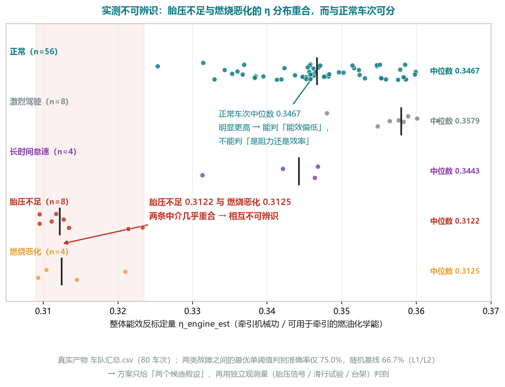

# 面向整车厂与 VCU 的降耗方向专项设计

> **定位**：`01`（主方案《AI 应用方案 · 整车能耗归因与降耗方向》）的专项展开件，用于整车开发商与 VCU 开发厂家的技术评审、立项评审与接口定义。
> **口径来源**：定位、六步法、差异红线、事实与数字分级、VCU 可干预量映射以 `01` 主方案与 `04` 审计报告为准；实现现状以 `prototype/` 代码与 `audit/` 复算脚本为准（**每一项能力声明都必须能在代码里找到，或明确标注为待实现**）。
> **与 04 的关系**：`04` 审计的是 v1。v1 的"RLS 质量辨识 / 卡尔曼融合 / SHAP 归因 / 解码成功率 / 三道自检"等口径已在 v2 逐条回改（分别改为"待实现 / 近似实现 / 口径修正"），本文只使用回改后的说法。
> **一句话收口**：把"能耗高"从一句抱怨，变成一张**按性价比排序、可标定、可回归验证的改进清单**。
> **本文不承诺**：不承诺节油/节电百分比，不替代法规认证，不替代真车验证。

| 状态标记 | 含义 | 判定依据 |
|---|---|---|
| ✅ **已实现（可复现）** | `prototype/` 代码中存在，`python run_demo.py` 可复现 | 【L1】/【L2】 |
| ◐ **近似实现** | 代码中存在，但与标准方法/公理有已知偏离 | 文中逐条标注近似点 |
| ⧗ **待实现** | 设计已明确、代码中**不存在**，全文禁止写成"已实现/已实测" | 见状态判据 |
| ⚑ **待标定假设** | 取值为常数或经验值，未用实测标定 | 必须给出取值与替换计划 |

| 数字标注 | 含义 | 出处 |
|---|---|---|
| 【L1】 | 原型实测、可现场复现 | `cd prototype && python run_demo.py` |
| 【L2】 | 第三方审计独立复算 | `audit/audit.py`、`audit2.py`、`audit3.py` |
| 【L3】 | 设计清晰但未实现，本文一律写"待实现" | 见状态标记 |
| 【L4】 | 测算假设，不得写成实测 | 待试点标定 |

> 全文凡出现数字，一律附以上标注；无标注的数字视为错误。
## 1. 文档目的与受众

| 读者 | 读完能得到什么 | 怎么用 |
|---|---|---|
| 整车能耗开发 / 性能集成 | 一台车/一个标定版本的能耗"花在哪"，分项与设计参数的对应关系 | 作为能耗分解口径与目标分解输入 |
| 动力总成与能量管理 | 工况点分布、能量流路径、回收与附件占比口径 | 校核能量管理策略设计假设 |
| 热管理 | 附件/热管理分项口径与缺失信号清单 | 定义热管理信号需求与验证方式 |
| 法规与合规 | 实车数据 → 法规工况口径的映射边界 | 只做口径映射与影响预估，**不作认证替代** |
| 竞品对标 | 同工况归一化的可比口径（吨公里、公平基线残差） | 把"不可比"变成"可比"，再比设计参数 |
| VCU 控制策略开发 | 每个能耗分项对应的 VCU 可干预量候选 | 形成策略需求条目 |
| 能量管理标定 | 可标定量清单 + 灵敏度排序 + A/B 验证方法 | 排标定优先级，做标定版本对比 |
| HIL / 实车测试验证 | 工况回放格式、验收判据、门禁 | 建回归基线，做改前改后同工况复测 |
### 1.1 本方案回答的三个问题

| # | 问题 | 输出物 | 状态 |
|---|---|---|---|
| 1 | 这些能耗花在哪？ | 能耗瀑布 + 分项归因 | ✅ 已实现（燃油侧）；EV 侧分项口径不同（§4） |
| 2 | 哪个设计参数 / 哪条 VCU 策略 / 哪个标定阈值能动，能省多少？ | 改进方向清单（按性价比排序） | ⧗ 待实现：当前只有"异常清单 + 模板化建议动作"，**无**收益/置信度/验证方法字段（§3.5、§5） |
| 3 | 改完到底省没省？ | 同工况 A/B 闭环验证报告 | ⧗ 待实现：原型仅有"故障注入 × 检出能力"评测，**没有** A/B 闭环与工况回放导出（§3.6） |
### 1.2 与其他文档的分工

`01` = 主方案（口径源头，优先级最高）；`02`/`03` = PPT 与一页纸（与 01 一致）；`04` = 独立复现与技术审计（审计 v1）——**04 说代码没有的，本文一律写"待实现"**；`05`（本文）= 面向整车厂/VCU 的专项设计与接口规格，与 01 一致但更细。
## 2. 受众与需求矩阵
### 2.1 八类角色：决策问题 → 本方案输出 → 接口与频次

| # | 角色 | 决策问题 | 本方案输出 | 接口与频次 |
|---|---|---|---|---|
| R1 | 整车能耗开发 / 性能集成 | 能耗分解是否自洽？哪个分项偏离设计预期？ | 能耗瀑布（化学能去向 + 车轮侧分解）、口径声明、参数反标定值 | 报告 + 数据包；按标定版本 / 每月 |
| R2 | 动力总成与能量管理 | 能量流路径对不对？回收与附件占多少？工作点是否在高效区？ | 能量流分项、工况点分布、工作点热力图（EV 侧 ⧗ 待实现） | 数据包 + 图；按车型 / 每标定版本 |
| R3 | 热管理 | 热管理能耗占多少？低温标定余量够不够？ | 附件/热管理分项、温度-附件功率关系（**EV 侧当前为常数假设**） | 信号需求清单 + 专项报告；每标定季 |
| R4 | 法规与合规 | 实车数据能否映射到法规工况口径？余量有无风险？ | 工况口径映射表、影响预估（**不作认证替代**） | 口径映射说明；每认证周期 |
| R5 | 竞品对标 | 两台车/两个标定版本能否公平比？差在哪个参数？ | 公平基线残差、吨公里归一化、参数反标定对比 | 对比报告；按项目 |
| R6 | VCU 控制策略开发 | 哪条策略能动这个分项？候选是什么？ | 改进方向清单（可干预量 + 收益 + 置信度 + 验证方法） | JSON（§5）+ 评审会；每迭代 |
| R7 | 能量管理标定 | 先标哪个参数？改多少？如何证明有效？ | 灵敏度排序、可标定量清单、A/B 标定版本对比方法 | 标定清单 + A/B 报告；每周 |
| R8 | HIL / 实车测试验证 | 用哪个工况回放？验收判据是什么？ | 代表性工况库、回放导出格式、门禁判据 | 回放包（MDF4/CSV/manifest）；每次验证 |
### 2.2 交付节奏与落地切入口

| 节奏 | 触发 | 主要读者 | 内容 |
|---|---|---|---|
| 日常（日/周） | 数据回传 | R1、R7 | 分项瀑布、质量分、异常条目（驾驶行为仅作不可控因素被剥离，不作考核项） |
| 迭代（每标定版本） | 标定数据集更新 | R6、R7、R8 | 改进方向清单、A/B 对比、灵敏度复核 |
| 专项（每车型） | 立项 | R2~R5 | 参数反标定、法规口径映射、竞品对标 |

切入口优先级：**① R6+R7（VCU 策略与标定，干预成本最低、迭代最快、可直接 A/B）→ ② R1（一次性建立分项口径）→ ③ R5（依赖反标定与样本量）→ ④ R4（价值在提前发现余量风险）**。
## 3. 六步法工程化实现

| 步 | 名称 | 一句话 | 面向谁的决策 | 实现状态 |
|---|---|---|---|---|
| 1 | **拆** | 能量瀑布：把总能耗拆成分项 | 所有人先要"花在哪" | ✅ 已实现（燃油侧）；怠速与附件合并（§3.1） |
| 2 | **比** | 公平基线残差：剥离工况/载荷/环境/地形 | 把不可控因素摘出去 | ✅ 已实现；样本同质导致偏乐观（§3.2） |
| 3 | **反** | 参数反标定：反推等效滚阻、风阻面积、传动效率、附件功率、电池内阻 | 找"设计与实际不一致" | ◐ 仅整体能效反标定（近似）；其余 ⧗ 待实现（§3.3） |
| 4 | **敏** | 灵敏度与优先级：Δ分项/Δ参数 × 可改范围 ÷ 代价 | 排序，不是列清单 | ✅ 审计已复算敏感性；⧗ 产品侧自动排序待实现（§3.4） |
| 5 | **指** | 降耗方向清单：可干预量 + 收益 + 置信度 + 验证方法 | OEM 改设计 / VCU 改策略与标定 | ⧗ 待实现（§3.5、§5） |
| 6 | **验** | 闭环验证：工况回放 → 台架/转鼓/HIL/实车 A/B → 复测 | 证明方向有效，形成回归基线 | ⧗ 待实现（§3.6） |
### 3.1 步 1「拆」— 能耗瀑布

| 项 | 内容 |
|---|---|
| 输入 | 已解码清洗的报文信号：车速、燃油率、累计油耗、里程、坡度、质量、环境温度 |
| 方法 | 化学能口径 𝐸_chem = ∫ EngineFuelRate 𝑑𝑡 × 9.9867 kWh/L（0.84 kg/L × LHV 42.8 MJ/kg）；车轮侧口径 𝑃_wheel = (𝑚_eff · 𝑎 + 𝑚 · 𝑔 · sinθ + 𝑚 · 𝑔 · 𝐶_rr · cosθ + ½ · ρ · 𝐶_d · 𝐴 · 𝑣²) · 𝑣 |
| 输出 | 化学能去向 4 项（怠速与附件 / 传动损失 / 发动机热效率与部分负荷损失 / 车轮牵引能量）+ 车轮侧分解 4 项（滚阻 / 风阻 / 坡道净值 / 动能净值）+ 制动需求 |
| 判据 | 分项和按定义等于总量（**恒等式，不是精度指标**）；账目 vs 仿真真值误差 0.00%/0.03%/0.01%（三车次）【L1】 |
| 实现状态 | ✅ 已实现。**两点必须写清**：① "发动机热效率与部分负荷损失"是**配平项**（总量 − 怠速 − 传动前能量），残差按定义恒为 0，**不能作为独立验证**；② 燃油车"怠速与附件"为**合并一项**（车速 < 0.3 m/s 时段的燃油积分），风扇/发电机/取力等附件**未单拆** |
### 3.2 步 2「比」— 公平基线残差

| 项 | 内容 |
|---|---|
| 输入 | 行程级特征（原型 54 列，建模用 14 列作业基线特征） |
| 方法 | ① 作业基线 `HistGradientBoostingRegressor`（max_depth=4、max_iter=400、lr=0.05），5 折 `cross_val_predict` 取**样本外**预测；② 近邻同类对比：按总质量/里程/地形标准化距离取 𝑘=9 近邻中位数 |
| 输出 | 残差 **𝑟 = 实际 − 预测**、残差百分比、同类偏差百分比 |
| 判据 | 样本外 R²=0.894、MAE=1.71 L/100km、MAPE=4.61%【L1】 |
| 实现状态 | ✅ 已实现。**三个已知偏乐观/保守点**：① 仿真车队工况同质（`avg_speed_moving_kph` 相对离散 2.9%、`distance_km` 2.4%、载荷 23.9%），单特征（整车总质量）R² 0.797、载荷+地形 4 特征 R² 0.909 > 14 特征 0.894，真实车队应更差【L2】；② 近邻集合含故障样本（每车次 9 近邻中故障占比均值 22.2%、最大 56%），基线被抬高、偏差被压低【L2】；③ 驾驶行为在本步仅作**不可控外部因素**被剥离，不作价值主张 |
### 3.3 步 3「反」— 参数反标定

| 项 | 内容 |
|---|---|
| 输入 | 长期多车次实车数据；独立观测（滑行试验、称重、胎压、温度） |
| 方法 | 设计：最小二乘/递推估计反推 C_rr、C_d·A、η_dt、P_aux、电池内阻（方法与可辨识条件见 §7.1） |
| 输出 | 参数反标定值 + 置信区间 + 可辨识条件满足度 |
| 判据 | 与独立观测相对偏差目标 ≤ 10%（**目标值本身为 L4 测算假设，待试点确认**） |
| 实现状态 | ◐ **近似实现，仅一项**：代码中唯一反标定量是 `eta_engine_est`（牵引侧机械功 / 可用于牵引的燃油化学能，分子分母均剔除怠速）。**C_rr / C_d·A / η_dt / P_aux / 电池内阻 ⧗ 待实现**——代码中 `crr_est`、`cda_est` 从未被赋值，仅出现在特征排除名单内【L2，04 §2.4】。本步目前**不能**回答"哪个物理参数偏离设计值多少" |
### 3.4 步 4「敏」— 灵敏度与优先级

| 项 | 内容 |
|---|---|
| 输入 | 反标定参数、可改范围（OEM/VCU 给定）、代价估计 |
| 方法 | 参数扰动 → 重算分项 → 弹性系数 **ΔE_item/E_item ÷ Δp/p** → 乘可改范围 → 除代价 |
| 输出 | 排序后的方向列表（性价比优先） |
| 判据 | 审计实验 A 已给出参数扰动敏感性（§7.2）；排序结果需人工评审可解释性 |
| 实现状态 | ✅ 敏感性**已在审计脚本层面复算**（`audit/audit.py` 实验 A）【L2】；⧗ **产品侧自动排序未实现**（当前为一次性实验，非流水线输出） |
### 3.5 步 5「指」— 降耗方向清单

| 项 | 内容 |
|---|---|
| 输入 | 分项瀑布、残差、反标定值、灵敏度、可干预量映射（§4） |
| 方法 | 每条给出：分项 + 当前值/占比 + 基准 + 偏差 + 候选可干预量 + 预期收益（量纲与口径）+ 置信度 + 需要的独立观测验证 + 建议验证方式 |
| 输出 | JSON 清单（Schema §5.1）+ 人读版报告 |
| 判据 | 可干预量必须落在已知设计参数或可标定量上；无独立观测支撑的方向必须降级置信度 |
| 实现状态 | ⧗ **待实现**。当前实际输出为：异常清单（19 条【L1】）+ 基于阈值规则的模板化"建议动作"（`src/report.py::_suggest`：怠速、急减速、经济车速、滚阻四条固定模板）。**无**预期收益、**无**置信度、**无**验证方式字段 |
### 3.6 步 6「验」— 闭环验证

| 项 | 内容 |
|---|---|
| 输入 | 代表性工况库、A/B 标定数据集、台架/转鼓/HIL/实车条件 |
| 方法 | 工况回放 → 改前/改后同工况对比 → 复测确认 → 形成回归基线 |
| 输出 | A/B 对比报告、回归基线、方向有效性结论 |
| 判据 | 同工况、同载荷、同环境下的差值方向与幅度；必须声明统计显著性与样本量 |
| 实现状态 | ⧗ **待实现**。原型具备的是"注入故障 × 检出能力"评测（TP=19 / FP=0 / FN=5 / TN=56，查准 100%、查全 79.2%【L1】；折半交叉验证查全 70.8%【L2】），**这不是 A/B 闭环**；工况库切分与回放导出格式见 §9.2 |
## 4. VCU 可干预量 × 能耗分项全表

| 能耗分项 | 设计侧可改 | VCU / 标定侧可改 | 量纲与可改范围 | 分析侧需要的证据 | 实现状态 |
|---|---|---|---|---|---|
| 怠速 / 停车耗能 | 起停系统硬件（硬件变更）、电动化附件（电动空调/电转向） | 怠速停机允许条件（水温/电瓶/SOC/制动状态/取力请求）、驻车取力（PTO）策略、怠速转速目标 | `kWh` 与 `%总能耗`；距离归一化 `s/100km`（跨行程可比）；可改范围由 OEM/VCU 给出边界（**待确认，14.2-⑭**） | 每百公里怠速秒数、怠速时长占比、怠速时段燃油率；**必须区分"停车熄火"与"怠速运行"** | ✅ 已实现（工况状态机含两态，输出 `idle_s_per_100km`/`idle_time_pct`/`idle_seconds`【L1】） |
| 附件 / 热管理 | 热泵 vs PTC、保温与风道、余热回收回路 | 压缩机转速/占空比、PTC 分级功率、电子风扇与水泵按需、目标温度与启停阈值、除霜策略 | `kWh` 与 `%总能耗`；自变量为环境温度 `°C`，应输出"附件功率 vs 温度偏离曲线" | 热管理请求等级时长、压缩机/PTC/风扇/水泵实际功率、目标温度偏差 | ⚑ 燃油侧与怠速**合并未单拆**；EV 侧附件电耗为**参数常数**，未从信号计算（§4.1） |
| 制动耗散 / 能量回收 | 制动器规格、回收能力上限、缓速器配置 | 回收强度分级、进入/退出阈值、制动扭矩分配（电制动 vs 机械制动）、滑行回收策略（vs 空挡滑行） | `kWh`（耗散）与 `kWh`（可回收未回收）；回收率口径建议"回收能量 ÷ 减速事件总动能" | 减速事件清单（起止车速、坡度、制动开关、回收功率/扭矩）、**"可回收但未回收"事件清单**、回收功率受限事件（低温/高 SOC） | ◐ 制动需求已算（T005-1 实测 11.25 kWh【L1】）；⧗ 可回收未回收清单、回收受限识别**未实现**；EV 回收效率为⚑待标定假设（§4.1） |
| 传动损失 | 变速器挡位数、速比、轴承/润滑 | 换挡线（升/降挡）、锁止离合器、挡位保持策略 | `kWh` 与 `%`；判别口径"同一 v-a 条件下转速偏高" | 巡航挡位/转速分布、转速-车速散点、锁止状态、换挡事件 | ◐ 仅按**常数 η_dt**（0.92，EV 0.95）折算；挡位分析 ⧗ 待实现，**且 DBC 无挡位信号**（§6.6 P1） |
| 空气阻力 | C_d、迎风面积 A、导流板、挂车匹配（间隙/侧裙） | 巡航目标车速、限速策略、预测性滑行、队列跟驰 | `kWh` 与 `%`；敏感度口径 **Δ𝐸_aero/E_aero ÷ Δv/v**（理论弹性 ≈ 2，因 aero ∝ v²） | 巡航车速分布、`aero_kwh_per_km`、**C_d·A 反标定值**（须与铭牌值对比） | ◐ 分项 ✅（T005-1 风阻 10.39 kWh、占车轮牵引 27.9%【L1】）；C_d·A 反标定 ⧗ 待实现；风速未补偿（§4.1） |
| 坡道 / 动能 | 轻量化、旋转惯量 | **预测性能量管理 PEM（地形前瞻）**、坡道与回收耦合、加速功率限制 | `kWh`（净值为正或负）；PEM 收益应区分"回收增益"与"目标车速规划增益" | 坡度序列（含来源与置信度）、加速功率分布、下坡回收达成率（回收能量 ÷ 可用势能） | ◐ 分项 ✅；坡度来源为近似实现（IMU 滑动平均优先、GNSS 回归回退，**非融合**）；下坡回收达成率 ⧗ 待实现（§4.1） |
| 电池 / 热管理（EV） | 电芯内阻与成组、热管理架构（液冷/直冷/热泵） | SOC 窗口、加热/冷却阈值、目标温度、低温回收功率限制 | `kWh`；需"温度-内阻-回收受限"三元口径 | 电池温度（多点）、内阻辨识值、回收功率受限事件与触发原因、ΔSOC 对账 | ⧗ **均未实现**：无电池温度、无回收功率限值、无热管理请求等级信号 |
| 电驱 / 工作点（EV） | 电机效率 MAP、双电机拓扑、减速器速比 | 双电机扭矩分配、单/双电机切换门限 | 工作点效率 `%`、高效区时间/能量占比 | 电机扭矩-转速工作点热力图（按时间/能量加权）、效率 MAP 参考、切换事件 | ⧗ 未实现（信号具备 `MotorTorque`/`MotorSpeedRpm100`，分析尚不存在） |
### 4.1 逐项工程注记（必须写清的细节与陷阱）

| 议题 | 工程注记 |
|---|---|
| 怠速口径 | 两种口径在仿真数据上**均完美分离**（正常车次 `idle_time_pct` 中位数 5.4%、p90 5.7%、max 6.1%；注入怠速中位数 25.2%）【L2】；采用距离归一化的理由是**跨行程长短可比性**（统计性质），不是本例分离度 |
| 附件 / 热管理缺口 | **代码核实口径差异**：真值侧含温度相关暖通耗电（`ev_hvac_power_kw` 按环境温度取 ×1.6 / ×1.3 / 0），分析侧纯电附件取**常数** `ev_aux_power_kw` → 纯电瀑布中该分项**必然偏离真值**（已定位缺口）。替换计划：接入空调/加热/冷却 CAN 信号或实测功率 MAP |
| EV 回收效率口径 | 分析侧取**固定值 0.55**（`src/energy.py`），参数表中 `regen_efficiency` 为 0.65（`src/physics.py`），**两处口径不一致** → 必须标为⚑待标定假设，接项目后以实测回收效率 MAP（温度/SOC/功率维度）替换并统一口径 |
| 传动损失 | 当前仅按常数 η_dt 折算，**无挡位/转速分布与换挡品质分析**；DBC 现有 25 个信号中**不含挡位信号**，需先补信号 |
| 风阻与坡度 | 风速未补偿：无风速传感器时按 `v_wind` = 0 处理，系统偏差被吸收进气动系数标定；仿真器落地报文时风速通道恒置 0【L1 代码核实】。坡度：IMU 信号 5 s 滑动平均优先，缺失时回退 GNSS 高程 30 s 窗口线性回归斜率（`if/elif` 回退，**不是融合**），**卡尔曼融合待实现** |
| 共性陷阱 | 分析侧恒按铭牌 C_rr 计算，故"滚动阻力能耗"对所有车次近似常数（吨公里口径离散仅 0.003%【L2】）→ **不可作为滚阻故障检测器** |
## 5. 改进方向清单的输出规格
### 5.1 JSON Schema（草案 v1.0，⧗ 待实现，本文仅定义接口）

```json
{
  "$schema": "http://json-schema.org/draft-07/schema#",
  "title": "ImprovementDirectionList",
  "type": "object",
  "required": ["schema_version","vehicle_id","calibration_dataset","generated_at","evidence_level","directions"],
  "properties": {
    "schema_version": {"const": "1.0"},
    "vehicle_id": {"type": "string"},
    "calibration_dataset": {"type": "string", "description": "标定数据集/软件版本标识，A/B 对比必需"},
    "generated_at": {"type": "string"},
    "evidence_level": {"enum": ["L1","L2","L3","L4"]},
    "directions": {"type": "array", "items": {
      "type": "object",
      "required": ["direction_id","owner","energy_item","baseline","intervention",
                   "expected_benefit","confidence","independent_verification",
                   "validation_method","implement_state"],
      "properties": {
        "direction_id": {"type": "string"},
        "owner": {"enum": ["OEM_设计","VCU_策略","标定","热管理","测试验证"]},
        "energy_item": {"type": "object",
          "required": ["key","name","unit","current_value","share_pct","measurement_basis"],
          "properties": {"key": {"type": "string"}, "name": {"type": "string"}, "unit": {"type": "string"},
            "current_value": {"type": ["number","null"]}, "share_pct": {"type": ["number","null"]},
            "measurement_basis": {"type": "string", "description": "实测积分/铭牌参数分解/常数假设"}}},
        "baseline": {"type": "object",
          "required": ["value","source","deviation_pct","caveat"],
          "properties": {"value": {"type": ["number","null"]},
            "source": {"enum": ["同类近邻中位数","作业基线模型预测","设计目标值","未建立"]},
            "deviation_pct": {"type": ["number","null"]}, "caveat": {"type": "string"}}},
        "intervention": {"type": "object",
          "required": ["design_side","vcu_calibration_side","range_source"],
          "properties": {"design_side": {"type": "array", "items": {"type": "string"}},
            "vcu_calibration_side": {"type": "array", "items": {"type": "string"}},
            "range_source": {"type": "string", "description": "OEM 设计边界/标定边界/待确认"}}},
        "expected_benefit": {"type": "object",
          "required": ["metric","value","unit","boundary","derivation","evidence_level"],
          "properties": {"metric": {"enum": ["分项能耗变化","整车能耗变化","年使用成本变化"]},
            "value": {"type": ["number","null"]},
            "unit": {"type": "string", "description": "kWh/100km 或 L/100km 或 %（须注明相对谁）或 元/车/年"},
            "boundary": {"type": "string", "description": "收益归属边界：分项/整车/仅牵引侧"},
            "derivation": {"type": "string", "description": "物理弹性 / 审计敏感性外推 / 实测 A/B"},
            "evidence_level": {"enum": ["L1","L2","L3","L4"]}}},
        "confidence": {"type": "object",
          "required": ["level","reason","degrade_rule_hit"],
          "properties": {"level": {"enum": ["高","中","低"]}, "reason": {"type": "string"},
            "degrade_rule_hit": {"type": "array", "items": {"type": "string"}}}},
        "independent_verification": {"type": "array", "items": {"type": "string"},
          "description": "独立观测验证：coast-down 反标 C_rr / 称重 / 长巡航段或风洞反标 C_d·A / 胎压 / 温度 / 维修工单"},
        "validation_method": {"type": "array",
          "items": {"enum": ["台架","转鼓","HIL","实车A/B","仿真工况回放"]}},
        "implement_state": {"enum": ["已实现","近似实现","待实现","待标定假设"]},
        "cost_note": {"type": "string", "description": "标定人天/设计变更/验证成本，待试点标定"},
        "priority_score": {"type": ["number","null"], "description": "受益 ÷ 代价，排序用"}
      }
    }}
  }
}
```
### 5.2 完整示例（数据来自 T005-1 实际产物；收益为测算假设）

```json
{
  "schema_version": "1.0",
  "vehicle_id": "DEMO-001",
  "calibration_dataset": "待填：标定数据集/软件版本号（A/B 必需）",
  "generated_at": "示例",
  "evidence_level": "L1",
  "directions": [{
    "direction_id": "D-AERO-CRUISE-SPEED-001",
    "owner": "VCU_策略",
    "energy_item": {"key": "aero", "name": "空气阻力（车轮侧）", "unit": "kWh",
      "current_value": 10.39, "share_pct": 8.2,
      "measurement_basis": "铭牌 C_d=0.60、A=9.0 m² 的车轮侧物理分解；账目本身 vs 真值误差 0.00%（L1）"},
    "baseline": {"value": null, "source": "未建立", "deviation_pct": null,
      "caveat": "分项级公平基线需 C_d·A 反标定（待实现）；整车级参考为相对作业基线 +11.1%（L1，T005-1）"},
    "intervention": {
      "design_side": ["C_d 优化（导流板/后视镜/挂车间隙）", "迎风面积 A"],
      "vcu_calibration_side": ["巡航目标车速上限", "坡道预测下的目标车速规划"],
      "range_source": "待确认：OEM 设计边界与 VCU 标定边界（14.2-⑭）"},
    "expected_benefit": {"metric": "分项能耗变化", "value": -12.1,
      "unit": "%（空气阻力分项，相对当前值）",
      "boundary": "仅空气阻力分项；折算整车需乘分项占比 8.2%（约 −1.0%），且未计入工况与驾驶员跟随误差",
      "derivation": "物理弹性：aero ∝ v²，巡航目标车速 80 → 75 km/h（Δv/v = −6.25%）→ ΔE_aero ≈ −12.1%",
      "evidence_level": "L4"},
    "confidence": {"level": "低",
      "reason": "① 分项基准取自铭牌参数分解，未做 C_d·A 反标定；② 目标车速能否落地取决于限速/交通流/跟随；③ 该车次实为胎压不足车次，风阻分项未被独立验证",
      "degrade_rule_hit": ["R2-无 C_d·A 反标定", "R4-仅单次行程证据", "R5-样本不足"]},
    "independent_verification": [
      "长巡航段反标 C_d·A（条件：匀速 ≥ 60 s、风速近似 0、坡度 < 1%）",
      "风洞 / 滑行试验（coast-down）参照",
      "GNSS 与车速一致性校核（确认巡航段数据质量）"],
    "validation_method": ["转鼓", "HIL", "实车A/B"],
    "implement_state": "待实现",
    "cost_note": "标定人天与验证周期：待试点标定的测算假设（L4）",
    "priority_score": null
  }]
}
```
### 5.3 关键字段含义与口径（硬性要求）

| 字段 | 口径要求 |
|---|---|
| `energy_item.current_value` | 必须声明 `measurement_basis`：**实测积分**（车速/燃油率）或**铭牌参数分解**（滚阻/风阻/坡道/动能）或**常数假设**（EV 附件） |
| `energy_item.share_pct` | 必须声明分母：占"总能耗（化学能/电能）"还是占"车轮牵引能量"。T005-1 风阻占车轮牵引 27.9%，占总能耗仅 8.2%【L1】——两者差异很大 |
| `baseline.source` / `deviation_pct` | 四选一；取"未建立"时**不得**给偏差 |
| `expected_benefit.unit`（**收益量纲**） | 只允许 `kWh/100km`、`L/100km`、`%（须注明相对谁）`、`元/车/年`（须给换算口径：里程、能耗率、能源单价） |
| `expected_benefit.boundary` / `derivation` | 必须写明分项口径还是整车口径、折算是否计入占比；推导口径三选一：物理弹性 / 审计敏感性外推【L2】/ 实测 A/B（⧗ 待实现） |
| `expected_benefit.evidence_level` | 接入真车前，收益一律不得标为 L1/L2 |
| `confidence`（**置信度**） | 三档 + 必须给理由 + 必须列出命中的降级规则（§5.4） |
| `independent_verification`（**需要的独立观测验证**） | **不得为空**；空则置信度必须置"低" |
| `validation_method`（**建议验证方式**） | 台架 / 转鼓 / HIL / 实车 A/B / 仿真工况回放，至少一项 |
| `implement_state` | 四类状态之一，禁止用"已实现"包装设计意图 |
### 5.4 置信度分级与降级规则

| 置信度 | 判据 | 允许的对外表述 |
|---|---|---|
| 高 | 有 L1/L2 实测证据 + 独立观测已闭环 + 同工况 A/B 已验证 | 可写"预计收益区间" |
| 中 | 分项实测 + 独立观测存在但未闭环；或敏感性外推有明确弹性依据 | 只可写"方向与量级"，不得承诺具体百分比 |
| 低 | 依赖铭牌参数分解、无独立观测、或样本 < 5 车次 | 只可写"建议优先核查"，不得写收益数字 |

| 降级规则 | 触发条件 | 后果 |
|---|---|---|
| R1 | 质量分 < 75（C 级低置信） | 该车次全部方向降一档 |
| R2 | 缺参数反标定（C_rr / C_d·A / η_dt 任一未标定） | 涉及该参数的方向最高只能"中" |
| R3 | 缺独立观测量（无胎压/温度/称重/滑行试验） | "低"，且必须写"原因待查" |
| R4 | 单次行程证据 | 最高"中"，并注明样本量 |
| R5 | 同类样本 < 5 车次 | 基线来源置"未建立" |
| R6 | 存在不可辨识候选（§12.3） | 必须给**多个候选假设**，禁止单一结论 |
## 6. 可观测性矩阵与信号需求清单
### 6.1 可观测性分级

| 级别 | 数据来源 | 典型内容 | 获取难度 |
|---|---|---|---|
| O1 报文可观测 | 整车 CAN / J1939 + T-Box 回传 | 车速、转速、扭矩百分比、燃油率、累计油耗、里程、环境温度、总质量、坡度、GNSS、胎压 | 低（现有 T-Box 即可） |
| O2 需 XCP/CCP + A2L | VCU/ECU 内部量与标定量 | 目标扭矩、目标回收功率、策略状态机、限扭与降功率原因、热管理请求等级、换挡状态 | 中（需 VCU 厂家开放测量量 + A2L） |
| O3 需标定数据集与 MDF4 | 标定系统与测量记录 | 标定版本与校验和、A2L 版本、测量文件（通道名/单位/采样率/事件标记）、试验元数据 | 中高（需流程与权限），是 A/B 分组键与可追溯性的前提 |
| O4 需外部独立观测 | 试验与工单 | 滑行试验、称重、风洞、胎压、维修工单、加油/充电记录 | 高（排期与成本） |
### 6.2 O1：报文可观测（原型 DBC 现状）

| 报文 | CAN ID | 速率 | 信号 | 用途 |
|---|---|---:|---|---|
| EEC1 | 0x0CF00400 | 10 Hz | `EngineSpeed`、`ActualEnginePercentTorque` | 转速、扭矩法补全 |
| CCVS | 0x18FEF100 | 10 Hz | `WheelBasedVehicleSpeed`、`BrakeSwitch` | 里程、动力学、制动识别 |
| LFE | 0x18FEEF00 | 10 Hz | `EngineFuelRate`、`TotalFuelUsed` | 油耗主信号、对账基准（0.5 L/bit） |
| VDHR | 0x18FEE800 | 1 Hz | `HighResolutionTotalVehicleDistance` | 里程第三方校验（5 m/bit） |
| AMB | 0x18FEF500 | 0.2 Hz | `AmbientAirTemperature` | 环境修正 |
| TRK_LOAD1 | 0x18FF1000 | 1 Hz | `TotalVehicleMass`、`AxleLoadFront` | 质量（能耗第一敏感因子） |
| TRK_ENV1 | 0x18FF2000 | 1 Hz | `RoadGrade`（IMU 融合输出）、`WindSpeed` | 坡度；**风速在原型中恒置 0** |
| TRK_GNSS1/2 | 0x18FF3000/4000 | 1 Hz | 经纬度、高程、GNSS 速度/航向/星数 | 坡度回退、里程校验 |
| TRK_TPMS1 | 0x18FF6000 | 0.5 Hz | `TirePressureFront/Rear` | 区分"阻力增大"与"效率下降"的**唯一独立观测量** |
| TRK_BMS1 | 0x18FF5000 | 10 Hz | 包电压/电流/SOC/电机扭矩/电机转速 | EV 电能与工作点 |

> 规模：11 条报文 / 25 个信号 / 3 车次 235,711 帧 / 11.8 MB【L1】。
> **可靠性口径（必须写清）**：`CAN ID 在 DBC 中的命中率` = 100.0000%【L1】，它**不度量信号完整性**——审计实验 𝐽 破坏 5% 帧的载荷字节后该率**纹丝不动**（DBC 无 CRC，任意 8 字节都能"解出"数值），只有注入未知 CAN ID 才下降（99.3682%）【L2】。真正兜住损坏数据的是 `preprocess.score_quality` 的量程断言 + 卡死检测。**接入真车 DBC 前必须确认是否存在 CRC/校验字段。**
### 6.3 O2：需 XCP/CCP + A2L 的 VCU 内部量

| # | 内部量 | 缺了会怎样 | 建议类型 |
|---|---|---|---|
| 1 | 目标扭矩 / 扭矩限制值 | 分不清"驾驶员需求"与"策略限扭"，传动与加速分项无法归因 | 测量量（10~100 ms） |
| 2 | 目标回收功率 / 回收扭矩 | 无法算"可回收但未回收"，回收方向无法定收益 | 测量量 |
| 3 | 能量管理策略状态机（当前态/迁移） | 无法把能耗差异定位到具体策略分支 | 测量量（枚举） |
| 4 | 限扭 / 降功率原因码 | 无法解释"应为而未为"的能耗 | 测量量（枚举） |
| 5 | 热管理请求等级（压缩机/PTC/风扇/水泵） | 附件分项只能停留在常数假设 | 测量量 |
| 6 | 怠速停机允许条件与抑制原因 | 怠速方向无法判断"能不能停" | 测量量 |
| 7 | 换挡请求 / 锁止状态 / 当前挡位 | 传动分项只能按常数 η_dt 折算 | 测量量（**报文侧亦缺**） |
| 8 | SOC 窗口与低温回收限值 | EV 回收受限事件无法识别 | 测量量 |
| 9 | 巡航目标车速 / 限速器设定 | 风阻方向的"可改范围"无依据 | 测量量 |
| 10 | 标定量（阈值、MAP） | 无法建立"标定值 → 能耗"映射与 A/B 归因 | 标定量（A2L 可读） |
### 6.4 缺失时的替代估计与置信度降级规则

| 缺失量 | 替代估计 | 实现状态 | 置信度影响 |
|---|---|---|---|
| 整车质量 m | 轴荷/悬架信号 → 20 s 滑动平均 | ✅ 已实现 | 有信号 → 正常 |
| 整车质量 m（无轴荷信号） | 当前**静默回退铭牌质量**（不报错、不标记） | ⚠️ **已定位缺陷**：递推最小二乘（RLS，recursive least squares）质量辨识 **⧗ 待实现** | 造成瀑布分解失真 → **必须强制降为"低"并标注**（当前实现未标记，待修） |
| 道路坡度 θ | IMU `RoadGrade` 5 s 滑动平均（优先）；缺失时 GNSS 高程 30 s 线性回归斜率（回退） | ◐ 近似实现（回退，非融合） | 来源必须写进报告（原型已输出 `grade_source`【L1】）；GNSS 回退路径再降一档 |
| 道路坡度 θ（融合） | 卡尔曼滤波融合（以 **a_GNSS − a_车速** 为观测量） | ⧗ **待实现** | 待实现前不得声称"融合" |
| 风速 | 按 `v_wind` = 0，系统偏差吸收进 C_d·A 标定 | ◐ 近似实现 | 侧风/逆风工况风阻分项不可信 |
| 燃油率 | 扭矩法：𝑃_e = 𝑇_e · ω、BSFC = 𝑓(𝑛, 𝑇_e) 查表 → 燃油率 | ⧗ 待实现（物理函数已在 `physics.py`，**未接入流水线**） | 无燃油率信号时该车次不可分析 |
| 电池电流 | 电机功率 / 效率 MAP 反推 | ⧗ 待实现 | EV 账目精度下降，需 ΔSOC 对账交叉验证 |
| 胎压 | **无替代**，必须外部观测（滑行试验/实测胎压） | — | 无胎压信号时"阻力增大 vs 效率下降"不可辨识，必须给双候选（§12.3） |
| 回收效率 / 附件功率 | 当前分别为固定 0.55 与参数常数（EV） | ⚑ 待标定假设 | 两项分项不可用于归因，置信度降为"低" |

> **降级规则（建议强制实现，⧗ 当前未实现）**：任一关键量走替代估计 → 该车次全部方向置信度上限"中"；走"静默回退"（如质量用铭牌值）→ 上限"低"，且报告顶部必须显式标注。
### 6.5 信号与资料需求清单（索取优先级）

| 优先级 | 信号/资料 | 归属 | 解决什么问题 |
|---|---|---|---|
| P0 | 实际 DBC（含是否定义 CRC/校验字段说明）；加油/充电对账真值；标定数据集版本标识 + A2L；轴荷/悬架或总质量信号 | OEM / VCU | 解码可信度、账目精度的唯一独立证据、A/B 与内部量解析、质量（第一敏感因子） |
| P1 | 挡位/锁止/换挡请求；热管理请求等级与压缩机/PTC 功率；目标扭矩/目标回收功率/限扭原因；胎压（全轴） | OEM / VCU | 传动分项、附件分项、策略归因、可辨识性 |
| P2 | 电池温度（多点）与回收功率限值；风速/风向；电机效率 MAP 与 BSFC MAP；维修工单与试验记录 | OEM / VCU | EV 热管理、风阻补偿、效率分项、外部闭环 |
## 7. 参数反标定与灵敏度分析
### 7.1 待反标定参数：方法与可辨识条件

| 参数 | 符号 | 铭牌取值（原型） | 反标定方法 | 可辨识条件 | 状态 |
|---|---|---|---|---|---|
| 等效滚阻系数 | C_rr | 0.0075 | 滑行试验（coast-down）速度区间回归 𝑎 = −𝑔(𝐶_rr · cosθ + sinθ) − ρ · 𝐶_d · 𝐴 · 𝑣²/(2m)；或长滑行段能量平衡 | 无制动、无驱动、坡度已知、风速小、速度区间足够宽 | ⧗ 待实现 |
| 风阻面积 | C_d·A | 𝐶_d=0.60、𝐴=9.0 m² → 5.4 m² | **长巡航段**回归 𝑃_wheel − 𝑃_roll − 𝑃_grade = ½ · ρ · 𝐶_d · 𝐴 · 𝑣³；或风洞/转鼓 | 匀速 ≥ 60 s、坡度 < 1%、风速近似 0、质量已知 | ⧗ 待实现 |
| 传动效率 | η_dt | 0.92（EV 0.95） | 同工况下"车轮侧机械功 / 传动前能量"回归；或台架实测 | 需挡位/锁止状态已知（**当前信号缺失**） | ⧗ 待实现（`eta_engine_est` 为**近似代理**） |
| 附件功率 | P_aux | 1.5 kW（行驶附件） | 怠速/停车段与稳态巡航段的"非牵引能耗"差分 | 需区分怠速与附件（**燃油侧当前合并为一项**） | ⧗ 待实现 |
| 电池内阻 | R_int | 未建模 | 电流阶跃/脉冲下的 ΔV/ΔI；或同 SOC 区间压降回归 | 需电池温度与 SOC 同步、电流激励 | ⧗ 待实现 |
| 回收效率 | η_regen | 分析侧固定 **0.55**（参数表另有 0.65，口径不一致） | 实测回收功率/扭矩 vs 回收电量回归，按温度/SOC/功率分档出 MAP | 需回收功率信号与 ΔSOC 对账 | ⚑ 待标定假设（须先统一口径） |
### 7.2 实测参数扰动敏感性（审计复算）

| 参数设定 | 牵引能耗 kWh | 相对基准 | 账目自洽性校验 |
|---|---:|---:|---|
| 基准（铭牌参数） | 26.87 | — | 全部通过 |
| 风阻系数 C_d × 1.6 | 31.23 | **+16.2%** | 全部通过 |
| 迎风面积 A × 1.5 | 30.47 | **+13.4%** | 全部通过 |
| 滚阻系数 C_rr × 3.0 | 42.06 | **+56.5%** | 全部通过 |
| 整备质量参数 +8000 kg | 26.87 | 0%（**因质量取自信号，参数不生效**） | 全部通过 |

> 【L2，`audit/audit.py` 实验 A】本表说明两件事，v2 必须都讲：
> **(a)** 分项能耗对参数高度敏感 → **灵敏度分析就是降耗方向排序的依据**；
> **(b)** 上述"账目自洽性校验"（守恒 / 三方里程 / 对账）**发现不了参数错标**：牵引能耗偏 56.5% 仍全部通过。原因之一是守恒项为**按定义闭合的恒等式**（末项是配平项，残差恒为 0），另两项只依赖报文信号、与整车参数无关。
> **结论**：物理正确性必须靠**独立观测量**（滑行试验反标 C_rr、称重校核质量、长巡航段/风洞反标 C_d·A），不能靠账目自洽。


### 7.3 与滑行试验 / 称重 / 风洞的关系与优先级

| 优先级 | 独立观测 | 反标对象 | 为什么排这个优先级 |
|---|---|---|---|
| 1 | **称重（或轴荷标定）** | 整车质量 m | 质量是能耗第一敏感因子（单特征 R²=0.797【L2】），且无信号时**静默回退铭牌值**，风险最高、成本最低 |
| 2 | **滑行试验（coast-down）** | C_rr（及与之耦合的 C_d·A） | 直接决定滚阻分项与"胎压不足 vs 效率下降"的判别能力 |
| 3 | **长巡航段反标** | C_d·A | 无需风洞排期，长期数据即可收敛，条件是巡航段质量 |
| 4 | **风洞 / 转鼓** | C_d·A 基准 | 作为长巡航段结果的独立校核，排期与成本较高 |
| 5 | 台架（发动机/电驱） | BSFC MAP、电机效率 MAP | 支撑效率分项与扭矩法补全 |

> 工程原则：**先做"成本最低、风险最高"的一步**（称重 + 滑行试验），把参数误差从"未知"压到"已知区间"，灵敏度排序才有意义。
## 8. 与整车开发流程的嵌入（V 模型）

| V 模型环节 | 本方案输入 | 本方案输出 | 门禁（未通过不进下一环） |
|---|---|---|---|
| ① 目标设定（V 左侧） | 车型参数、竞品数据、法规目标 | 分项目标分解建议（滚阻/风阻/附件/回收占比目标） | 分项目标必须能落到可标定量或设计参数上 |
| ② 仿真 / 台架 | 参数集、工况库 | 仿真-实测差异定位（哪个参数偏离设计值） | 参数反标定置信区间宽度达标（目标 ≤ 10%，L4 待确认） |
| ③ 转鼓 / 台架验证 | 工况回放包（§9.2）、A/B 标定数据集 | 改前/改后分项差异 | 同工况、同载荷、同环境；数据质量分 ≥ 90 |
| ④ 路试标定（V 右侧） | 实车报文 + 内部量（XCP/A2L） | 降耗方向清单（§5）、灵敏度复核 | 每条方向必须有独立观测验证，否则降级为"低" |
| ⑤ 量产车回传 | T-Box 数据、标定版本标识 | 回归基线、漂移监测（CUSUM） | 对账误差 < 5%，且声明量化下限 |
| ⑥ 迭代 | A/B 结果、维修工单 | 方向有效性结论、清单更新 | 差值方向与幅度均可解释；无解释则回到 ② |

| 门禁判据（建议值） | 口径/现状 |
|---|---|
| `CAN ID 在 DBC 中的命中率` ≥ 99.5% 且质量分 ≥ 90（𝐴 级） | 【L1】100.0000% / 93.2 |
| 三方里程互差 < 2%；对账误差 < 5%（并声明累计量分辨率下限） | 【L1】0.01%~0.03% / 1.08%~3.57% |
| 参数反标定已完成，或该分项方向置信度已降级；每条方向含收益（带口径）+ 置信度 + 独立验证 + 验证方式；同工况 A/B 与显著性声明 | C_rr、C_d·A、η_dt 反标定 ⧗ 待实现；方向清单 ⧗ 待实现；A/B ⧗ 待实现 |

> V 模型两侧的连接作用：**瀑布分解是"分项目标设定 ↔ 实测分项达成"的公共语言；反标定报告给出"参数设计值 ↔ 实际值"的偏差；方向清单把策略候选落到标定量；工况库是仿真工况与法规/实际工况的共同基准。**
## 9. 与现有工具链的集成
### 9.1 工具矩阵

| 工具 | 角色 | 集成方式 | 状态 |
|---|---|---|---|
| INCA / CANape | 标定与测量（XCP/CCP） | 导出 MDF4（测量）与 A2L（变量定义）；数据集版本号进入分析元数据 | ⧗ 待实现（原型仅读 candump 文本） |
| CANoe | 残余总线仿真、报文回放、脚本 | ① 回放工况/报文；② CAPL 脚本触发采集；③ 作为 HIL 前端 | ⧗ 待实现 |
| Simulink / dSPACE（HIL） | 能量管理策略在环验证 | 接收工况回放包（§9.2）与 VCU 策略接口定义；输出能耗对比 | ⧗ 待实现 |
| 台架 / 转鼓 | 受控条件下 A/B | 接收同一工况回放包；输出能耗 | ⧗ 待实现 |
| MDF4 / A2L | 测量与变量定义标准载体 | MDF4 为主记录格式；A2L 解析内部量 | ⧗ 待实现 |
| Python / SQL | 分析与自助查询 | 原型为 Python（pandas/numpy/scikit-learn/cantools）；规模化后 Parquet + SQL（DuckDB/ClickHouse） | ✅ Python 侧已实现；SQL 侧 ⧗ 待实现 |
| DBC | 报文数据字典 | 单一事实来源：`prototype/src/dbc_spec.py` 渲染 → `config/trucks_demo.dbc` | ✅ 已实现 |
### 9.2 工况库回放导出格式（规格建议，⧗ 待实现）

| 项 | 规格 |
|---|---|
| 主文件 | MDF4（`.mf4`），通道命名 `{Vehicle}_{Signal}_{Source}`，例 `V01_VehSpeed_CAN` |
| 采样率与单位 | 默认 10 Hz（与原型网格一致），可配置 1/10/100 Hz；累计量单独标注；SI 优先并在通道注释给工程单位，坡度用 `%` 或 `rad` 必须明确 |
| 必需通道 | 车速、坡度、整车质量、环境温度、挡位（若有）、目标车速（规划值） |
| 事件通道 | 制动开关、怠速/停机、回收受限、热管理请求等级；以 MDF4 事件或独立 JSON 给出 |
| 元数据 sidecar | `manifest.json`：车型、参数集版本、标定数据集版本、载荷、路线、天气、数据质量分、证据等级 |
| 可读性副本与切分 | 同步导出 CSV（UTF-8，列名与 MDF4 通道名一致）；按代表性循环切分（起步怠速 → 城市启停 → 城郊中速 → 高速巡航 → 市区低速），每段给时长与里程 |
| 用途声明 | 每包必须写明用途（台架/转鼓/HIL/仿真）与对比组（A 或 B） |
### 9.3 数据接口约定

| 接口 | 内容 | 格式与状态 |
|---|---|---|
| 数据接入（入） | 报文日志 | candump 文本 ✅ 已支持；`.blf`/`.asc` 需 `python-can` 转换 ⧗ 未接入 |
| 数据接入（入） | 标定/测量 | MDF4 + A2L ⧗ 待实现 |
| 分析输出（出） | 车队汇总（特征 + 残差 + 归因 + 评分） | CSV（22 个数值列，`round(4)` 写出）【L1】 |
| 分析输出（出） | 异常清单 / 单车归因 | JSON（19 条 / 单参考点贡献分解）【L1】 |
| 分析输出（出） | 降耗方向清单 / 回放包 | JSON（Schema §5.1）⧗ 待实现；MDF4 + CSV + manifest ⧗ 待实现 |
| 报告（出） | 人读版 | Markdown ✅ 已实现；v2 对外改称《能耗归因与改进方向报告》 |
## 10. 交付物规格与验收指标 + PoC 试点设计
### 10.1 交付物清单

| # | 交付物 | 内容 | 状态 |
|---|---|---|---|
| D1 | 《能耗归因与改进方向报告》 | 分项瀑布、公平基线残差、反标定摘要、方向清单（人读版） | 瀑布/残差 ✅；清单 ⧗ |
| D2 | 降耗方向清单（机器可读） | JSON（§5.1 Schema） | ⧗ 待实现 |
| D3 | 能耗瀑布数据包 | 分项数值 CSV + 图（PNG） | ✅ 已实现 |
| D4 | 参数反标定报告 | C_rr / C_d·A / η_dt / P_aux / R_int 估计值 + 置信区间 + 可辨识条件满足度 | ⧗ 待实现 |
| D5 | 可观测性矩阵与信号缺口清单 | O1~O4 分级 + 索取样例（§6.5） | ✅ 本文即规格 |
| D6 | 工况库与回放包 | MDF4 + CSV + manifest（§9.2） | ⧗ 待实现 |
| D7 | A/B 对比报告 | 同工况改前改后分项差异 + 统计口径 | ⧗ 待实现 |
| D8 | 数据质量与口径声明 | 质量分、命中率口径（非信号完整性）、对账量化下限、替代估计与降级记录 | 质量分/校验项 ✅；降级记录 ⧗ |
| D9 | 复现说明 | 运行命令、依赖、产物校验 | ✅ 已实现（跨版本逐字节复现【L2】） |
### 10.2 验收指标

| 类别 | 指标 | 目标 | 口径与现状 |
|---|---|---|---|
| 数据链路 | `CAN ID 在 DBC 中的命中率` / 平均数据质量分 | ≥ 99.5% / ≥ 90（𝐴 级） | 【L1】100.0000%（**不度量信号完整性**）/ 93.2 |
| 账目精度 | 三方里程互差 / 对账误差 | < 2% / < 5%（并声明分辨率下限） | 【L1】0.01%~0.03% / 1.08%~3.57%（均值 1.92%） |
| 账目精度 | 能耗账目 vs 真值 | 接入真车后**重新实测** | 【L1】0.00%/0.03%/0.01%（仿真真值口径） |
| 分解精度 | 车轮侧分解误差 | 参数反标定后重新评定 | 【L1】T005-1 为 9.08%（铭牌参数分解 vs 真值） |
| 归因质量 | 参数反标定相对偏差 / 方向清单人工评审通过率 | ≤ 10%（**L4 目标，待试点确认**）/ 待试点定义 | ⧗ 待实现 |
| 方向有效性 | A/B 同工况差值可复现率 | 待试点定义 | ⧗ 待实现 |
| 效率 | 单车分析耗时 | < 3 min | 【L2】0.00 s（审计机）；原型自产日志记录 0.04 s/车次 |
### 10.3 PoC 试点设计（2 周 / 3 台车）

| 阶段 | 天数 | 动作 | 交付 |
|---|---|---|---|
| S0 摸底 | D1–D2 | 取 DBC（确认 CRC）、1 周报文、对账真值、轴荷与胎压信号确认、标定数据集与 A2L 可得性 | 数据可用性结论 + 信号缺口清单（D5） |
| S1 账目 | D3–D5 | 解码 → 清洗 → 质量分 → 里程三路径 → 能耗账目 → 对账 | 账目精度报告（D8 部分） |
| S2 分解 | D6–D8 | 瀑布分解 + 参数反标定（先称重/滑行试验，再以长巡航段反标 C_d·A） | 参数反标定报告（D4）+ 分项瀑布（D3） |
| S3 方向 | D9–D11 | 生成方向清单（含口径/置信度/验证方式），与 VCU 标定工程师评审 | 方向清单（D1/D2） |
| S4 回放与 A/B 设计 | D12–D13 | 切分代表性工况、导出回放包、定义 A/B 方案与门禁 | 工况库与回放包（D6）+ A/B 方案（D7 设计） |
| S5 复盘 | D14 | 验收评审、口径确认、下一步范围 | 试点总结 + 迭代计划 |

| PoC 验收标准 | 判据 |
|---|---|
| 账目 | 对账误差 < 5%，且给出该车次的量化下限 |
| 分解 | ≥ 3 个参数给出反标定值与置信区间；无法反标定的参数**必须显式标注"未标定"** |
| 方向 | ≥ 5 条方向，每条含可干预量 + 收益量纲口径 + 置信度 + 独立验证 + 验证方式 |
| 可追溯与诚实性 | 任一结论可回溯到具体报文片段与代码路径、脚本可复跑；报告显式列出替代估计、降级规则命中、不可辨识项 |

| 退出条件（触发即停止或缩范围） | 说明 |
|---|---|
| 拿不到 DBC 或 CRC 规则不明 | 解码可信度不可保证 |
| 拿不到独立对账真值 | 账目精度无法证明 |
| 拿不到任何独立观测（称重/滑行试验/胎压/温度） | 参数反标定不可做 → 只交付"口径 + 缺口清单" |
| 标定数据集版本不可追溯 | A/B 不成立 |
| 数据合规审批未通过 | 立即停止数据处理 |
| 3 台车中有效车次 < 2 | 基线与灵敏度无统计意义 |
## 11. 法规口径映射

> **总声明（须逐字保留）**：本方案**只做口径映射与影响预估，不作认证替代**；具体条款、工况构成、限值与计算方法**以现行有效版本为准**，本文不引用任何具体限值数字。

| 法规/工况 | 它关心什么 | 本方案能提供的映射 | 本方案**不**做什么 |
|---|---|---|---|
| CHTC（中国重型商用车行驶工况） | 中国实际道路工况下的能耗/排放测试循环 | 实车数据 → 工况特征（车速分布、怠速占比、坡度、载荷）与 CHTC 各子循环的**相似度对比**；指出哪段运营最接近/最偏离 | 不生成认证用行驶曲线，不替代底盘测功机试验 |
| C-WTVC（中国世界瞬态车辆循环） | 瞬态循环下的能耗与排放 | 实车瞬态特征（加速度分布、PKE、怠速）与 C-WTVC 的**偏移量提示** | 不做循环符合性判定 |
| GB 30510（重型商用车燃料消耗量限值类标准） | 燃料消耗量限值 | 实车 L/100km、L/(100t·km) 口径与标准口径的**对齐说明**；给出"实车-标准口径差异来源"清单（载荷、坡度、温度、附件） | 不出具达标结论；不引用具体限值 |
| 双积分（CAFC 企业平均燃料消耗量 / NEV 新能源汽车积分） | 企业平均能耗与新能源比例 | 车型级能耗数据的**统计口径映射**（吨公里、电能折算、附件是否计入） | 不参与积分计算与交易 |
| EU VECTO（Vehicle Energy Consumption Calculation Tool） | 欧盟重车 CO₂/能耗仿真工具链 | 输入参数（C_rr、C_d·A、质量、附件、传动）与 VECTO 输入项的**对应关系表**；指出哪些可用实车数据反标定 | 不运行 VECTO、不产出认证结果 |

**影响预估的正确用法**：用同一口径的长期实车数据看"达标余量是否在收窄"（允许），不得断言"是否达标"；用灵敏度排序决定先改哪个参数（允许），不得断言"改完即可达标"；同工况归一化后比较分项（允许），不得直接比较厂家公布的循环结果。

**版本与免责**：法规条款、工况构成与限值均可能修订，引用前必须核对现行有效版本（14.2-⑮）；本方案输出为**工程分析结论**，不作为型式认证、公告或合规申报依据；实车运营数据与法规试验条件（载荷、温度、路面、附件状态）存在系统性差异，映射结果仅用于方向判断。
## 12. 诚实边界与风险
### 12.1 已定位的实现缺口（主动披露）

| # | 缺口 | 事实 | 影响 | 计划 |
|---|---|---|---|---|
| G1 | 质量估计回退 | 无轴荷/悬架信号时**静默回退铭牌质量**，不报错、不标记降级；递推最小二乘（RLS）辨识 **⧗ 待实现** | 重载变化的车队会造成瀑布分解系统性失真 | 补辨识实现 + 强制标记降级；短期先做称重标定 |
| G2 | 坡度估计 | IMU 5 s 滑动平均优先，GNSS 30 s 线性回归**回退**（`if/elif`，不是融合）；卡尔曼融合 **⧗ 待实现** | 坡度与动能分项精度受限 | 按需实现融合，或要求 OEM 提供可信坡度信号 |
| G3 | 归因方法 | 采用**单参考点贡献分解（SHAP 的高效近似）**：把特征替换为车队中位数看预测变化，**不满足 SHAP 的可加性/一致性公理**，`shap` 未安装 | 归因数值不能解释为严格 Shapley 值 | 生产环境替换 `shap.TreeExplainer` |
| G4 | 异常判据 | 𝑧 ≥ 1.8、残差 > 1.5%、`iso_quantile` = 0.88，**单点判定、无持续性要求**；原型实现 **6 类判据**，其余为归因假设清单 | "持续 N 段"是**待实现**的稳健化设计；类别数不得对外夸大 | 车次级 → 片段级后实现持续性判据 |
| G5 | EV 回收效率与附件电耗 | 回收效率分析侧固定 **0.55**（参数表另有 0.65，口径不一致）；附件电耗为**参数常数**（真值侧含温度相关暖通耗电） | 纯电回收与附件分项失真 | ⚑ 以实测回收效率 MAP / 热管理信号替换并统一口径 |
| G6 | 仿真器物理约束 | 求解功率可达轨迹时未施加滚阻倍率：61/80 车次超过仿真器自设车轮功率上限 310.64 kW，6 个超过额定 353 kW【L2，实验 G】 | 对能耗账目无影响（误差仍 0.01%~0.05%），但影响"真值物理自洽"的宣称 | 已列入修复清单（约 3 行改动） |
| G7 | 特征与一致性 | 车速分布类特征与作业基线原则不一致（剔除后 R² 反升 0.894→0.916【L2】）；置换重要度用训练集预测自证；近邻基线含故障样本 | 影响可解释性与偏差方向 | 归入已知局限并逐条修正 |
| G8 | 测试口径 | 查全率 79.2% 为**全量自评**，折半交叉验证 70.8%；查准率 100% 稳健（5 次折半仍 100%） | 对外必须标注口径 | 已在 v2 标注 |
### 12.2 方法与统计边界

| # | 边界 | 说明 |
|---|---|---|
| B1 | 工况同质性 | 80 车次共用同一套工况骨架，`avg_speed_moving_kph` 相对离散仅 2.9%、`distance_km` 2.4% → R²/MAPE 相对真实车队**偏乐观**【L2】 |
| B2 | 样本量 | 80 车次 / 14 特征；单特征（总质量）R² 已达 0.797，说明大部分解释力来自载荷【L2】 |
| B3 | 账目自洽 ≠ 物理正确 | 账目自洽性校验无法发现参数错标（牵引能耗 +56.5% 仍全绿）【L2】；瀑布**按定义闭合**，"发动机热效率与部分负荷损失"为配平项、残差恒为 0，**不能作为独立验证** |
| B4 | 扭矩法与挡位 | 扭矩法补全 ⧗ 待实现；DBC 无挡位信号 → 换挡品质类方向无法验证 |
| B5 | 怠速口径 | 两种口径在仿真数据上均完美分离；选距离归一化的理由是跨行程可比性【L2】 |
| B6 | 风速与对账 | 风速按 `v_wind` = 0 处理，偏差吸收进气动系数标定；累计油耗 0.5 L/bit，短行程量化下限可达 4%~6%，真实场景应与加油周期对账 |
| B7 | 仿真边界 | 仿真能证明算法自洽且账目算得准，**不能替代真车验证**；接入真车后全部精度指标需重新实测 |
### 12.3 不可辨识清单（必须给多候选，禁止单一结论）

| 现象 | 候选原因 | 为什么不可辨识 | 需要的独立观测 |
|---|---|---|---|
| 整体能效偏低 | ① 行驶阻力增大（胎压不足/制动拖滞/轮毂轴承/四轮定位）<br>② 动力系统效率下降（燃烧恶化/进气堵塞/喷油器衰减） | 二者在油耗上表现相同：`eta_engine_est` 中位数 0.3122 vs 0.3125，最优单阈值判别准确率仅 **75.0%**（随机基线 66.7%）【L2】 | 胎压信号、滑行试验、维修工单、台架 |
| 滚阻能耗 | 不可作为滚阻故障检测器 | 分析侧恒按铭牌 C_rr 计算 → 吨公里滚阻能耗 0.02042~0.02043 kWh/(t·km)，相对离散仅 **0.003%**【L2】 | 滑行试验反标 C_rr |
| 附件/热管理异常耗电 | ① 制冷/加热需求增大 ② 热管理系统效率下降 ③ 传感器偏差 | 缺热管理请求等级与实测功率 | 热管理信号（XCP/A2L）、台架 |
| 电机效率衰减 | ① 电机本体 ② 减速器 ③ 逆变器 | 缺效率 MAP 与温度 | 台架效率 MAP |
| 电池一致性/内阻升高 | ① 电芯老化 ② 热管理不足 ③ SOC 估计偏差 | 缺电池温度与内阻激励 | 台架 / 充放电试验 |

> 处理方式：**先给候选假设，再用独立观测量判别；判别不了就写"原因待查"**，不武断归因于车辆或驾驶行为。


### 12.4 数据合规与风险登记

| 项 | 措施 |
|---|---|
| 标定数据与 A2L | OEM/VCU 核心资产：签保密协议、限定用途、脱敏后再离场；只提取分析所需变量 |
| 量产车回传 | 车架号等标识假名化；位置数据降精度或限定使用范围 |
| 个人信息 | 与车辆数据分离存储；分析侧只用匿名 ID；展示层按权限回填 |
| 原始数据留存 | 按"热 30 天 + 冷归档 1 年"分层；脱敏后可用于模型训练 |
| 对外输出与审计追溯 | 只出聚合与分项结论，不出现可定位到个人的轨迹细节；DBC/A2L/数据集/脚本四者版本联动保证可复算 |

| 风险 | 可能性 | 影响 | 应对 |
|---|---|---|---|
| 拿不到独立观测（称重/滑行试验） | 中 | 高 | 先交付"口径 + 缺口清单"，明确"参数未标定"并降级置信度 |
| 参数错标而无人发现 | 中 | 高 | 强制独立观测校验；禁用账目自洽性作为物理正确性证据 |
| 仿真结论被误用于真车决策 | 中 | 高 | 全文标注【L1/L2】；真车接入后重新实测 |
| 工况同质导致乐观 | 高 | 中 | 真实车队接入后重评；扩充工况骨架（城市配送/城际中速/干线长途） |
| XCP/A2L 拿不到 | 中 | 中 | 降级为 O1 口径，明确"策略归因不可做" |
| 反标定不可辨识 | 中 | 中 | 给出置信区间与"未标定"标记，不用点估计 |
| A/B 条件不可控 | 中 | 高 | 固定工况回放 + 同载荷同环境；不可控则只报方向不报幅度 |
| 数据合规不通过 | 低 | 高 | 作为退出条件，立即停止 |
## 13. 推广路径

| 模式 | 对象 | 交付 | 收入形态 | 关键前提 |
|---|---|---|---|---|
| M1 OEM 试点 | 整车开发商（能耗开发/性能集成） | D1~D9 全套 + PoC | 项目制 | DBC + 对账真值 + 独立观测排期 |
| M2 VCU 厂家白标集成 | VCU 开发厂家 | 分析内核以白标形式嵌入其工具链（INCA/CANape 侧插件或独立服务）+ 方向清单 Schema | 许可（License）+ 年度维护 | 开放测量量清单（O2）与 A2L |
| M3 项目制与订阅制 | 已量产车型的持续运营 | 分项目标回归、标定版本 A/B、漂移监测 | 项目制（专项）+ 订阅（常态） | 量产车回传通道与数据合规 |

| 阶段 | 目标 | 判据 |
|---|---|---|
| S1（0~1 月） | 打通 1 个车型账目口径 | 对账 < 5%，质量分 ≥ 90 |
| S2（1~3 月） | 完成参数反标定 | ≥ 3 个参数有置信区间 |
| S3（3~6 月） | 方向清单进入标定流程 | ≥ 5 条方向被 VCU 采纳并排期 |
| S4（6~12 月） | A/B 闭环与回归基线 | 至少 1 条方向经同工况验证 |
| S5（12 月+） | 白标集成与订阅 | M2/M3 合同落地 |

| 价值口径 | 值 | 说明 |
|---|---|---|
| 人工基线 | 4 h/车次（解码 → 对齐 → 算里程 → 算油耗 → 切工况 → 做汇报） | 【L4】沿用经验口径，待试点标定 |
| 每 1% 能耗改善（燃油 / 纯电） | 1,800 元 / 768 元（每车每年） | 【L4】8 万 km × 30 L/100km × 7.5 元/L = 18 万元/年；96,000 kWh/年 × 0.8 元/kWh |
| 本方案价值主张 | **不依赖上述金额**：价值在于"能耗分解口径 + 可标定方向 + 可回归验证" | 金额仅作折算参考 |

> 下游衍生价值（车队运营侧成本改善）可在报告末尾一句话说明；本方案的价值主张不依赖它。
## 14. 附录
### 14.1 术语表（中英对照）

| 缩写 | 英文 | 中文 | 在本方案中的用途 |
|---|---|---|---|
| VCU / ECU | Vehicle Control Unit / Electronic Control Unit | 整车控制器 / 电子控制单元 | 可干预策略与标定量的宿主 / 报文发送与内部量来源 |
| CAN / DBC / J1939 | Controller Area Network / CAN Database / SAE J1939 | 控制器局域网 / CAN 数据字典 / 商用车应用层标准 | 总线、报文信号定义、PGN 与 SPN 溯源 |
| PGN / SPN | Parameter Group / Suspect Parameter Number | 参数组编号 / 可疑参数编号 | 信号溯源 |
| XCP / CCP | Universal / CAN Calibration Protocol | 通用 / CAN 标定协议 | 读取内部量与标定量 |
| A2L / MDF4 | ASAP2 Description File / Measurement Data Format v4 | ECU 描述文件 / 测量数据格式 | 变量地址与类型定义 / 台架与路试记录载体 |
| HIL | Hardware-in-the-Loop | 硬件在环 | 策略闭环验证 |
| BSFC | Brake Specific Fuel Consumption | 有效燃油消耗率 g/kWh | 效率分项与扭矩法补全 |
| PEM | Predictive Energy Management | 预测性能量管理 | 坡道/地形前瞻策略 |
| CHTC / C-WTVC | China Heavy-duty commercial vehicle Test Cycle / China World Transient Vehicle Cycle | 中国重型商用车行驶工况 / 中国世界瞬态车辆循环 | 法规口径映射 |
| VECTO / CAFC / NEV | Vehicle Energy Consumption Calculation Tool / Corporate Average Fuel Consumption / New Energy Vehicle | 欧盟重车能耗计算工具 / 企业平均燃料消耗量 / 新能源汽车积分 | 法规与双积分口径映射 |
| OOF / PKE / CUSUM | Out-of-Fold / Positive Kinetic Energy / Cumulative Sum | 折外预测 / 正动能需求 / 累积和变点检测 | 残差口径 / 驾驶激烈度（仅作不可控因素剥离）/ 车况漂移监测 |
| coast-down | Coast-down test | 滑行试验 | C_rr 反标定的标准方法 |
| RLS | Recursive Least Squares | 递推最小二乘 | 质量辨识方法（**⧗ 待实现**） |
| MAP / SOC / LHV / ZOH | Look-up Map / State of Charge / Lower Heating Value / Zero-Order Hold | 特性图 / 荷电状态 / 低热值 / 零阶保持 | 查表 / EV 能量口径 / 燃油化学能换算（42.8 MJ/kg）/ 累计量插值策略 |
### 14.2 待确认信息清单（向 OEM / VCU 确认的 15 项）

| # | 待确认项 | 向谁确认 | 影响的交付物/方向 | 缺失后果 |
|---|---|---|---|---|
| ① | 实际 DBC（含是否定义 CRC/校验字段） | OEM | 全部 | 解码可信度不可保证 |
| ② | 加油/充电对账真值（周期与精度） | OEM | 账目精度 | 无法证明 < 5% |
| ③ | 标定数据集版本标识与变更记录 | VCU | A/B、方向清单 | A/B 不成立 |
| ④ | A2L 可得性与可开放的测量量清单 | VCU | O2 层归因 | 策略类方向不可做 |
| ⑤ | 轴荷/悬架或总质量信号（速率与精度） | OEM | 质量与全部分项 | 瀑布分解失真 |
| ⑥ | 挡位 / 锁止 / 换挡请求信号 | OEM/VCU | 传动分项 | 传动类方向无证据 |
| ⑦ | 胎压信号（全轴、速率） | OEM | 可辨识性 | 只能给双候选 |
| ⑧ | 热管理请求等级与压缩机/PTC/风扇功率 | VCU | 附件/热管理分项 | 附件停留在常数假设 |
| ⑨ | 目标扭矩、目标回收功率、限扭原因码 | VCU | 策略归因 | 无法解释"应为而未为" |
| ⑩ | 实测回收效率 MAP（温度/SOC/功率） | OEM/VCU | EV 收益口径 | 仍为 0.55 / 0.65 假设 |
| ⑪ | 电池温度（多点）与回收功率限值 | OEM/VCU | EV 热管理方向 | 该类方向不可做 |
| ⑫ | 车型参数集：m、C_rr、C_d、A、η_dt、δ、BSFC MAP、电机 MAP | OEM | 反标定与分项精度 | 只能用原型典型值 |
| ⑬ | 独立观测试验排期（称重/滑行/风洞/转鼓） | OEM | 参数反标定 | 参数无法闭环 |
| ⑭ | 设计边界与标定边界（各可干预量的可改范围） | OEM/VCU | 预期收益与排序 | 收益无法定量 |
| ⑮ | 数据合规审批口径与现行法规版本核对责任人 | OEM | 全部 | 项目风险 |
### 14.3 证据等级索引（本文数字出处）

| 数字 | 值 | 等级 | 出处 |
|---|---|---|---|
| 落地报文规模 / 命中率 / 质量分 | 3 车次 / 235,711 帧 / 11.8 MB；`CAN ID 在 DBC 中的命中率` 100.0000%（**不度量信号完整性**）；93.2 | 【L1】 | `python run_demo.py` |
| 能耗账目 vs 真值 / 对账误差 / 里程互差 | 0.00%/0.03%/0.01%；3.57%/1.08%/1.10%（均值 1.92%）；0.01%~0.03% | 【L1】 | 同上 |
| 基线模型样本外 | R²=0.894，MAE=1.71 L/100km，MAPE=4.61% | 【L1】 | 同上 |
| 异常检测 | 查准 100% / 查全 79.2% / F1 0.884（TP19 FP0 FN5 TN56），**全量自评口径**；折半交叉验证查全 70.8% | 【L1】/【L2】 | 同上 / 实验 D2 |
| 车轮侧分解误差（T005-1） | 9.08%（37.278 vs 40.999 kWh） | 【L1】/【L2】 | 体检报告 / 实验 I |
| 可辨识性 | 0.3122 vs 0.3125；最优判别 75.0%（随机基线 66.7%） | 【L1】/【L2】 | 实验 K |
| 吨公里滚阻能耗 | 0.02042~0.02043 kWh/(t·km)，离散 0.003% | 【L2】 | 实验 M |
| 参数扰动敏感性 | 𝐶_d×1.6 → +16.2%；𝐴×1.5 → +13.4%；𝐶_rr×3.0 → +56.5% | 【L2】 | 实验 A |
| 工况离散度 / 特征子集 R² | 车速 2.9%、里程 2.4%、载荷 23.9%；单特征 0.797、4 特征 0.909 | 【L2】 | 实验 N / N2 |
| 近邻故障占比 / 纯统计判据贡献 | 均值 22.2%、最大 56%；查全 12.5%、19 条中贡献 3 条 | 【L2】 | 实验 F / N3 |
| 峰值功率越界 / 编码器一致性 | 61/80 超自设车轮上限 310.64 kW、6 个超额定 353 kW；3300/3300 | 【L2】 | 实验 G / H |
| 人工基线 / 单位收益 | 4 h/车次；1% = 1,800 元（燃油）/ 768 元（纯电）/车/年 | 【L4】 | 测算假设，待试点标定 |

---

*文档版本 v2.0 ｜ 本文为 `01` 的专项展开件，与 `02`/`03` 口径一致；`04` 审计对象为 v1，本文已按审计结论逐条回改。*
