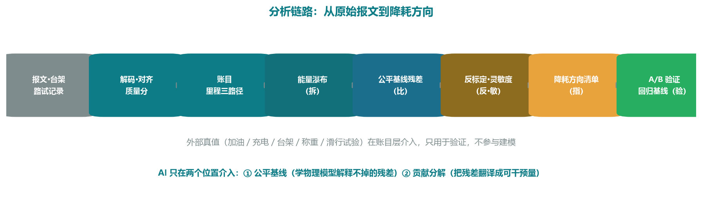
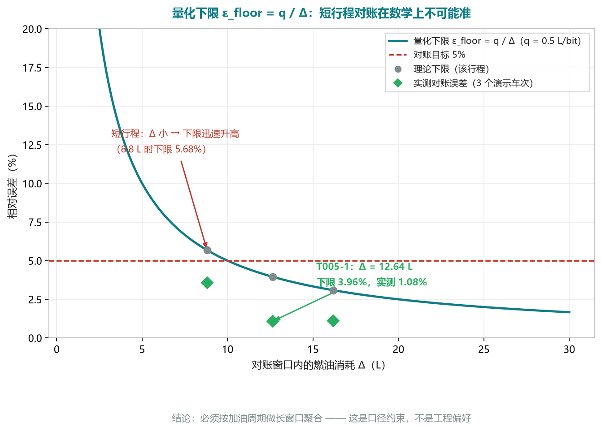
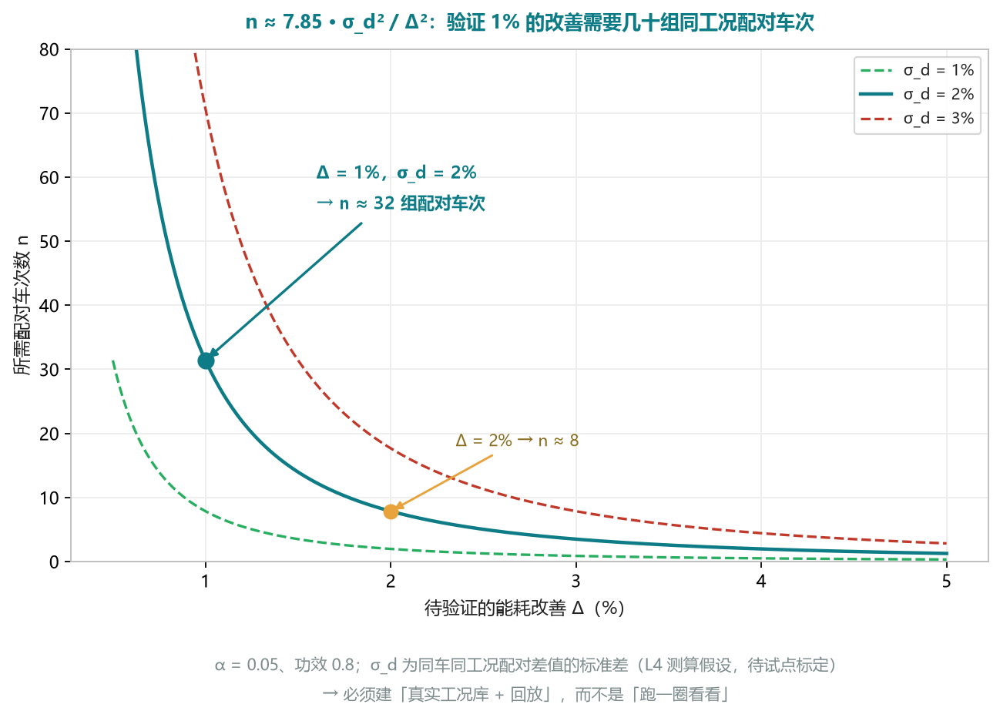
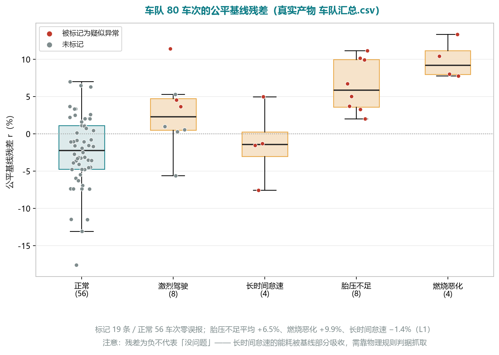

# 面向整车开发与 VCU 标定的整车能耗归因与降耗方向模型

## —— 基于随车 CAN 报文的"物理—统计"混合建模

> **格式说明**：本文按数学建模论文体例撰写，用于整车开发商与 VCU 开发厂家的技术评审与立项评审。
> **排版约定**：公式**不用 LaTeX、也不依赖公式引擎**，而是按数学排版惯例写成 **Unicode 数学字形**：
> **变量用数学斜体**（𝐸、𝑣、𝑚、𝑃、𝑎），**下标说明 / 单位 / 函数名 / 缩写与标识符保持正体**（E_idle 里的 "idle"、`TotalFuelUsed`、MJ/kg、abs(·)），**数字与运算符保持正体**（∑ ∫ ρ θ η Δ ≤ ≥ ⇒ ∝ ² ³）。
> 数学斜体字形由系统数学字体提供（Windows 上为 Cambria Math，与 Word 公式同一字体）。
> ⚠️ **副作用**：数学斜体字符**无法用 "E_chem" 这类 ASCII 串直接检索**；检索符号请用 §四 符号说明表里的中文名，或在编辑器中按字母区搜索。
> **配套材料**：`01`（主方案）、`04`（独立复现与技术审计报告，本文全部实测数字的复现依据）、`05`（面向整车厂与 VCU 的降耗方向专项设计）、`prototype/`（可运行原型）、`audit/`（复算脚本）。
> **证据等级**：**【L1】** 原型实测可复现｜**【L2】** 第三方审计独立复算｜**【L3】** 设计已明确但未实现｜**【L4】** 测算假设（待试点标定）。全文数字均带标注。

---

## 摘要

本文针对**整车能耗开发中"账目在、归因不在"**的问题——能耗总量可以算出，却无法定量回答"该改哪个设计参数、哪条 VCU 控制策略、哪个标定阈值"——建立了一套**物理模型与统计学习混合**的能耗归因模型，并在此基础上给出了**降耗方向的排序与验证方法**。

模型以随车 CAN/J1939 报文（含台架、转鼓、路试与量产回传数据）为输入，按"**拆—比—反—敏—指—验**"六步建立：

**（1）拆（能量瀑布）**：由纵向动力学与能量守恒建立分项分解模型

𝐸_chem = 𝐸_idle + 𝐸_dt_loss + 𝐸_thermal + 𝐸_trac

𝐸_trac = 𝐸_roll + 𝐸_aero + 𝐸_grade + 𝐸_kinetic + 𝐸_brake

**（2）比（公平基线）**：以作业条件特征建立梯度提升基线 𝐹(𝑥)，以折外残差 𝑟 = 𝑦 − 𝐹^(−κ)(𝑥) 构造公平比较器，并配以不依赖模型的近邻中位数基线；

**（3）反（参数反标定）**：把残差翻译为物理参数偏差（等效滚阻、C_d · A_f、传动效率、附件功率、电池内阻）；

**（4）敏（灵敏度与优先级）**：由能量项的**一次齐次性**证明"相对灵敏度 = 该分项的能量份额"，从而解析地给出方向排序；

**（5）指（降耗方向清单）**：把偏差映射到可干预量（设计参数 / VCU 策略 / 标定阈值），并强制附置信度与验证方式；

**（6）验（闭环验证）**：以配对设计与功效分析给出验证所需的样本量，用工况回放做台架/HIL/实车 A/B。

本文的主要**理论结果**包括：① 证明瀑布自检是**构造性恒等式**（鉴别力为零，故不能作为物理验证）；② 证明牵引能耗对参数的**相对灵敏度等于分项能量份额**（欧拉齐次函数定理），并用审计实验数据三行交叉验证（𝐶_d × 1.6 与 𝐴_f × 1.5 独立反解出同一份额 27.0% / 26.8%）；③ 给出**可辨识性退化关系** ρ = 1 / [1 + (k − 1) · w]，证明"滚阻升高 35%"与"动力系统效率下降 8.9%"在一维观测量下**数学等价**；④ 给出量化误差下限 ε_floor = 𝑞 / Δ、分位数阈值的退化条件、以及配对验证的样本量公式 𝑛 ≈ 7.85 · σ_d² / Δ²。

**实测结果【L1/L2】**：能耗账目与真值偏差 **0.00% ~ 0.03%**；与外部对账误差 **1.08% ~ 3.57%**（均值 1.92%，目标 < 5%）；三方里程互差 **0.01% ~ 0.03%**；基线模型样本外 𝑅² = 0.894、MAE = 1.71 L/100km、MAPE = 4.61%；异常检测查准 **100%**、查全 **79.2%**（折半交叉验证 70.8%）、F1 **0.884**；参数扰动使牵引能耗变化 **+16.2% / +13.4% / +56.5%**，而上述"自检"全部通过；跨 4 个大版本依赖下 CAN 报文日志 **SHA256 逐字节一致**。

**结论**：模型在带真值的仿真数据上通过了对抗性检验，证明了"算法自洽且算得准"；但**不能替代真车与台架验证**。论文同时给出模型的**能力上限**——一维观测量只能识别一个参数组合，因此参数反标定必须与独立观测量（称重、滑行试验、长巡航段、风洞、台架）配合，这是本模型最重要的边界结论。

**关键词**：整车能耗归因；能量瀑布；纵向动力学；梯度提升回归；孤立森林；CUSUM；可辨识性；参数反标定；预测性能量管理

---

## 一、问题重述

### 1.1 问题背景

商用车的车联网终端以 10 ~ 100 Hz 采集整车 CAN / SAE J1939 报文，一台车一天可产生 GB 级数据。这些数据目前仅用于**实时监控、故障回放与单点试验报告**。同时，整车厂与 VCU 厂家在能耗开发中面临六个相互关联的困难：

| 编号 | 困难 | 具体表现 |
|---|---|---|
| P1 | 账目在，归因不在 | 能算出 32.16 L/100km，但拆不出怠速 / 附件 / 滚阻 / 风阻 / 传动各占多少 |
| P2 | 分析与决策隔着"翻译" | 报文是 `0x0CF00400`、`SPN 183`，决策要的是换挡线、回收阈值、目标温度 |
| P3 | 对比不公平 | 不同线路 / 载荷 / 温度混着比，策略改动的收益无法归因 |
| P4 | 参数漂移不可见 | 设计值 vs 在用车实际（滚阻、C_d · A_f、内阻）无持续反标定机制 |
| P5 | 迭代闭环缺失 | 策略改动收益靠"跑一圈看看"，缺同工况回归基线 |
| P6 | 人力不可扩展 | 一次完整能耗分析约 4 h/车次，标定项目动辄几百车次 |

### 1.2 问题提出

**问题一（账目与分解）**：如何从带噪声、丢帧、量化的原始报文中，反算出**可与外部真值对账**的能耗账目，并把它分解为**可归因的物理分项**？

**问题二（偏差识别与方向生成）**：如何在剥离工况、载荷、地形、环境等**不可控因素**之后，识别出**可干预**的偏差，并映射为按性价比排序的**降耗方向**（设计参数 / VCU 策略 / 标定阈值）？

**问题三（验证与边界）**：如何判断所给方向**确实有效**，并明确模型自身的**能力边界**（哪些结论不能下）？

---

## 二、问题分析

### 2.1 总体思路：三次"分账"

能耗归因的本质是**逐层剥离不可改的部分，使"可改的部分"收敛**：

| 分账 | 做什么 | 得到什么 |
|---|---|---|
| 第一次：数据分账 | 信号按物理性质选重构方式 × 按重要度加权评分 | 结论是否可信 |
| 第二次：能量分账 | 总能量 → 物理分项（瀑布） | 能耗花在哪 |
| 第三次：偏差分账 | 总偏差 → 不可控（工况 / 载荷 / 环境）+ 可控（车辆参数 / 策略执行） | 该改什么 |


### 2.2 难点分析

| 难点 | 数学本质 | 本文对策 |
|---|---|---|
| 关键量未知（质量、坡度、风速） | 状态不可完全观测 | 传感器优先 + 估计器回退，并**显式标记降级** |
| 多参数不可分 | 观测映射非单射 | **命题 10**：给出可辨识性退化关系，要求增加观测维度或改变实验设计 |
| 无真值可校 | 无法定义精度 | 用**物理自洽的仿真数据**先验证算法，再换数据源 |
| 小样本 | 高容量模型必然过拟合 | 浅树 + 强收缩 + L2 + **折外残差** |
| 自检无鉴别力 | 恒等式 vs 验证 | **命题 3**：区分构造性恒等式与外部独立验证 |
| 误报代价高 | 假阳性摧毁信任 | 强证据门限 + 置信度分级 + 待人工判定 |

### 2.3 技术路线




---

## 三、模型假设

| 编号 | 假设 | 数学表述 | 依据与影响 |
|---|---|---|---|
| **A1** | 纵向动力学主导 | 忽略横摆、侧倾与垂向振动，只保留纵向力平衡 | 干线运输工况下横向 / 垂向能量占比很小；影响：坡道与转弯耦合工况精度下降 |
| **A2** | 旋转惯量等效为常数 | 𝑚_eff = 𝑚 · (1 + δ)，δ = 0.06 | 换挡瞬态被忽略；影响：急加速段动能项有 1% ~ 3% 量级偏差 |
| **A3** | 无风速传感器时按静风处理 | v_w ≡ 0，系统偏差并入 C_d · A_f 标定 | 避免引入不可观测变量；影响：反标定的 C_d · A_f 是"等效值" |
| **A4** | 制动时动力源不输出牵引功率 | 𝑝_traction = max(𝑝_total, 0)，𝑝_brake = max(−𝑝_total, 0) | 由构造保证 𝑝_traction − 𝑝_brake = 𝑝_total ⇒ **命题 3** |
| **A5** | 传动效率为常数 | η_dt 与挡位、温度无关 | 影响：E_dt_loss 分项误差随挡位分布变化 |
| **A6** | 燃料物性为常数 | LHV = 42.8 MJ/kg，ρ_diesel = 0.84 kg/L ⇒ 9.9867 kWh/L | 影响：账目尺度误差约 1% 量级，可按实测油品标定 |
| **A7** | 累计量在行程内单调不减 | TFU(t) 单调，加油事件不在行程内 | 保证 max − min 即行程油耗；**命题 2** 的量化界 |
| **A8** | 质量与坡度由独立观测量或估计得到 | 𝑚 = 𝑚̂(𝑡)，θ = θ̂(𝑡)，估计误差有界 | 二者是能耗第一、第二敏感因子；估计失效时必须降级标注 |
| **A9** | 残差可作语义分解 | 𝑟 = 𝑟_操作 + 𝑟_车辆 + 𝑟_策略 + ε | 由特征分组实现（**命题 5**）；是归因成立的前提 |
| **A10** | 参数扰动为开环重算 | 扰动参数时轨迹 (v, a, θ) 不变 | 保证能量对参数一次齐次 ⇒ **命题 9** 的严格性 |
| **A11** | 车次级样本独立同分布 | (x_i, y_i) 独立同分布 | 折外评估与配对检验的前提 |
| **A12** | 观测噪声加性、零均值、有限方差 | 𝑦 = 𝑓(𝑥) + ε，𝐸[ε] = 0，Var[ε] = σ² < ∞ | 保证回归与残差统计量的基本性质 |

---

## 四、符号说明

| 符号 | 含义 | 单位 | 备注 |
|---|---|---|---|
| 𝑡_k = 𝑘 · Δ𝑡 | 统一时间网格 | s | Δ𝑡 = 0.1（10 Hz） |
| v、a、θ | 车速、纵向加速度、坡度 | m/s、m/s²、% | θ 由 IMU / GNSS 估计 |
| m、m_eff | 整车质量、含旋转惯量的等效质量 | kg | 𝑚_eff = 𝑚 · (1 + δ) |
| C_rr、C_d、A_f | 滚动阻力系数、空气阻力系数、迎风面积 | —、—、m² | 铭牌参数 |
| η_dt | 传动效率 | — | 0.92（6×4 牵引车典型值） |
| E_x | 各分项能量 | kWh | 下标 x ∈ {idle, dt_loss, roll, aero, grade, kinetic, brake}，见 §5.3 |
| E_chem、E_fuel | 化学能、燃油体积 | kWh、L | 𝐸_chem = 9.9867 · 𝐸_fuel |
| q、Δ | 累计量量化步长、对账窗口内的消耗量 | L | 𝑞 = 0.5 L |
| y、F(x)、r | 目标能耗、基线预测、残差 | L/100km | 𝑟 = 𝑦 − 𝐹^(−κ)(𝑥) 为折外残差 |
| w_i | 第 i 项在牵引能量中的份额 | — | 𝑤_i = 𝐸_i / 𝐸_trac |
| k、ρ | 滚阻倍率、动力系统效率倍率 | — | 可辨识性分析的参数 |
| η_engine_est | 已实现的唯一反标定量 | — | 见式 (14) |
| w_s、cap_s、slope_s | 质量评分中的信号权重与罚分参数 | — | 经验值 |
| p | 异常样本占比 | — | 影响分位数阈值的可行性 |

---

## 五、模型建立

### 5.1 数据治理模型

#### 5.1.1 重构算子与良定性判据

设信号经解码得到非均匀样本 {(τ_j, x_j)}，需重构到均匀网格 {t_k}。定义三种重构：线性 L、零阶保持 Z、最近邻 N。对**累计量**（燃油累计、里程表、SOC）必须用 Z。

**命题 1（累计量重构的良定性判据）**
设 x 为分段常值（阶梯）信号，跳变幅度 Δ_j、跳变时刻 t_j。累计量的可接受重构应满足：(i) 与样本一致；(ii) 保持单调性；(iii) **差分谱局部化**（不引入数据不支持的变化）。则 Z 满足三条，L 不满足 (iii)：L 在跳变处产生幅值 Δ_j / Δt 的伪速率并持续 Δt；Z 的差分是单样本支撑的稀疏脉冲，可被量程与单调性约束识别。

**证明要点**：L 在区间 [t_k, t_(k+1)] 上斜率恒为 (x_(k+1) − x_k) / Δt；当该区间跨越跳变时，该斜率被解释为"该时段存在恒定消耗 / 产生"，即伪造了 Δ_j / Δt 的速率并持续 Δt。Z 在该区间取值 x_k，差分为 0，跳变被压缩到单样本。∎

**推论**：累计量的**消耗量估计必须用首尾差分**（E₂ = max − min），不能对重构序列逐段积分——这正是账目模型采用两条路径的原因。

#### 5.1.2 质量评分模型

质量评分是**饱和线性罚分模型**：

𝑄 = clip( 100 − ∑_s pen_s , 0 , 100 )，其中 pen_s = min( cap_s , slope_s · excess_s ) · 𝑤_s 　　(1)

| 项 | excess_s | slope_s | cap_s | 乘 w_s |
|---|---|---|---|---|
| ID 命中率 | 0.995 − dsr | 3000 | 15 | 否 |
| 未知 ID 帧数 | n_unk | 1/10000 | 4 | 否 |
| 缺失率 | mr − 0.02 | 120 | 12 | 是 |
| 最长空档 | gap − max(3, 5 / rate) | 0.25 | 8 | 是 |
| 卡死时长 | stuck − 300 | 0.01 | 6 | 是 |
| 越量程点数 | n_oob | 0.01 | 6 | 是 |
| 核心信号缺失 | 每项 25 | — | — | — |
| 车速全程恒定 | 极差 < 1 km/h ⇒ 30 | — | — | — |

𝑄 单调、有界、分段线性、可加；分级 𝐴: 𝑄 ≥ 90，𝐵: 𝑄 ≥ 75，𝐶: 其余。**注意 𝑄 不是概率**，未做校准。

### 5.2 里程与账目模型

#### 5.2.1 里程三路径

𝑠_A = (Δ𝑡 / 2) · [ v₀ + 2 · ∑_(k=1)^(N−1) v_k + v_N ] / 1000　（车速积分，轮速信号）

𝑠_B = max(odo) − min(odo)　（里程表差分）

𝑠_C = (Δ𝑡 / 2) · [ g₀ + 2 · ∑ g_k + g_N ] / 1000　（GNSS 测速积分）

一致性判据：max_(𝑖 ≠ 𝑗) abs(𝑠_i − 𝑠_j) / 𝑠̄ < 2%

梯形法的全局误差 ≈ (Δt² / 12) · abs(𝑣′(𝑇) − 𝑣′(0))；Δ𝑡 = 0.1 s 时系数 8.3 × 10⁻⁴，故平滑工况下误差极小。**三条路径的独立性来自传感器不同，而非算法不同**（若需真正的几何第三方校验，应对经纬度做相邻点大圆距离求和——列为待补项）。

#### 5.2.2 账目与量化下限

𝐸₁ = ∑_k (rate_k + rate_(𝑘+1)) / 2 · Δ𝑡 / 3600　（燃油率积分）

𝐸₂ = max(TFU) − min(TFU)　（累计量差分）

ε = abs(𝐸₁ − 𝐸₂) / 𝐸₂

**命题 2（量化下限）**
设累计量量化步长 𝑞，行程消耗 Δ，则 abs(ΔE₂) ≤ 𝑞，从而

ε_floor = 𝑞 / Δ 　　(2)

**证明**：两端读数各有 ≤ 𝑞 / 2 的舍入误差，由三角不等式 abs(ΔE₂) ≤ 𝑞，两边同除 Δ。∎

代入 T005-1：ε_floor = 0.5 / 12.64 = 3.96%（实测 ε = 1.08%，优于最坏界）。

**推论**：ε_floor ∝ 𝑞 / Δ ⇒ **短行程对账在数学上不可能准**，必须按加油周期做长窗口聚合（窗口越长，Δ 越大，下限越低）。这是口径约束，不是工程偏好。



### 5.3 能量瀑布模型

#### 5.3.1 分项分解

车轮侧各分项的功率表达式为：

| 分项 | 表达式 | 含义 |
|---|---|---|
| p_inertia | 𝑚_eff · 𝑎 · 𝑣 | 惯性（含旋转惯量） |
| p_grade | 𝑚 · 𝑔 · sinθ · 𝑣 | 坡道 |
| p_roll | 𝑚 · 𝑔 · 𝐶_rr · cosθ · sign(𝑣) · 𝑣 | 滚动阻力 |
| p_aero | ½ · ρ_air · 𝐶_d · 𝐴_f · (𝑣 + 𝑣_w)² · 𝑣 | 空气阻力 |

合计：𝑝_total(𝑡) = 𝑝_inertia + 𝑝_grade + 𝑝_roll + 𝑝_aero

功率按符号分离：𝑝_traction = max(𝑝_total, 0)，𝑝_brake = max(−𝑝_total, 0)，分项能量 𝐸_x = ∫ 𝑝_x 𝑑𝑡 / 3.6 × 10⁶。

分项体系为：

𝐸_chem = 𝐸_idle + 𝐸_dt_loss + 𝐸_thermal + 𝐸_trac

𝐸_trac = 𝐸_roll + 𝐸_aero + 𝐸_grade + 𝐸_kinetic + 𝐸_brake

𝐸_trac_engine = 𝐸_trac / η_dt，𝐸_dt_loss = 𝐸_trac_engine · (1 − η_dt)

#### 5.3.2 恒等式（本模型的第一个边界结论）

**命题 3（瀑布自检的恒等式性质）**
在假设 A4 下，𝐸_trac − (∑_i 𝐸_i + 𝐸_brake) ≡ 0，且化学能侧各分项之和按定义等于 𝐸_chem。故这两项残差**不构成对物理模型的验证**。

**证明**

𝐸_trac − (∑_i 𝐸_i + 𝐸_brake)<br>
= ∫ 𝑝_traction dt − ∫ (𝑝_inertia + 𝑝_roll + 𝑝_aero + 𝑝_grade) dt − ∫ 𝑝_brake dt<br>
= ∫ [ p_traction − p_total − p_brake ] dt<br>
= ∫ [ max(p, 0) − p − max(−p, 0) ] dt ≡ 0　∎

化学能侧：𝐸_thermal := 𝐸_chem − 𝐸_idle − 𝐸_trac / η_dt 为**配平项**，故 𝐸_idle + 𝐸_dt_loss + 𝐸_thermal + 𝐸_trac = 𝐸_chem 恒成立。∎

**数值验证【L1】**（T005-1 真实产物）：车轮侧 14.74 + 10.39 + 0.90 + 0.00 + 11.25 = **37.28 kWh** = 𝐸_trac ✓；化学侧 0.84 + 3.24 + 84.83 + 37.28 = **126.19 kWh** = 𝐸_chem ✓；传动校核 (37.28 / 0.92) × (1 − 0.92) = **3.24 kWh** ✓（η_dt 直接决定该分项）。

**审计验证【L2】**：以故意错标的参数重算同一份日志（C_rr × 3 ⇒ 牵引能耗 26.87 → **42.06 kWh**，即 **+56.5%**），上述自检**全部通过**——从实验上确认了命题 3。

#### 5.3.3 齐次性（通向灵敏度定理）

**命题 4（能量项的一次齐次性）**
在 A10（轨迹不变）下：E_roll 关于 (m · C_rr) 一次齐次；E_aero 关于 (ρ_air · C_d · A_f) 一次齐次；E_grade、E_kinetic 关于 m 一次齐次。

**证明**：以滚阻为例，𝐸_roll = ∫ 𝑚 · 𝑔 · 𝐶_rr · cosθ · sign(𝑣) · 𝑣 𝑑𝑡，把 (𝑚, 𝐶_rr) 同时放大 λ 倍，被积函数放大 λ 倍，积分放大 λ 倍；轨迹固定故积分区间与 cosθ、sign(𝑣)、𝑣 均不变。其余同理。∎

### 5.4 工况切分与事件模型

#### 5.4.1 优先级决策列表

工况标签由一个**优先级覆盖式决策列表**产生：

**label(𝑡) = 𝑐_(𝑗*)**，其中 **𝑗* = max { 𝑗 : mask_j(𝑡) = 1 }**　（后写覆盖 ⇒ 优先级 = 赋值顺序）

优先级（低 → 高）：低速行驶 < 匀速巡航 < {爬坡, 下坡} < 制动减速 < 起步加速 < 怠速 < 停车熄火

加速度由**低通后求导**得到：𝑎 = d/dt [ MA(v, 1 s) ]，等效截止频率约 0.1 ~ 0.2 Hz，故阈值判定的是平滑加速度。

**两个由覆盖顺序决定的边界效应**：① 爬坡 / 下坡仅覆盖**稳态坡段**（坡上加速被判为"起步加速"）；② 起步瞬间（v < 1 km/h 且 a > 0.3 m/s²）被"怠速"覆盖。

#### 5.4.2 事件计数与 PKE

事件数 = 1 + # { 满足 𝑚_k = 1 且下一次 𝑚 = 1 的间隔 > 𝑔 }　（游程合并，𝑔 = 2 s / 30 s）

PKE_raw = ∑_k max(𝑣_k, 0) · max(𝑎_k, 0) · Δ𝑡 / 𝑠_km = ∑_k Δ(𝑣_k² / 2) |_(𝑎_k > 0) / 𝑠_km 　　(3)

其单位为 J/kg ÷ km = kJ/(𝑡 · km)。**单位口径提醒**：∑ 𝑣⁺ 𝑎⁺ Δ𝑡 / 𝑠_km 已经是 kJ/(𝑡 · km)；原型的实现又除以 1000，故其报出值为常规口径的 1/1000。判据使用相对倍数（max(P90, 1.6 × median)），**不影响检出**，但对外报数须换算并标注"按整车质量计的 kJ/(𝑡 · km)"，不可与 L/(100 t · km)（按载重计）混淆。

### 5.5 特征空间模型：残差语义由分组决定

#### 5.5.1 分组定义

| 特征组 | 内容 | 处置 |
|---|---|---|
| X_leak | 由物理解析直接导出的量 | 必须从特征中剔除（防循环论证） |
| X_task | 载荷、地形、环境、车辆属性 | 进入作业基线 |
| X_drive | 操作方式：怠速、急加减速、PKE、车速选择 | 从作业基线中排除 |

于是折外残差的语义为

𝑟 = 𝑟_操作 + 𝑟_车辆 + 𝑟_策略 + ε 　　(4)

#### 5.5.2 混淆路径的切断（第二个边界结论）

**命题 5（行驶时间口径的必要性）**
设行程距离 𝐷、行驶时长 𝑇_m、怠速时长 𝑇_i，单位里程能耗 𝑌 = 𝑐_d + 𝑐_i · 𝑇_i / 𝐷，全程平均车速 𝑆 = 𝐷 / (𝑇_m + 𝑇_i)。则在 (𝑇_m, 𝐷, 𝑐_d, 𝑐_i) 固定时，𝑆 与 𝑇_i **一一对应**，从而存在单调函数 𝑔 使 𝑌 = 𝑔(𝑆)。

**推论**：若把 S 作为回归特征，模型可通过 S 完整表达 T_i 的因果效应，**怠速油耗将被解释为"平均车速低"而在残差中消失**（因果信息泄漏）。

**对策**：改用**行驶时间口径** 𝑆_m = 𝐷 / 𝑇_m（其中 𝐷 = Δ𝑡 · ∑_(𝑣 ≥ 1) 𝑣，𝑇_m = Δ𝑡 · # { 𝑣 ≥ 1 }），该量不依赖 𝑇_i，从而切断上述函数依赖。

**证明**：𝑆 = 𝐷 / (𝑇_m + 𝑇_i) 关于 𝑇_i 严格单调，𝑌 关于 𝑇_i 严格单调，故在其余量固定时二者存在严格单调对应关系；反解 𝑇_i = 𝐷 / 𝑆 − 𝑇_m 代入 𝑌 即得 𝑌 = 𝑐_d + (𝑐_i / 𝐷) · (𝐷 / 𝑆 − 𝑇_m) =: 𝑔(𝑆)。∎

### 5.6 公平基线残差模型

#### 5.6.1 梯度提升基线

以 𝑋_task 为输入、𝑦 = L/100km 为目标的加性模型：

𝐹₀(𝑥) = argmin_c ∑_i 𝐿(𝑦_i, 𝑐)，𝐹_m(𝑥) = 𝐹_(𝑚−1)(𝑥) + ν · ℎ_m(𝑥)

ℎ_m ≈ argmin_h ∑_i [ −(∂L / ∂F)|_(F_(m−1)(x_i)) − h(x_i) ]²

取平方损失 𝐿(𝑦, 𝐹) = ½ (𝑦 − 𝐹)²，则伪残差即为 **𝑦 − 𝐹**。 　　(5)

实现：HistGradientBoostingRegressor(max_depth = 4, max_iter = 400, ν = 0.05, min_samples_leaf = 8, λ = 1.0)。

#### 5.6.2 折外残差（防自证）

𝑟_i = 𝑦_i − 𝐹^(−κ(𝑖))(𝑥_i)　（𝐾 = 5 折，shuffle，固定随机种子）　　(6)

**必要性**：若用内部预测 F(x_i)，浅树亦足以近似插值 ⇒ r_i → 0 ⇒ 式 (6) 之后的所有统计量失去意义。

指标（全部为折外口径）：

𝑅²_oof = 1 − ∑ 𝑟² / ∑ (𝑦 − ȳ)²；MAE = (1 / 𝑛) · ∑ abs(𝑟)；RMSE = √( (1 / 𝑛) · ∑ 𝑟² )；MAPE = (100 / 𝑛) · ∑ abs(𝑟 / 𝑦)

#### 5.6.3 近邻同类基线（不依赖模型的第二路径）

匹配维度 𝑋_match = (payload_t, distance_km, grade_abs_mean)，𝑘 = 9：

𝑍 = (𝑋_match − μ) / σ；𝑑_ij = ‖𝑍_i − 𝑍_j‖₂；base_i = median { 𝑦_j : 𝑗 ∈ 𝑁_k(𝑖) }；dev_i = (𝑦_i − base_i) / abs(base_i)

### 5.7 异常检测模型

#### 5.7.1 三路判据

**① 物理规则**：高侧 𝑇 = max( 𝑃90(𝑎) , 𝑐 · median(𝑎) )；低侧 𝑇 = max( 𝑐 · median(𝑎) , 𝑃05(𝑎) )

**② 统计残差**：𝑧_i = (𝑟_i − median(𝑟)) / 𝑠𝑑(𝑟)，判据 𝑧_i ≥ 1.8 且 𝑟_i > 1.5%

**③ 无监督**：异常分数 𝑠(𝑥, 𝑛) = 2^(−𝐸[h(x)] / 𝑐(𝑛))，归一化常数 𝑐(𝑛) = 2·𝐻(𝑛−1) − 2·(𝑛−1)/n ≈ 2·ln(𝑛−1) + 1.154；实现取 score = −score_samples，门限取 0.88 分位（即 1 − contamination，contamination = 0.12）

**命题 6（分位数阈值的退化条件）**
设异常样本占比 𝑝。对低侧异常（异常位于分布下尾）：若 𝑝 < α，则 𝑃_α 落在正常总体内，阈值位于正常尾部，可稳定检出整簇异常；若 𝑝 ≥ α，则 𝑃_α 落入异常簇内部，触发条件 𝑥 < 𝑃_α 只能检出簇内**比 𝑃_α 更极端**的部分，灵敏度显著下降（𝑝 = α 时尤为严重）。

故低侧阈值取 𝑃05（α = 5%）而非 𝑃10；高侧同理取 P90，并以 **max(·, 𝑐 · median)** 形成"统计离群 ∧ 物理倍数"的双重门限（保守化，符合"宁漏不误"的取向）。

#### 5.7.2 融合逻辑与告警条件

告警 ⟺ [ (车辆类证据 ≠ ∅) ∨ (z ≥ 1.8 ∧ r > 1.5%) ∨ (孤立森林离群) ∨ 强证据 ] ∧ [ (存在物理规则证据) ∨ (r > 0) ]

**只对正残差告警**（比基线省能不是异常）；当"仅有行为规则命中、总能耗未超标、证据不强"时不告警——该门限消除的误报量级为 16%（9/56 正常车次），是查准率 100% 的直接来源。

#### 5.7.3 变点检测

𝑆_i = max( 0 , 𝑆_(𝑖−1) + 𝑟_i − 𝑘 )，𝑘 = 3（%），ℎ = 12

对持续偏移 δ > 𝑘：平均报警延迟 ≈ ℎ / (δ − 𝑘) 个车次；δ ≤ 𝑘 时永不报警。

### 5.8 归因模型

#### 5.8.1 单参考点（OAT）贡献分解

𝑐_j = 𝑓(𝑥) − 𝑓(𝑥^(𝑗))，其中 𝑥^(𝑗) 表示仅将第 𝑗 个特征替换为车队中位数 　　(7)

取 abs(c_j) 的 Top-5 作为该车次的偏差来源。

#### 5.8.2 与 Shapley 值的公理差异

**命题 7（OAT 分解的不可加性）**
Shapley 值 φ_j = ∑_(𝑆 ⊆ 𝑁∖{𝑗}) [ abs(S)! · (M − abs(S) − 1)! / M! ] · [ f(S ∪ {j}) − f(S) ] 满足效率公理 ∑_j φ_j = 𝑓(𝑥) − 𝑓(∅)。而式 (7) 满足

∑_j 𝑐_j = 𝑀 · 𝑓(𝑥) − ∑_j 𝑓(𝑥^(𝑗)) ≠ 𝑓(𝑥) − 𝑓(reference)

**证明**：当 𝑓 为可加模型 𝑓(𝑥) = ∑_j 𝑓_j(𝑥_j) 时，𝑐_j = 𝑓_j(𝑥_j) − 𝑓_j(ref_j)，故 ∑_j 𝑐_j = 𝑓(𝑥) − 𝑓(ref)，等式成立；而一般（含交互项的树模型）不存在该分解，等式不成立。∎

**结论**：式 (7) 是**一阶单因子敏感性**（龙卷风图），是 SHAP 的高效**近似**，不满足效率与一致性公理；生产环境应替换为 TreeExplainer（精确 Shapley，复杂度 O(T · L · D²)）。

#### 5.8.3 近邻基线的污染分析

**命题 8（中位数抗污染阈值）**
𝑘 = 9 时 base_i 是第 5 序统计量；当近邻中异常样本占比 > 1/2 时基准发生偏移。

**验证【L2】**：实测每个车次的 9 个近邻中故障样本占比均值 **22.2%**（不移位）、最大 **56%**（移位）——因此只有少数车次的同类偏差被压低，表现为 tire_pressure_low 的同类偏差 **+2.55%** 明显小于其模型残差 **+6.48%**（另叠加匹配维度不足：未匹配车速与环境）。

### 5.9 灵敏度与优先级模型（第三个边界结论）

**命题 9（灵敏度定理）**
在 A10 下，牵引能耗 𝐸_trac = ∑_i 𝐸_i，则对任意参数 𝑝_i（仅第 𝑖 项依赖）

𝑆_(𝑝_i) := (𝑑𝐸_trac / 𝐸_trac) / (𝑑𝑝_i / 𝑝_i) = 𝐸_i / 𝐸_trac = 𝑤_i 　　(8)

**证明**：由命题 4，𝐸_i 关于 𝑝_i 一次齐次 ⇒ 欧拉齐次函数定理给出 𝑝_i · (∂𝐸_i / ∂𝑝_i) = 𝐸_i。而 ∂𝐸_trac / ∂𝑝_i = ∂𝐸_i / ∂𝑝_i（其余项不依赖 𝑝_i），故 (dE_trac / 𝐸_trac) / (dp_i / 𝑝_i) = (𝑝_i · ∂𝐸_i / ∂𝑝_i) / 𝐸_trac = 𝐸_i / 𝐸_trac。∎

**推论（线性叠加式）**

𝑑𝐸_trac / 𝐸_trac = 𝑤_roll · (𝑑𝐶_rr / 𝐶_rr) + 𝑤_aero · (𝑑𝐶_d / 𝐶_d + 𝑑𝐴_f / 𝐴_f + 𝑑ρ_air / ρ_air) + (𝑤_grade + 𝑤_kin) · (𝑑𝑚 / 𝑚) 　　(9)

**审计数据交叉验证【L2】**（同一日志、开环重算）：

| 扰动 | 实测 ΔE_trac | 由式 (9) 反解 | 一致性检验 |
|---|---:|---|---|
| 𝐶_d × 1.6 | +16.2% | 0.6 · 𝑤_aero = 16.2% ⇒ 𝑤_aero = 27.0% | — |
| 𝐴_f × 1.5 | +13.4% | 0.5 · 𝑤_aero = 13.4% ⇒ 𝑤_aero = 26.8% | **两次独立扰动给出同一份额** ✓（证明 𝐸_aero ∝ 𝐶_d · 𝐴_f） |
| 𝐶_rr × 3.0 | +56.5% | 2.0 · 𝑤_roll = 56.5% ⇒ 𝑤_roll = 28.3% | — |
| 质量参数 +8000 kg | **0%** | 质量取自信号（mass_override）⇒ ∂𝐸 / ∂𝑚_param = 0 | 与实现完全吻合 ✓ |


**降耗方向的优先级模型**

Priority_i = 𝑤_i · (Δ𝑝_(𝑖,max) / 𝑝_i) / Cost_i 　（Cost_i：改动成本 × 风险 × 周期） 　　(10)


**适用范围**：式 (8)(9)(10) 的严格性依赖 A10（开环重算）；闭环系统（驾驶员或 VCU 随参数自适应）需用仿真 / HIL 复核二阶效应。

### 5.10 参数反标定模型与可辨识性

#### 5.10.1 回归形式

**（𝑎）稳态巡航**：𝑃_trac / 𝑣 = 𝑚 · 𝑔 · 𝐶_rr + ½ · ρ_air · 𝐶_d · 𝐴_f · 𝑣²，即设计矩阵 **[1, v²]**，参数 (𝑎, 𝑏) = (𝑚 · 𝑔 · 𝐶_rr , ½ · ρ_air · 𝐶_d · 𝐴_f) 可分的条件是 v² 的相对离散度足够大 　　(11)

**（𝑏）滑行试验**：𝑎_veh = −( 𝑔 · 𝐶_rr · cosθ + ρ_air · 𝐶_d · 𝐴_f / (2m) · 𝑣² ) —— 与 (11) 数学同构，但把发动机与传动移出回路 ⇒ 阻力与效率解耦（SAE J1263 / J2263 类方法） 　　(12)

**（𝑐）电池内阻**：𝑈 = OCV(SOC) − 𝐼 · 𝑅 ⇒ 对 (𝐼, 𝑈) 回归，斜率 = −𝑅（需多温度点） 　　(13)

**（𝑑）质量辨识（RLS，【L3】待实现）**：𝐾_k = 𝑃_k · φ_k / (λ + φ_kᵀ · 𝑃_k · φ_k)；θ_(𝑘+1) = θ_k + 𝐾_k · (𝑦_k − φ_kᵀ · θ_k)；𝑃_(𝑘+1) = ( 𝑃_k − 𝐾_k · φ_kᵀ · 𝑃_k ) / λ。可辨识条件：持续激励（abs(𝑎) > 0.3 m/s²、无换挡、无制动）

#### 5.10.2 已实现的唯一反标定量

η_engine_est = (𝐸_dt_loss + 𝐸_trac_engine) / (𝐸_chem − 𝐸_idle) = (𝐸_trac / η_dt) / (𝐸_chem − 𝐸_idle) 　　(14)

#### 5.10.3 可辨识性退化定理（本模型最重要的边界结论）

**命题 10（一维观测量只能识别一个参数组合）**
设名义需求的牵引能量为 E₀，滚动阻力份额 w，真实动力系统效率 η_sys。考虑两类偏差：

- 情形 𝐴：滚阻升高 𝑘 倍 ⇒ 𝑅 = η_sys / [ 1 + (k − 1) · w ]
- 情形 𝐵：效率降为 ρ · η_sys ⇒ 𝑅 = ρ · η_sys

则观测映射 (k, ρ) ↦ R 的秩为 1，其水平集为

ρ = 𝑐 · [ 1 + (k − 1) · w ]，𝑐 = 𝑅 / η_sys 　　(15)

即 **(k, ρ) 不可分别辨识**，任意一维观测量只能识别一个参数组合。

**证明**：情形 𝐴 的可用于牵引的化学能为 E₀ · [1 + (k − 1) · w] / η_sys（真实阻力更大，需更多能量），而分析侧仍用名义 E₀ 计算比值，得 𝑅 = E₀ / (𝐸_chem − 𝐸_idle) = η_sys / [1 + (k − 1) · w]；情形 𝐵 直接得 𝑅 = ρ · η_sys。二者相等当且仅当式 (15)。由于映射的雅可比 ∂𝑅 / ∂𝑘 ≠ 0、∂𝑅 / ∂ρ ≠ 0 但二者线性相关（dR / 𝑅 = −𝑤 · dk / [1 + (k − 1) · w] = 𝑑ρ / ρ），雅可比矩阵秩为 1，Fisher 信息矩阵奇异，故不可辨识。∎

**数值代入**：𝑤 ≈ 0.28、𝑘 = 1.35（胎压不足 +35% 滚阻）⇒ **ρ = 1 / [1 + 0.35 × 0.28] = 0.911**。

即 **"滚阻升高 35%"与"动力系统效率下降 8.9%"在一维观测量下完全等价**。

**实测印证【L1/L2】**：η_engine_est 在"胎压不足"与"燃烧恶化"两类车次上的中位数几乎相同（**0.3122 vs 0.3125**），最优单阈值判别准确率仅 **75.0%**（随机基线 66.7%）。

**对策（模型层面的出路）**：① 增加观测维度（胎压信号、ΔSOC、台架 MAP）；② 改变实验设计（滑行试验单独暴露阻力项）；③ 降低自由度（冻结已知参数，例如用称重固定 m）。**这三条对策构成方案对 OEM / VCU 的硬性资源要求。**


### 5.11 验证模型

**命题 11（配对验证的样本量）**
对同车、同线路、同载荷、同温度带的配对差值 𝑑 = 𝐸_B − 𝐸_A，检验 H₀: μ_d = 0，双侧水平 α、功效 1 − β 所需样本量

𝑛 ≈ ( 𝑧_(1−α/2) + 𝑧_(1−β) )² · σ_d² / Δ² 　　(16)

代入 α = 0.05、1 − β = 0.8（𝑧 之和 = 2.802）：

| 待验证改善 Δ | 所需配对车次（σ_d = 2%【L4】） |
|---|---|
| 3% | ≈ 4 |
| 2% | ≈ 8 |
| **1%** | **≈ 32** |

**判据**：abs(Δ) > 同版本重复试验的 95% 噪声带 才认定有效。

**工程含义**：证明 1% 量级的策略改善需要**几十组同工况配对车次**——这直接决定了必须建**工况库 + 回放**，而非"跑一圈看看"。



---

## 六、模型求解

### 6.1 算法流程

```
输入: 报文日志(blf/asc/mdf4/candump) + DBC/A2L + 车型参数 + (可选)外部真值
输出: 能耗账目、能量瀑布、公平残差、归因、降耗方向清单、验证建议

 1  解码: DBC/A2L → 物理信号; 记录 ID 命中率与未知 ID 帧数
 2  重构: 按 INTERP_POLICY 分派 {linear, zoh, nearest}; 统一到 10 Hz 网格
 3  评分: 式(1) → Q, 分级 A/B/C; 低分数据标注置信度上限
 4  里程: s_A, s_B, s_C; 两两互差 > 2% 则告警并降级
 5  账目: E1 = ∫rate dt, E2 = ΔTFU; ε = abs(E1−E2)/E2; 对照 ε_floor = q/Δ
 6  分解: §5.3.1 → 车轮侧 + 化学能侧瀑布; 计算恒等式残差(命题3, 仅作审计记录)
 7  工况: 优先级决策列表 → 8 类工况占比; 游程合并 → 事件计数; PKE
 8  特征: 抽取 X_task / X_drive / X_leak; 按命题5 采用行驶时间口径
 9  基线: HistGBR + K 折交叉预测 → r_i (式6); 近邻基线
10  检测: 三路判据 + 门限融合 → 疑似异常清单(含 z、IF 分数、证据类型)
11  归因: 式(7) 单参考点分解 + 物理规则证据 → 责任方向
12  反标: 式(14) 计算 η_engine_est; 有独立观测量时按式(11)-(13) 反标
13  灵敏: 式(9) 计算各参数相对灵敏度 → 式(10) 排序
14  指  : 生成降耗方向清单(可干预量 + 预期收益口径 + 置信度 + 独立观测建议 + 验证方式)
15  验  : 按式(16) 设计配对验证方案; 工况回放 → 台架/转鼓/HIL/实车 A/B → 回归基线
16  门禁: 账目自洽 ∧ 里程互差 ∧ 外部对账(如有) 全部通过才允许发布
```

### 6.2 计算复杂度

| 步骤 | 复杂度 | 说明 |
|---|---|---|
| 解码 / 网格重构 | O(N log N) | searchsorted 二分；N 为帧数 |
| 能量分解 / 工况 / 特征 | O(N) | 矢量化 |
| 基线训练 | O(M · n · bins) | M 迭代数、n 样本数、bins 直方图桶数 |
| 孤立森林 | 𝑂(𝑛_est · 𝑛 log 𝑛) | 𝑛_est = 300 |
| OAT 归因（单车） | 𝑂(𝑘 · 𝑀_feat) | 𝑘 = 5，𝑀_feat ≤ 14 次模型预测 |
| 近邻基线 | O(n² d) | 𝑛 = 80 可接受；生产需 KD-tree / 近似最近邻 |

**实测**【L1】：落地报文 **235,711 帧 / 3 车次 / 11.8 MB**，解码 0.66 s；单次能耗分析 **0.00 s**；全流程端到端 **6.8 s**（离线、单进程、无 GPU）。

### 6.3 超参数汇总

| 层 | 参数 | 取值 |
|---|---|---|
| 重构 | 网格频率 GRID_HZ | 10 Hz |
| 质量 | 权重 w_s / 罚分 cap, slope | 0.15 ~ 1.0 / 见表 5.1.2 |
| 基线 | max_depth, max_iter, ν, min_samples_leaf, λ | 4, 400, 0.05, 8, 1.0 |
| 交叉验证 | K | 5（cross_val_predict） |
| 孤立森林 | n_estimators, contamination | 300, 0.12 |
| 统计判据 | z_thresh, min_residual_pct | 1.8, 1.5% |
| 孤立森林门限 | iso_quantile | 0.88 |
| CUSUM | k, h | 3.0, 12.0 |
| 近邻 | k, 匹配维度 | 9, (payload_t, distance_km, grade_abs_mean) |
| 工况 | HARSH_ACCEL / HARSH_BRAKE / IDLE_SPEED | 0.8 / −1.2 m/s² / 1.0 km/h |
| 随机性 | RANDOM_STATE | 20241013（固定） |

---

## 七、模型检验

### 7.1 数据与场景

仿真车队 **80 车次 / 40 天**（6×4 重型牵引车·柴油），其中 **3 个车次落地为真实整车 CAN 报文日志**（11.8 MB / 235,711 帧），DBC 含 11 条报文 / 25 个信号；按约 30% 比例注入 4 类偏差（燃烧恶化、胎压不足、激烈驾驶、长时间怠速）并保留真值标签用于评测。

### 7.2 账目层检验【L1】

| 指标 | 目标 | 实测 |
|---|---|---|
| 能耗账目 vs 仿真真值 | — | **0.00% / 0.03% / 0.01%**（三个车次） |
| 与外部对账基准误差 | < 5% | **3.57% / 1.08% / 1.10%**（均值 **1.92%**） |
| 三方里程最大互差 | < 2% | **0.01% ~ 0.03%** |
| 量化下限对照（命题 2） | — | 下限 **3.96%**，实测 1.08% ⇒ 优于最坏界 |

### 7.3 分解层检验【L1/L2】

- 恒等式残差 0 ~ 2.6 × 10⁻¹⁴ %：**与命题 3 一致，属恒等式而非验证**；
- 车轮侧分解 vs 真值（T005-1）：计算 **37.278 kWh** vs 真值 **40.999 kWh**，偏差 **9.08%**——该车次滚阻已被注入 +35% 劣化，**偏差本身即为待检测信号**，而非模型误差；
- 参数扰动检验（命题 9 的反向验证）：见表 5.9，两行独立扰动给出同一 w_aero（27.0% / 26.8%）。

### 7.4 预测层检验【L1/L2】

| 指标 | 数值 | 说明 |
|---|---|---|
| 样本外 R² | **0.894** | 14 特征口径 |
| 样本外 MAE / MAPE | **1.71 L/100km / 4.61%** | — |
| 消融：单特征（整车总质量） | R² = **0.797** | 说明载荷是主方差来源 |
| 消融：载荷 + 地形（4 特征） | R² = **0.909** | **高于** 14 特征口径 ⇒ 部分特征净增噪声 |
| 工况同质性 | avg_speed_moving 相对离散 **2.9%**、distance_km **2.4%**、payload_t **23.9%** | 故上述 R² / MAPE 相对真实项目**偏乐观** |



### 7.5 检测层检验【L1/L2】

混淆矩阵：TP = 19，FP = 0，FN = 5，TN = 56

**查准率 𝑃 = 1.000**，**查全率 𝑅 = 0.792**，**F1 = 0.884**

折半交叉验证（阈值仅在半数样本标定）：**𝑃 = 1.000**（5 次折半均稳健），**𝑅 = 0.708**

贡献分解：19 条标记中纯统计路径仅贡献 **3 条**（单用查全率 12.5%）⇒ **检出主力为物理规则**。


### 7.6 稳健性检验【L2】

| 检验项 | 结果 |
|---|---|
| 跨依赖版本复现（pandas 3.0.6 / numpy 2.5.3 / sklearn 1.9.1，与作者环境跨大版本） | 三份 CAN 日志 **SHA256 逐字节一致**；车队汇总.csv **22 个数值列逐位相同** |
| 自研矢量化编码器 vs cantools 官方编码器 | **3300/3300 完全一致** |
| 确定性设计 | stable_seed 用 zlib.crc32 替代内置 hash() ⇒ 结果可复现 |
| 解析鲁棒性 | 破坏 5% 帧载荷后"ID 命中率"仍为 100.0000% ⇒ **该指标不度量信号完整性**（真正兜底的是量程断言与卡死检测） |

### 7.7 误差来源分解

| 误差项 | 量级 | 性质 | 处置 |
|---|---|---|---|
| 累计量量化 | q / Δ（本例 3.96% 下限） | 随机、有系统性上限 | 长窗口对账 |
| 梯形法离散化 | O(Δt²) | 系统、可忽略 | 10 Hz 网格 |
| 质量 / 坡度估计 | 未单独评测【L3】 | 系统 | 传感器优先 + 强制降级标记 |
| 铭牌参数错标 | 可致分项偏差 **9% ~ 17%** | **信号而非误差** | 参数反标定 + 独立观测 |
| 工况同质性 | 使 R² 偏乐观 | 系统 | 真实项目重新标定 |
| 阈值取材同批数据 | 查全率乐观 **8.4 pp** | 选择偏差 | 独立标定集 |

---

## 八、模型评价与改进

### 8.1 优点

1. **物理先行、AI 补残差**：样本需求低、结论可归因，且分项与设计 / 标定参数一一对应；
2. **可对账**：账目精度由外部真值检验（实测 1.08% ~ 3.57%），而非自证；
3. **可复现、可审计**：跨版本逐字节一致，编码器与官方实现 3300/3300 一致；
4. **边界清晰**：本文给出三条硬边界结论（恒等式、灵敏度定理、可辨识性退化），这是模型可信度的组成部分而非缺陷；
5. **有验证闭环**：方向清单强制附置信度与验证方式，并有样本量公式支撑试验设计。

### 8.2 局限（如实列出）

| 类别 | 项 | 证据等级 |
|---|---|---|
| 算法近似 | 贡献分解为 OAT 近似（非精确 Shapley）；置换重要度用训练集自证 | L1 代码核实 |
| 阈值口径 | 异常判据阈值取自被评测的同一批数据；contamination 构造性 12% | L2 |
| 未实现 | 质量 RLS 辨识、坡度卡尔曼融合、参数自动反标定（C_rr / C_d · A_f / η_dt / P_aux / R_batt）、片段时间窗持续性判据 | L3 |
| 待标定 | EV 回收效率（分析侧硬编码 0.55；参数表 0.65；真值侧等效约 0.88）、EV 附件电耗为常数 | L4 |
| 物理缺陷 | 仿真器 solve_feasible_profile 未施加 c_rr_scale ⇒ 12/80 车次峰值越界（对账目无影响） | L2 |
| 数据边界 | 指标基于带真值仿真数据；工况同质导致指标偏乐观；不能替代真车与台架验证 | L1/L2 |

### 8.3 改进方向

1. **增加观测维度**（解命题 10 的唯一出路）：胎压、称重、ΔSOC、台架 MAP、转鼓循环；
2. **独立标定异常判据**：阈值改由独立标定集确定，并引入片段级时间窗持续性判据；
3. **归因升级**：接入 shap.TreeExplainer；近邻基线剔除已标记异常后再取中位数；
4. **建工况库**：把真实工况聚类为代表循环，导出给 Simulink / HIL / 台架，支撑式 (16) 的验证规模；
5. **口径规范化**：PKE 单位、质量参数与信号口径、regen 效率硬编码等实现级不一致应统一。

### 8.4 模型推广

- **动力型式**：模型对动力链解耦（燃油侧为"化学能 → 机械能"，纯电侧为"电能 ↔ 机械能"），替换动力链方程与参数集即可；--powertrain ev 已验证框架可行性；
- **车型**：乘用车、工程机械、非道路移动机械，凡有 CAN 数据与纵向动力学的对象均适用；
- **跨领域**：任何"已知物理守恒关系 + 未知参数漂移 + 需要把偏差归因到可干预量"的场景，例如风电机组（功率曲线偏差归因）、工业空压站、充电站能耗管理。

---

## 参考文献

[1] Friedman J H. Greedy function approximation: a gradient boosting machine. *Annals of Statistics*, 2001, 29(5): 1189–1232.
[2] Liu F T, Ting K M, Zhou Z H. Isolation Forest. *Proc. 8th IEEE ICDM*, 2008: 413–422.
[3] Page E S. Continuous inspection schemes. *Biometrika*, 1954, 41(1/2): 100–115.
[4] Breiman L. Random Forests. *Machine Learning*, 2001, 45(1): 5–32.
[5] Lundberg S M, Lee S I. A Unified Approach to Interpreting Model Predictions. *NeurIPS*, 2017.
[6] Gillespie T D. *Fundamentals of Vehicle Dynamics*. SAE International, 1992.
[7] SAE International. *J1939 系列*（商用车 CAN 应用层，PGN/SPN 定义）；*J1263 / J2263*（滑行法道路阻力测量）。
[8] ASAM. *MDF v4*（测量数据格式）、*MCD-2 MC (A2L)*（标定描述）、*MCD-1 XCP*（测量标定协议）。
[9] GB/T 38146《中国汽车行驶工况》；GB/T 27840《重型商用车辆燃料消耗量测量方法》（C-WTVC）；GB 30510《重型商用车辆燃料消耗量限值》（**具体条款以现行有效版本为准**）。
[10] Commission Regulation (EU) 2017/2400（VECTO，重型车 CO₂ 认证工具）。
[11] scikit-learn 用户指南：HistGradientBoostingRegressor、IsolationForest、permutation_importance。
[12] 本项目内部文献：`04_独立复现与技术审计报告.md`（第三方独立复现与对抗性验证，本文全部 L2 数字的复算依据）。

---

## 附录

### 附录 A · 车型参数（`prototype/src/physics.py`）

| 参数 | 取值 | 来源 |
|---|---|---|
| 整备质量 / 载重 | 9 500 kg / 15 000 kg | 6×4 牵引车典型值 |
| C_rr / C_d / A_f | 0.0075 / 0.60 / 9.0 m² | 行业典型值，**须按车型标定** |
| 旋转惯量系数 δ | 0.06 | 经验值 |
| η_dt | 0.92（燃油）/ 0.95（纯电） | 典型值 |
| 额定功率 | 353 kW（燃油）/ 400 kW（纯电） | 典型值 |
| 怠速 / 附件功率 | 5.5 kW / 1.5 kW | 典型值 |
| BSFC 最优 / 最优负荷 / 曲率 | 195 g/kWh / 0.60 / 0.45 | 二次罚函数近似 |
| 柴油 LHV / 密度 | 42.8 MJ/kg / 0.84 kg/L ⇒ 9.9867 kWh/L | 物性 |
| 空气密度 ρ_air | 1.225 kg/m³（15 ℃ 海平面） | 物性 |
| EV：电机效率 / 回收效率 | 0.93 / **参数表 0.65 而分析侧硬编码 0.55** | **待标定假设【L4】** |
| EV：附件 / 空调基础功率、电池 | 2.0 kW / 3.0 kW、350 kWh / 650 V | **待标定假设【L4】** |

### 附录 B · 复现方式

```
cd prototype
pip install -r requirements.txt
chcp 65001                      # 中文 Windows 必做，否则打印 R² 时抛 UnicodeEncodeError
python run_demo.py              # 完整模式（80 车次，端到端约 6.8 s）
python run_demo.py --quick      # 彩排模式
python run_demo.py --powertrain ev

cd ../audit
python audit.py                 # 实验 A~F：自检独立性 / 幽灵变量 / 特征消融 / 阈值外推 / 峰值功率 / 近邻污染
python audit2.py                # 实验 G~J
python audit3.py                # 实验 I、K~M
```

### 附录 C · 证据等级对照表

| 等级 | 含义 | 本文中的例子 |
|---|---|---|
| **L1** | 原型实测，可现场复现 | 账目误差 0.00% ~ 0.03%、对账 1.08% ~ 3.57%、R² = 0.894、查准 100% / 查全 79.2%、η_engine_est 0.3122 vs 0.3125 |
| **L2** | 第三方审计独立复算 | 参数扰动 +16.2% / +13.4% / +56.5%、折半 CV 查全 70.8%、编码器 3300/3300、SHA256 一致、量化下限 3.96% |
| **L3** | 设计明确但未实现 | RLS 质量辨识、卡尔曼坡度融合、参数自动反标定、TreeExplainer、持续性判据 |
| **L4** | 测算假设，待试点标定 | 人工基线 4 h/车次、方向有效率 ≥ 60%、σ_d = 2%、EV 回收效率与附件功率 |

> **本文声明**：凡 L3/L4 项均不得作为已实现能力或已达成收益对外陈述；所有精度指标均在带真值的仿真数据上取得，**不能替代真车与台架验证**。
